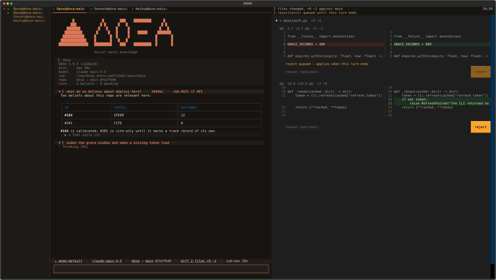
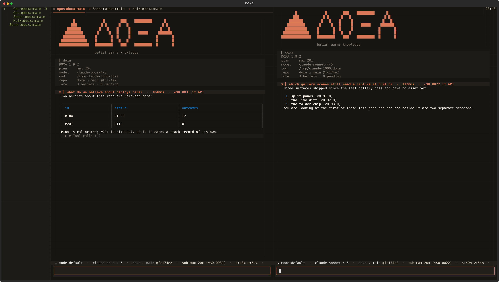
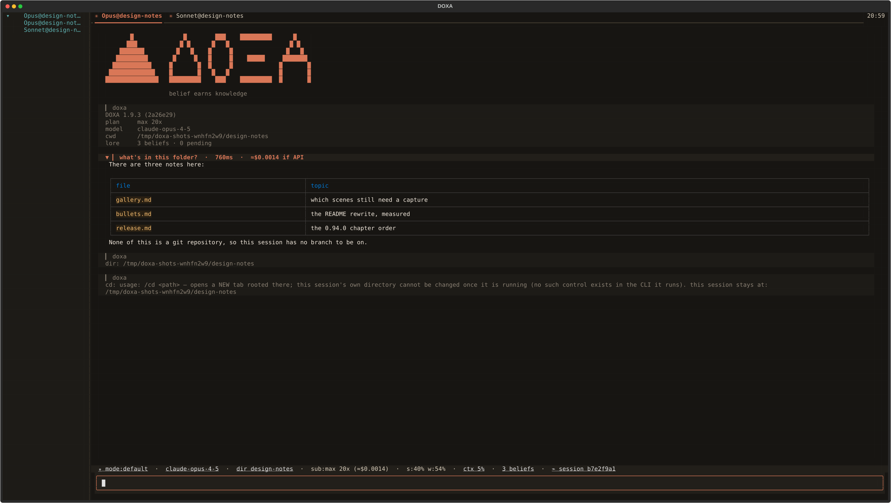

<p align="center"></p>

<p align="center">
  <a href="https://github.com/docwilde/doxa/releases"></a>
  <a href="https://github.com/docwilde/doxa/actions/workflows/ci.yml"></a>
  
  
  
</p>

> [!WARNING]
> **Alpha.** DOXA is `0.x` and moves daily: interfaces, keybindings, config
> keys and on-disk formats change between releases with no migration path.
> It runs an agent that edits your files and a shell with your privileges.
> The suite gates every release, but the project has one author and most
> defects so far were found by using it, not by the tests. Read
> [Non-goals](#non-goals) before trusting it with anything you would mind
> losing.

**DOXA** is a terminal for Claude agents, built on the Claude Agent SDK
and Textual and billed through your Claude subscription rather than an API
key. Each session runs in a **daemon** of its own: close the terminal,
`doxa attach` an hour later, and the transcript picks up where it stopped.
No tmux involved.

Start DOXA inside a repository and the session already knows the project.
Durable facts about that codebase — conventions, past workarounds,
corrections a human made once — reach the model before your first prompt,
per-repo rather than global. Every durable conclusion the agent draws
enters as a **belief**: visible, queryable, citable, never acted on. It
earns influence only when a human approves it or it builds a track record
of being right. The tagline is meant literally.

δόξα (*dóxa*): belief, opinion — as distinct from ἐπιστήμη (*epistēmē*),
justified knowledge. The name is the thesis: belief is the raw material,
never the finished thing.

Memory is [LORE](https://github.com/docwilde/LORE)'s `lore_core`, imported
in-process rather than shelled out to. LORE also ships as a Claude Code
plugin; both front ends share one store. See
[LORE integration](docs/manual.md#lore-integration).


*Every image here is rendered headlessly from the real app — scripted, no
spend, fake account numbers. See
[screenshots](docs/manual.md#screenshots).*

## What you get

- **[Sessions outlive the window.](docs/manual.md#sessions-and-the-daemon)**
  Each is a daemon behind a `0600` socket; closing the terminal detaches,
  and `doxa` restores the repo's tab set.
- **[Reasoning and tool calls on the record.](docs/manual.md#the-transcript)**
  Markdown under a collapsed reasoning fold; each `⚒ Tool calls (N)` chip
  opens to its arguments and result.
- **[Pane groups own their tabs.](docs/manual.md#pane-groups)** `ctrl+n`
  splits side by side, `ctrl+o` stacked; `ctrl+←/→` cycles one group and
  leaves the rest alone.
- **[A live diff you can reject one hunk of.](docs/manual.md#the-live-diff)**
  `f2` opens it beside the session, live. A rejected hunk reverts and the
  agent is told why.
- **[Memory stays inert until it earns influence.](docs/manual.md#lore-integration)**
  `lore_core` runs in-process; nothing new reaches the model until a human
  approves a staged row.
- **[A shell the model cannot reach.](docs/manual.md#shell-escape)** A `!`
  line runs in this session's worktree, with your privileges, outside the
  model's context.
- **[Worktrees, never auto-merged.](docs/manual.md#worktrees-and-finalize)**
  Each session gets its own worktree and branch. A clean one vanishes;
  real work waits for you.
- **[A permission mode you can see and change.](docs/manual.md#permission-modes)**
  `shift+tab` cycles it; the chip leads the bar, and the modes that stop
  asking are amber or red.
- **[A tool gate that counts strikes.](docs/manual.md#containment)** Every
  call passes `PreToolUse`; a tool failing hard twice is disabled for the
  session.
- **[Numbers that were measured.](docs/manual.md#the-status-bar)** Fifteen
  tooltipped chips — `dir NAME` outside a repo — and a `/context` the CLI
  itself counted.
- **[Pictures, or a straight answer why not.](docs/manual.md#images)**
  kitty graphics → sixel → half-block → text, settled by one probe.
- **[Sessions talk to each other.](docs/manual.md#search-resume-and-peers)**
  Same-repo sessions find each other and exchange `/msg` — always
  human-sent; the model has no send tool.
- **[An isolated CLI config.](docs/manual.md#the-spawned-cli)** Spawned
  `claude` processes use a config directory DOXA owns, not your
  `~/.claude`; your plugins load only if you opt in.

A `Task` subagent also gets a status row and a live read-only tab, and
`/dir` says [where a session is](docs/manual.md#where-a-session-is)
outside a repo. `alt+d` / `alt+s` / `alt+g` reach the split and diff
actions too, but only on a kitty-protocol terminal; `/help` marks every
binding yours cannot send.

## Gallery



*`f2` (or `/diff`) opens the live diff beside the session. **Reject** reverse-applies that hunk and tells the agent why; mid-turn it queues, and says so.*



*A split spawns a **second session**, not a second view of the first. Shot at v0.94.0; since v0.97.0 each region has its own tab strip.*


*Calls fold to one row each, opening to exact arguments and result. The marker counts through a silent call, so a slow one never reads as hung.*


*A memory call is an ordinary chip: what decides the agent's beliefs is as inspectable as anything else it does.*


*Every belief, grouped by scope, with what reality has said about it. Four verdicts record an outcome; `g` only looks.*


*One cell per half-percent. Every number is the CLI's own accounting of its own request — DOXA runs no second tokenizer.*


*Questions and permission requests get a real dialog. A headless run with no callback auto-denies both, silently.*


*Who else is on this repo, and tokens spent — self-reported on each peer's 15-second heartbeat. A peer mid-first-turn reads as unknown, never zero.*


*The chip leads the bar at every width — `auto` amber, `bypassPermissions` and `dontAsk` red, the modes where nothing stops to ask.*



*Outside a repo the chip is a different shape, not the same one with a hole in it. `/cd` opens the target in a new tab and says the session stayed put.*

Eighteen more scenes come from the same pass; the
[manual](docs/manual.md#screenshots) catalogues every one. An asset named
nowhere is how `beliefs-browser.png` rotted for eighteen releases before
v0.87.0 deleted it.

## Install

```sh
curl -fsSL https://raw.githubusercontent.com/docwilde/doxa/main/scripts/install.sh | sh
```

It checks Python 3.11+, [`uv`](https://docs.astral.sh/uv/) (offering to
install it), `git`, and the
[`claude` CLI](https://docs.claude.com/en/docs/claude-code) signed in —
DOXA authenticates through that CLI's OAuth session and never reads
`ANTHROPIC_API_KEY` — then runs `uv tool install
git+https://github.com/docwilde/doxa`. DOXA is not on PyPI. Re-running is
safe and never touches an existing `~/.doxa/config.toml`. Add `sh -s --
v0.39.0` for a tag. Read it first if you would rather not pipe a
stranger's script into `sh`.

Or run from a checkout:

```sh
git clone https://github.com/docwilde/doxa && cd doxa
uv sync
uv run doxa
```

`uv sync` is all of it: `lore_core` is a pinned git dependency, so the
LORE plugin is not a prerequisite. Install that plugin anyway and its
checkout deliberately wins over the pinned copy — both share one store,
and a terminal quietly disagreeing with the rest of the machine is the
worse surprise. `/about` names which copy loaded.

## Quickstart

```sh
uv run doxa          # spawn a session here, or restore this repo's saved tab set
uv run doxa new      # force a fresh session instead of attaching
uv run doxa new --branch <name>   # fork the session's worktree from <name>
uv run doxa attach   # reattach by session id / title prefix
uv run doxa stop     # finalize now (LORE review + index), daemon exits
uv run doxa doctor   # read-only health checks, no TUI: pass/fail + fix per check
uv run doxa launcher install      # XDG start-menu entry + icons
```

`launcher install` points at **the DOXA you ran it from**, by absolute
path, and prints that path and version — so a shortcut that would start
something unexpected shows up now, not in a month. It names any other
`doxa` on your `PATH` and changes nothing about it.

A daemon finalizes once every client has been detached for `--linger`
seconds (120 by default), or at once on `doxa stop`. `doxa --in-process`
runs the engine inside the TUI: no daemon, no detach, quitting finalizes
on the spot.

Then type a prompt and press enter. `ctrl+p` opens the palette, `ctrl+t` a
tab, `ctrl+r` searches past sessions, `shift+tab` cycles the permission
mode, a `!` line runs as a shell command, and `/help` lists every command
and key — marking any your terminal cannot send.

## Status

A working daily driver for its author, not a finished product. Everything
in [What you get](#what-you-get) and in the [manual](docs/manual.md) has
shipped and behaves as described; [CHANGELOG.md](CHANGELOG.md) has the
history. Config keys, socket protocol and command names can still change
between minor versions.

**Specified, not built.** Nine documents in [`docs/plans/`](docs/plans/)
are designs with nothing behind them, each saying so in its opening lines:
`plugin-api` (no loader exists — v0.34.0 shipped only the seams one could
bind to), `remote`, `mermaid`, `code-graph`, `sandbox`, `peer-publishing`,
`model-registry`, `spawn-session`, `session-sidebar`. Three left that list
by shipping: `split-panes` (v0.91.0), `live-diff` (v0.92.0), `pane-groups`
(v0.97.0, which inverted the first). `plugins.md` shipped in v0.74.0 and
is a different system — it adopts *your own* Claude Code plugins
(commands, skills, agents; never hooks or MCP servers) into the spawned
CLI.

**Not built, not specified.** No orchestration in any form: nothing
schedules sessions, assigns work between them or supervises a fleet.
`/msg` is the whole inter-session mechanism and a human always sends it.
Also absent: history drill-in past `/search`, and custom keybindings.

**Sessions older than v0.56.0 cannot be resumed.** That release stopped
DOXA and the CLI minting two session ids and pinned them to one, and the
fix cannot reach backwards: an older conversation is addressed by an id
the CLI's own store never knew, so it returns read-only and says so first.

Run the suite with `uv run pytest`.

## Non-goals

Provider-agnostic model routing — the point is subscription auth, not a
router. Replacing the LORE Claude Code plugin, which keeps shipping the
same core. General Claude Code plugin compatibility — DOXA does not load
third-party plugins today.

## License

[AGPL-3.0-only](LICENSE) for everyone, including over a network; a
[commercial licence](LICENSE-COMMERCIAL.md) is available for uses AGPL's
terms don't suit. The DOXA name and mark are reserved — see
[TRADEMARK.md](TRADEMARK.md).
