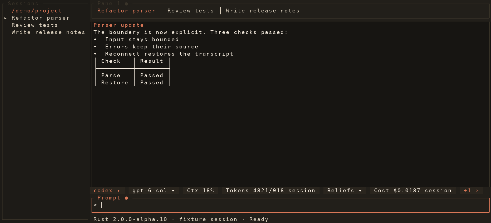
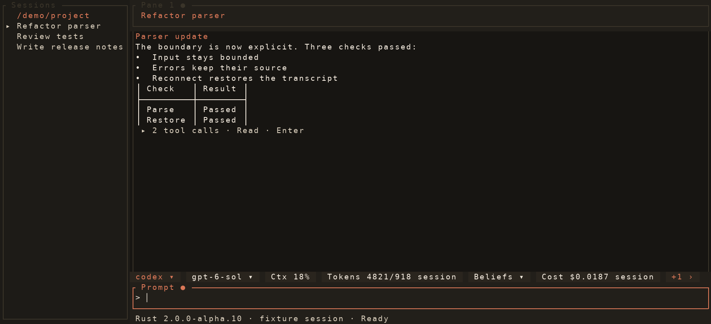
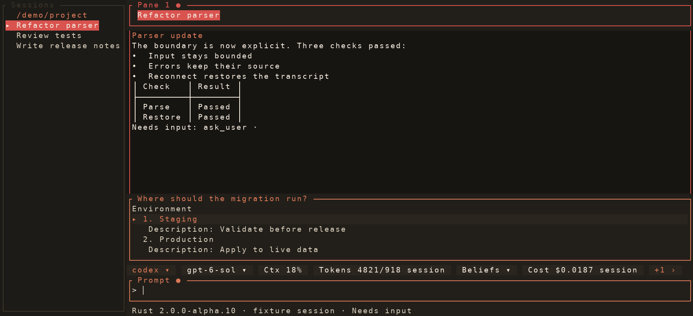
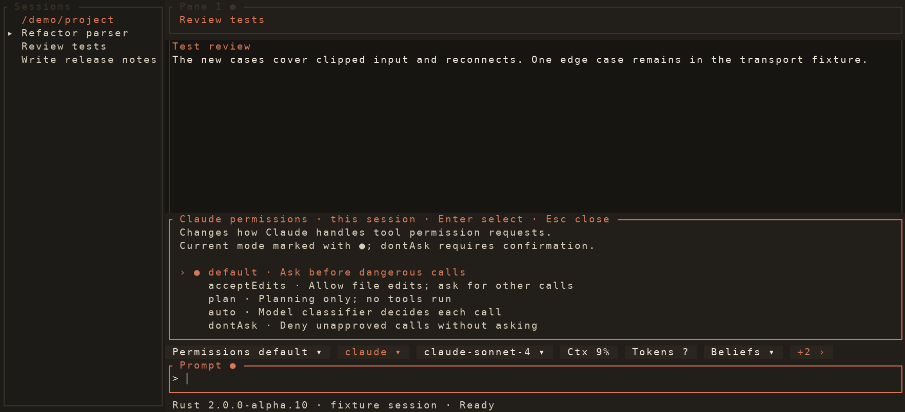
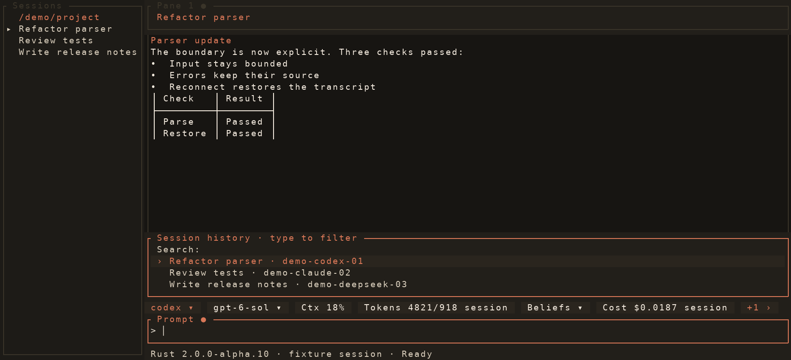

<p align="center"></p>

<p align="center">
  
  <a href="https://github.com/docwilde/doxa/releases"></a>
  <a href="https://github.com/docwilde/doxa/actions/workflows/rust-ci.yml"></a>
  
  
</p>

> [!WARNING]
> **Alpha.** Rust 2.0 is the main DOXA frontend. Config and on-disk formats
> can change between alpha releases. Agents
> can edit files and run commands with your privileges. Read
> [Non-goals](#non-goals) before using it on important work.

**DOXA** is a terminal for coding agents. Development now leads with the
**Rust 2.0 alpha**, built with Ratatui and a native daemon. Run Claude, Codex,
DeepSeek, or GLM in separate sessions; close the terminal and reattach to their
daemons later. Claude currently uses a bundled Python SDK sidecar.
[LORE](https://github.com/docwilde/LORE)
shares user and repo memory across DOXA, Claude Code, and Codex, with
evidence-backed beliefs and an informational source-engine label. See the
[engine setup and capabilities](rust/README.md) guide.



*The lead image and gallery below are rendered by the real Rust 2.0
Ratatui frontend from deterministic fixture events. No provider calls or
account data are used. The fixtures and renderer live in
[`scripts/rust_gallery.py`](scripts/rust_gallery.py).*

## What you get

Launch and reattach [four engines](rust/README.md), work
across grouped tabs and two-pane splits with separate prompts, inspect bounded
worktree diffs and tool cards, change supported models and permissions, and
browse LORE beliefs and peer activity. The [Rust guide](rust/README.md)
describes its current capabilities and limits. Worktree lifecycle, diff hunk
rejection, LORE proposal approval, fleets, and remote control are still being
ported.

## Gallery

### Rust 2.0 alpha.10



*Tool calls stay collapsed in the transcript until expanded.*



*A daemon input request expands above the active prompt.*



*The permission picker expands from the chip row above the active prompt.*



*Session history searches attached and archived transcripts.*

These images come from `python3 scripts/rust_gallery.py`, which renders the
production `doxa_tui::ui::App` through Ratatui's test backend. The sessions,
events, and usage numbers are fixtures; they are examples of UI behavior,
not a live provider run.

## Install

### Rust 2.0 alpha

```sh
curl -fsSL https://raw.githubusercontent.com/docwilde/doxa/main/scripts/install.sh | sh
```

The installer builds the Rust frontend and daemon from `main` and installs the
Rust `doxa` command in `~/.local/bin` (or `DOXA_RUST_BIN_DIR`). Pass a tag such
as `v2.0.0-alpha.10` after `sh -s --` to pin a release. It uses Git, Cargo,
Python 3.11+, and `uv`; the Python environment it creates is private to the
LORE and Claude sidecars. No Python frontend command is installed. See the
[Rust guide](rust/README.md) for provider setup and current limits.
If an older `uv tool` install owns `doxa`, run `uv tool uninstall doxa`
before installing Rust; the installer reports when another `doxa` on `PATH`
would shadow its launcher.

From a checkout, use `./task build`, `./task run`, or `./task install`. Install
builds committed `HEAD` with the same locked sidecars and launcher as the
release installer.

## Quickstart

Check dependencies, start a session, and reattach later:

```sh
doxa doctor --engine codex
doxa new --engine codex
doxa list
```

The [Rust guide](rust/README.md) covers Claude, DeepSeek, and GLM setup.

## Status

Rust 2.0 alpha is the main line. The [Rust guide](rust/README.md) tracks
what is implemented and what still needs porting. Existing Python 1.x releases
and their [manual](docs/manual.md) remain available for historical reference;
the Python SDK and LORE sidecar modules remain internal runtime dependencies.

Rust CI tests the frontend, native daemon, protocol, LORE bridge, installer,
and compatibility paths. See the [Rust UI benchmark](docs/rust-ui-benchmark-2026-09-25.md)
for rendering, event-loop, scrolling, and resize measurements.

## Non-goals

- **Automatic model routing:** you choose an engine per session; DOXA does
  not load-balance or fail over between providers.
- **Replacing LORE:** DOXA uses the same core as the Claude Code and Codex
  plugins.
- **Full Claude plugin compatibility:** the 2.0 alpha uses a Claude SDK
  sidecar. DOXA's [plugin API](docs/plans/plugin-api.md) remains a design.

## License

[AGPL-3.0-only](LICENSE) for everyone, including over a network; a
[commercial licence](LICENSE-COMMERCIAL.md) is available for uses AGPL's
terms don't suit. The DOXA name and mark are reserved — see
[TRADEMARK.md](TRADEMARK.md).
