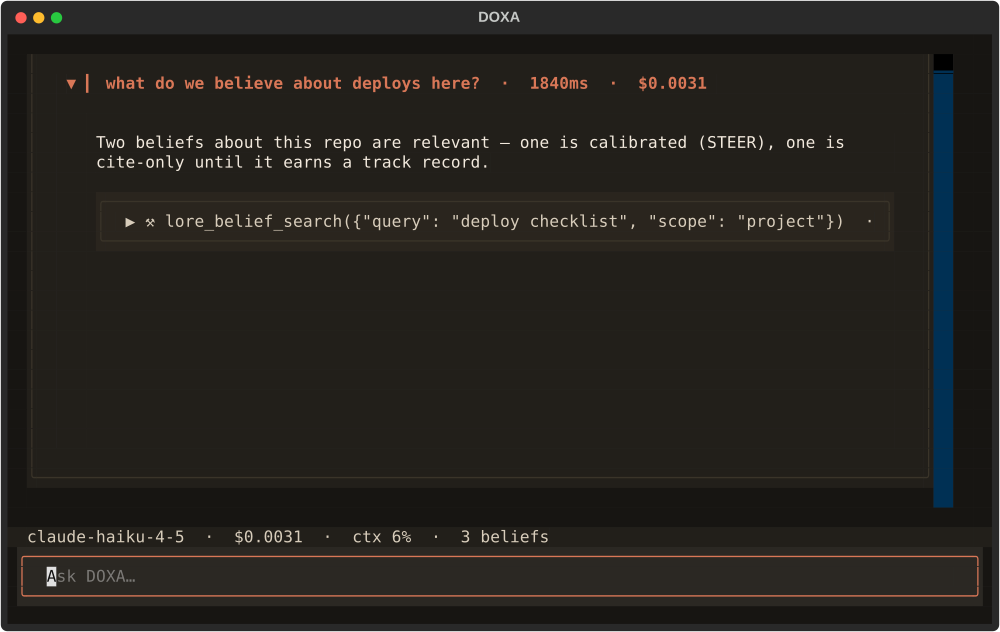

<p align="center"></p>

**DOXA** is a terminal for working with a Claude agent whose memory you can
audit — the native home for [LORE](https://github.com/docwilde/LORE)'s memory model,
built on the Claude Agent SDK (engine) and Textual (TUI), billed through your
Claude subscription, not API keys.

δόξα (*dóxa*): belief, opinion — as distinct from ἐπιστήμη (*epistēmē*),
justified knowledge. Greek epistemology drew the line; DOXA implements it.
Everything the agent derives starts as doxa: visible, queryable, cite-only.
Only what survives the dialectic — human approval, or a calibrated record of
being right — ascends to steer. LORE holds the engrams; DOXA is where they
are examined.

<p align="center"></p>

*The shell, headless-rendered from the real Textual app (scripted engine, no spend): turn blocks with cost/duration chips, foldable tool calls, the belief-count status bar. The session behind it is a detachable daemon -- close the terminal, `doxa attach` later, replay from your cursor.*

## The one property everything serves

**Nothing steers the agent that isn't human-approved or outcome-calibrated.**
Curated memory writes pass a review gate. Skills pass the same gate and carry
usage track records. Derived beliefs never enter context uninvited; at
decision time they split STEER (calibrated, may shape the call) from
CITE-ONLY (mention, never follow). Every new ingestion path routes through
one secret-scrubbing choke point. A terminal that owns the whole loop can
enforce this at every tool-call boundary — a plugin can only enforce it where
the host offers hooks.

## What DOXA is (functionality by subsystem)

**Engine — Claude Agent SDK daemon.** One daemon per session runs the agentic
loop: streaming completions, tool execution, subagents. Authenticates through
the local Claude Code OAuth session (subscription-billed — verified in the
Phase 0 spike, no `ANTHROPIC_API_KEY` involved). The TUI is a thin client
over a Unix socket, so sessions detach and reattach without tmux.

**LORE, in-process.** The memory system is imported as `lore_core`, not
shelled out to: hard-capped curated memory (user + project), the uncapped
belief store with its FTS index and evidence trails, the deriver / dreamer /
dialectic split, the calibration outcomes ledger, the pending-proposal review
gate, per-stage toggles. Same files, same SQLite database, byte-compatible
with the LORE Claude Code plugin — one codebase, two carriers.

**Native tools (registry discipline).** The LORE surface the agent calls —
belief search and inspection, curated-memory listing, session FTS — is an
explicit registry of frozen operator definitions (hand-written schemas, cost
tiers, a declared read/write posture), projected onto an in-process SDK MCP
server. Adding a tool is a reviewed act, never an import side effect; the
registry's closure is a test. Exactly one operator can write, and it doesn't:
`lore_remember` stages a pending proposal for the same human review gate
everything else passes — the model proposes, the user approves. Every call
routes through a containment gate at the PreToolUse choke point: calls
outside the offered set are gracefully denied, every operator failure comes
back as an ordinary error result the model can recover from, and a tool that
hard-fails twice is removed from the session's surface (`⊘` in the status
bar) instead of burning the step budget on retries.

**Blocks, panes, palette (Warp/tmux ergonomics).** Each turn is a foldable
block with metadata chips: model, duration, cost, exit code. Split panes —
agent | logs | belief-inspector — plus a read-only Profile pane showing the
derived interaction model live (transparency as the safeguard). Ctrl+P
command palette; Ctrl+R history search backed by LORE's own FTS index, so
search is instant BM25 over every session ever, not a scrollback scan.
Typing `/` at the start of the prompt opens a suggestion dropdown above the
input — the same command registry the palette reads, scored by the same
fuzzy matcher (one registry, two surfaces): arrows move, Tab/Enter
complete, Esc dismisses, deleting the `/` puts it away.

**Trace transparency (DeepSeek-harness grade, redaction kept).** Every tool
call is inspectable: exact arguments, full results, timing; subagent calls
nest as an indented, foldable tree under their parent. Traces persist and
are searchable. One deliberate divergence from the unredacted-by-design
reference: trace bodies pass the same scrubber as everything else —
`[REDACTED:kind]` markers inline, the call's shape fully visible, credential
payloads withheld.

**Streaming deriver.** Beliefs derive incrementally as the session runs
(debounced, capped per session, cheap-model only) instead of only at session
end — generalizing LORE's live-index watermark pattern. A belief minted
30 seconds ago obeys the same read-time gate as one minted last month: the
calibration gate is cadence-agnostic by construction. Landed shape: opt-in
via `DOXA_DERIVE_SECS=<secs>` (default off) — the engine runs lore_core's
incremental review against the session transcript at most once per
interval, never overlapping finalize, never more than one in flight; newly
staged proposals surface as a "N proposals staged — /lore:pending" block
and wait at the same human review gate as everything else.

**Multi-agent, isolated by default.** Parallel subagents each run in their
own git worktree with a single-consumer merge queue (agents race to finish;
merges land one at a time — conflict flags the pane, never clobbers the
checkout). An opt-in container tier (rootless Podman) sandboxes risk-classed
tasks: only the task's worktree mounted, no credentials inside the container
at all — the SDK loop and its OAuth stay on the host.

**Peer sessions.** Independently launched DOXA sessions discover each other
when they work on the same repo: every live session registers in a
same-user runtime registry (0700; dead entries reaped on sight, never
trusted), the status bar counts your same-repo peers, and messaging is
explicit — `/peers` lists them, `/msg <session> <text>` sends one frame
over the target's own Unix socket. Received text is treated as what it is:
another agent talking. It passes the same `[REDACTED:kind]` scrubber as
everything else, renders in its own dimmed block, waits for your next turn
(a peer can never start or interrupt one), and reaches the model only
behind an explicit untrusted-peer preamble — peer data to weigh, never an
instruction to follow. The registry entry points at whoever hosts the
engine, so the layer survives the Phase 2 daemon split unchanged.

**Identity you can trust, auth DOXA never touches.** The session-start
identity block and the status line report the plan you actually have. The
SDK's connect-time account block gives `subscriptionType` — a coarse
display string that cannot tell a Max 5x from a Max 20x — so DOXA prefers
the precise field the Claude Code CLI already keeps locally
(`organizationRateLimitTier` = `default_claude_max_20x` → `max 20x`),
falls back to the SDK string, and shows nothing at all when neither exists.
Plan and organization are separate lines, always: an org name is
informative and is never rendered as the plan. `/login [provider]` and
`/logout [provider]` suspend the TUI and exec the provider's *own*
interactive auth CLI (`claude auth login`, `codex login` — probed, not
assumed), then resume and re-read identity. No credential is ever handled,
stored, or written by DOXA; the provider table is data, so another agent
CLI is a row, not a code path.

**Claude Code plugin compatibility.** DOXA loads existing Claude Code
plugins: hooks (all observed events, both manifest conventions) and slash
commands first; skills and tool-scoped custom agents next. Verified against
a real plugin set, not a spec — because there is no public spec, and the
compat layer ships with regression fixtures for exactly that reason.

**Crush-grade look, Claude-orange.** Rounded borders, OKLab gradient
accents, pill chips, dimmed modal overlays, native Markdown rendering — a
dark theme built on `#D97757`. Calibration is encoded visually: `▲ STEER`
is a filled orange pill; `○ CITE` is outline-only — a belief that hasn't
earned color. The context-usage chip turns amber, then red, as a containment
signal, not decoration.

## Status

Phase 0 (validation spike) is complete — see `PHASE0_FINDINGS.md`:
subscription auth confirmed, PreCompact and UserPromptSubmit hooks fire,
SessionStart fires (despite missing type hints), SessionEnd is absent (the
daemon finalizes sessions itself — deterministic beats hoping a hook fires).
Verdict: GO with four small redesigns, all itemized.

| Phase | Scope | State |
|---|---|---|
| 0 | SDK lifecycle validation, Textual coexistence, auth | **done** |
| 1 | `lore_core` extraction; single-pane shell; block rendering; session-end review; ask | **done** |
| 2 | Daemon split + detach/reattach, Ctrl+P palette, Ctrl+R FTS history search, theme | **done** |
| 3 | Warp-style tabs (sketch below), split panes + review pane, streaming deriver, multi-agent panes + merge queue, act-time consult, trace tree | **in progress** — landed: terminal images (KGP → sixel → half-block → text ladder; tool results + `/img`); tabs (`SessionPane` under `TabbedContent`, one client per tab, Ctrl+T/Ctrl+W + palette picker); trace tree (subagent calls nest foldably under their Task chip via the SDK's `parent_tool_use_id`, scrubbed); streaming deriver (`DOXA_DERIVE_SECS`, debounced, never concurrent with finalize); act-time consult (cheap FTS belief note on the prompt, cite-only, `DOXA_CONSULT_FLOOR`). Remaining: split panes + review pane, multi-agent panes + merge queue |
| 4 | Container isolation tier, calibration dashboard, plugin-compat hardening | planned |

**Tab system (Phase 3 — landed as sketched, with one documented
divergence).** The sketch below is what shipped: `SessionPane` extraction
first (pure refactor), then N panes under a `TabbedContent`, one
`EngineClient`/engine handle each, worker groups scoped per pane node.
`Ctrl+T` opens a fresh same-repo session in a new tab; `Ctrl+W`
close-detaches just that tab (its daemon keeps running; the last tab closes
the app); the palette gained "New tab", "Close tab" and a tab picker, and
its "Quit: stop session" became tab-scoped. The divergence: `Ctrl+C` stays
**app-level** — one press detaches ALL tabs, a double press stops ALL
sessions — because a reflex keystroke should always get the
cheapest-to-recover outcome; deliberate per-tab stopping lives in the
palette and `Ctrl+W`, where you are looking at the tab you mean.

**Original sketch (kept for the record).** The
daemon split already did the hard part: a session is a process, the TUI is a
thin `EngineClient`, and `_switch_engine` proves the shell can swap live
handles. Tabs are therefore N clients in one TUI, not N engines: a
`TabbedContent` (or a custom one-line tab bar) across the top, where each
tab owns exactly the per-session widget subtree the single pane owns today —
block list, status bar, prompt input — plus its own `EngineClient`, git
chip, and boot/pump workers (worker groups keyed by tab id, so an exclusive
pump dies with its tab, not with its neighbor). `Ctrl+T` and a palette "New
tab" spawn a fresh daemon **in the same repo scope** (exactly
`new_session_factory`) and attach it in a new tab; the attach picker gains
"open in new tab" so a foreign session reattaches without evicting the
current one. Closing a tab is quit-detach for that client only; quit-stop
stays per-tab; Ctrl+C keeps its double-press semantics but scoped to the
active tab, and closing the LAST tab closes the app. The peer layer needs
zero changes — each daemon already registers its own presence, so two tabs
of the same repo see each other as peers, which is correct and useful.
Migration path: extract today's single-pane subtree into a `SessionPane`
widget first (pure refactor, tests unchanged), then mount N of them under
`TabbedContent`. 

## Detach/reattach

Since Phase 2 a DOXA session is a process of its own: `uv run doxa` spawns a
session daemon (`doxa/daemon.py`) that hosts the engine — the SDK client,
the LORE hooks, the transcript, the peer presence entry — and attaches the
TUI to it as a thin client over a 0600 Unix socket (line-JSON frames, the
same idioms as the peer layer; the hello frame is version-stamped so a
mismatched client backs off instead of misparsing). Closing the TUI
(`ctrl+q`, or the palette's "Quit: detach") leaves the session running; no
tmux involved. `doxa attach [prefix]` reattaches from anywhere: the daemon
replays its bounded, seq-numbered ring of recent events from your cursor,
then the live tail follows on the same stream. Running `doxa` again in the
same repo reattaches to that repo's most recent live session; `doxa new`
forces a fresh one. The daemon finalizes the session — the LORE review +
index that used to run on TUI quit — once the **last** client has been
detached for `--linger` seconds, or immediately on `doxa stop` (or the
palette's "Quit: stop session"). Discovery reuses the peer registry: a
daemon-hosted session's entry carries a `daemon_socket` marker — one
surface for peers and attach alike, and the peer layer itself survived the
split unchanged, exactly as its docstring promised. `doxa --in-process`
keeps the Phase 1 shape (engine inside the TUI, quit finalizes at once).

## Run it

Phase 2 status, honestly: single pane still (split panes and the review
pane moved to Phase 3), but the session is now a detachable daemon, `ctrl+p`
opens the command palette (new session, attach picker over live sessions,
peers, belief-inspector stub, quit-detach vs quit-stop), and `ctrl+r` opens
history search — instant BM25 over LORE's index of every past session, a
chosen hit inserting its session reference into the prompt. One prompt
input at the bottom, a scrolling list of foldable turn blocks above it, a
status bar (model · repo `⎇` branch · `sub:<tier>` on subscription auth or
the `$` estimate on API-key auth · context estimate · active belief count ·
`⌁` reattach handle). Session start renders an identity block — account,
plan, model, cwd, repo, LORE store — from the fields the CLI actually
reports, never guesses. `Ctrl+C` quits: one press detaches (daemon keeps
running), a second press within 2s stops the session (finalize now).
Billed through your Claude subscription — authenticates via the local
`claude` CLI's own OAuth session, same as `PHASE0_FINDINGS.md` verified;
no `ANTHROPIC_API_KEY` needed or read.

```sh
uv sync
uv run doxa          # spawn-or-attach this repo's session
uv run doxa new      # force a fresh session
uv run doxa attach   # reattach (add a session-id/title prefix if several)
uv run doxa stop     # finalize now: LORE review + index, daemon exits
```

`uv run doxa` resolves the current directory as the session's cwd (and the
LORE project scope the same way the LORE plugin does — the git repo root
when you're inside one). Type a prompt, press enter; `ctrl+q` **detaches**
— the daemon keeps the session alive and finalizes (the host-driven
session-end review + index, `PHASE0_FINDINGS.md` redesign item 1) only
after `--linger` seconds with no client attached, or immediately on
`doxa stop`. `doxa --in-process` keeps the Phase 1 single-process shape,
where `ctrl+q` finalizes on the spot.

`lore_core` is picked up from the LORE Claude Code plugin's marketplace
checkout via a `sys.path` shim (`doxa/_lore_bootstrap.py`), documented there
as temporary until `lore_core` ships to PyPI. Override its location with
`DOXA_LORE_CORE_PATH` if your marketplace checkout lives somewhere other
than `~/.claude/plugins/marketplaces/lore`.

Run the tests with `uv run pytest`.

## Commands

`/help` prints this list — it is generated from the one command registry
(`doxa/commands.py`), which the Ctrl+P palette and the prompt's `/`
autocomplete also read, so no surface can drift from another.

What the Claude-Code-shaped commands do is bounded by what the SDK
actually supports, and each one was implemented only that far:

| command | what it really does |
|---|---|
| `/model [name]` | **Live.** `ClaudeSDKClient.set_model` is a control request, so the model changes for subsequent turns with **no reconnect** — transcript, daemon, replay ring, peer presence and hooks all survive. The chosen model is also written to the settings file: the `model` row and this command are one state. |
| `/effort [level]` | **Connect-time only.** `ClaudeAgentOptions.effort` (the CLI's `--effort`) has no control-request counterpart, so this sets the level for *new* sessions and says plainly that the running one keeps its own. It is not a live knob and does not pretend to be. |
| `/usage` | Measured numbers only: token counts and turn count summed from the CLI's own per-result `usage` block, plus the subscription headroom the `claude` CLI itself fetched and cached (`cachedUsageUtilization` — session %, weekly %, per-model weekly % with its severity). Nothing cached ⇒ nothing shown. |
| `/clear` | A **fresh session in this tab**: the old handle is finalized (LORE review + index), the transcript rotates to the new session's file, the tab stays. Distinct from Ctrl+T (new tab) and from scrolling away (the context is gone because the session is). |
| `/compact` | Registered but deliberately **not intercepted** — the literal prompt text is what makes the CLI compact and what fires the `PreCompact` hook the deriver hangs off. There is no typed `compact()` in the SDK (`PHASE0_FINDINGS.md` §6). |
| `/login`, `/logout` | The provider's own auth CLI, under a suspended TUI. |
| `/settings` | The settings modal (`Ctrl+,`). |
| `/peers`, `/msg`, `/img` | Peer listing, peer message, image-ladder probe. |

## Configuration

**Precedence, everywhere: environment > config file > default.** An
environment variable is a deliberate act with a narrower scope than a file
(a shell, a launcher, a systemd unit, a test), so it beats the file it
cannot see. The file is `$XDG_CONFIG_HOME/doxa/config.toml` (else
`~/.config/doxa/config.toml`), written by the settings modal — `Ctrl+,`,
`/settings`, or the palette's *Settings* entry — and safe to hand-edit
(0600, plain TOML). Emptying a field removes the key, which returns that
knob to its default. Keys DOXA doesn't recognize are preserved on save, so
a file written by a newer version survives an older one.

The modal lists only knobs that already do something, and each row names
the code that reads it. A row whose environment variable is set is marked
`[env]` and says what the environment is forcing — an edit that cannot
take effect says so rather than silently doing nothing.

| setting | env | default | read by |
|---|---|---|---|
| `model` | `DOXA_MODEL` | CLI default | `doxa.cli --model` (and `/model` for the live session) |
| `effort` | `DOXA_EFFORT` | CLI default | `doxa.engine.effort_level` → `ClaudeAgentOptions.effort` — connect-time only |
| `derive_secs` | `DOXA_DERIVE_SECS` | off | `doxa.engine.derive_interval` — streaming-deriver debounce |
| `linger_secs` | `DOXA_LINGER_SECS` | 120 | `doxa.cli --linger` — daemon detach-to-finalize window |
| `consult_floor` | `DOXA_CONSULT_FLOOR` | 1.0 | `doxa.engine.consult_floor` — act-time belief consult; 0 disables |
| `nerd_font` | `DOXA_NERD_FONT` | off | `doxa.app.git_branch_symbol` — branch glyph |
| `image_mode` | `DOXA_IMAGE_MODE` | probe | `doxa.images.detect_mode` — force a rung of the image ladder |
| *lore store* | `LORE_ROOT` | `~/.claude/lore` | `lore_core.ROOT` — shown read-only |

There is deliberately no theme row: DOXA ships one theme, and a settings
menu that lists an inert choice teaches the user that the menu lies.

## Non-goals

Provider-agnostic model routing (the subscription-auth path is the point);
replacing the LORE plugin (it keeps shipping — same core, one gets the fixes
of the other); general Claude Code plugin compatibility claims (scoped to
tested plugins at tested versions — the contract is reverse-engineered and
Anthropic may change it any release).

## License

[DOXA Noncommercial License 1.0](LICENSE) (PolyForm-Noncommercial-derived) — free for personal use, research, education, and noncommercial organizations; commercial use requires a separate arrangement with the author. Same license family as [LORE](https://github.com/docwilde/LORE), whose `lore_core` DOXA embeds.
