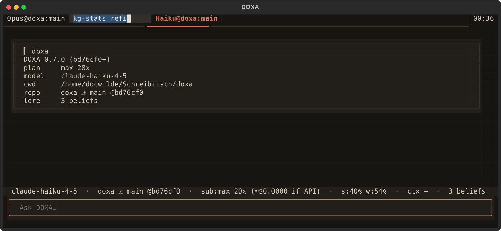
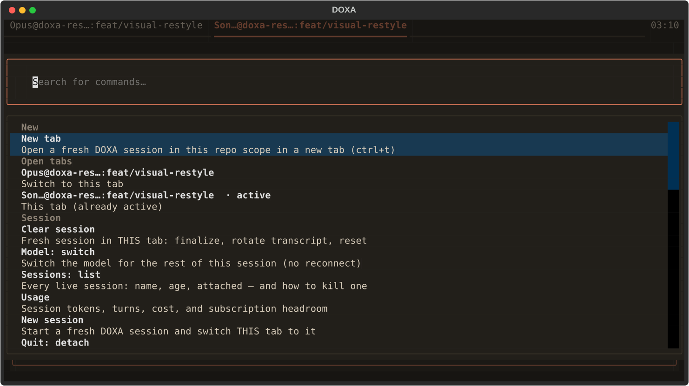
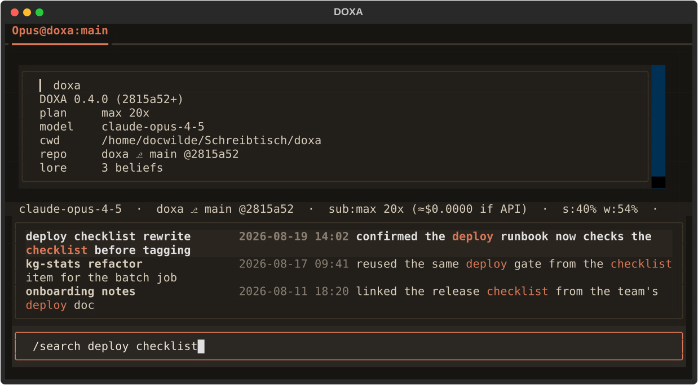

<p align="center"></p>

**DOXA** is a terminal for working with a Claude agent whose memory you can
audit — the native TUI home for [LORE](https://github.com/docwilde/LORE)'s
memory model, built on the Claude Agent SDK and Textual, billed through your
Claude subscription rather than an API key.

δόξα (*dóxa*): belief, opinion — as distinct from ἐπιστήμη (*epistēmē*),
justified knowledge. Everything the agent derives starts as belief:
visible, queryable, cite-only. Only what a human approves, or what earns a
track record, steers the next answer. LORE holds the beliefs; DOXA is where
you watch them form.

<p align="center"></p>

*Headless-rendered from the real Textual app (a scripted session, no
spend, fake account numbers). A session is a detachable daemon: close the
terminal, `doxa attach` later, and the transcript resumes where it left
off. Every screenshot below is generated the same way by
[`scripts/screenshot.py`](scripts/screenshot.py).*

## Install

```sh
curl -fsSL https://raw.githubusercontent.com/docwilde/doxa/main/scripts/install.sh | sh
```

Checks for Python 3.11+, [`uv`](https://docs.astral.sh/uv/) (offers to
install it if missing), `git`, and the
[`claude` CLI](https://docs.claude.com/en/docs/claude-code) signed in
(`claude auth login`) — DOXA authenticates through that CLI's own OAuth
session and never reads `ANTHROPIC_API_KEY` — then installs with `uv tool
install git+https://github.com/docwilde/doxa` (never PyPI; DOXA isn't
published there). Re-running it is safe: it never touches an existing
`~/.doxa/config.toml`, and picks up whatever changed on `main` since the
last run. Install a specific tag instead of `main`'s HEAD with
`sh -s -- v0.5.0`.

Piping a stranger's script into `sh` deserves a second look first:

```sh
curl -fsSL https://raw.githubusercontent.com/docwilde/doxa/main/scripts/install.sh -o install.sh && less install.sh   # then: sh install.sh
```

Or clone-and-run from a source checkout instead of installing at all:

```sh
git clone https://github.com/docwilde/doxa && cd doxa
uv sync
uv run doxa
```

## Quickstart

```sh
uv run doxa          # spawn a session here, or attach this repo's most recent one
uv run doxa new      # force a fresh session instead of attaching
uv run doxa attach   # reattach by session id / title prefix
uv run doxa stop     # finalize now (LORE review + index), daemon exits
```

`uv run doxa` spawns a session **daemon** — a process of its own — and
attaches the TUI to it as a thin client over a Unix socket. Closing the TUI
(`ctrl+q`, or the palette's "Quit: detach") leaves the daemon running with
no tmux involved; running `doxa` again in the same repo reattaches to it.
The daemon finalizes the session (LORE's review + index pass) once every
client has been detached for `--linger` seconds (120 by default), or
immediately on `doxa stop`. `doxa --in-process` runs the engine inside the
TUI instead, with no daemon and no detach — quitting finalizes on the spot.

Once you're in: type a prompt, press enter. `ctrl+p` opens the command
palette, `ctrl+t` opens a new tab, `/help` lists every command and key
binding.

## Features

**LORE, in-process.** The memory system is imported as `lore_core`, not
shelled out to: hard-capped curated memory (user + project), an uncapped
belief store with an FTS index and evidence trails, the same review gate a
human clears before anything is written. It is the same SQLite database
the LORE Claude Code plugin uses — one store, two carriers — so switching
between the plugin and DOXA never forks your memory. A tool call against
that store renders as an ordinary foldable chip; opened up, it shows the
exact arguments and the exact result text — here, one calibrated belief
(`STEER`, with its outcome count) and one still cite-only:

<p align="center"></p>

**Tabs.** `SessionPane` widgets mount under a `TabbedContent`, one engine
client per tab. `ctrl+t` opens a fresh session in a new tab (same repo
scope); `ctrl+w` closes a tab and detaches its daemon (the session keeps
running); `ctrl+←`/`ctrl+→` cycle tabs. Outside a git repo, or once a
custom name is cleared, a tab names itself from its first turn with one
cheap Haiku call, cached in `~/.doxa/names.toml` so a session is never
renamed twice. Double-clicking a tab header (or `/rename`) opens an inline
editor in the tab strip itself; Enter commits, Esc cancels, an empty name
restores the automatic label:

<p align="center"></p>

**Command palette and `/` autocomplete.** `ctrl+p` opens a palette listing
new-tab, the open tabs (in tab-bar order, active one marked), every
registered command grouped (Session · Memory · Panes & tabs · Tools &
config · Maintenance), then live sessions available to attach. Typing `/`
at the start of the prompt opens the same list as a dropdown above the
input. Both read one registry (`doxa/commands.py`); a command cannot exist
on one surface and not the other.

<p align="center"></p>

**`/search`.** Full-text search over LORE's session index, live in a popup
the moment you type `/search `. Debounced and sequence-guarded, so a slow
query can never repaint over a newer one's results; an empty query lists
recent sessions. This is the one search path — `ctrl+r` opens it too. The
matched terms are FTS5's own `snippet()` output, highlighted rather than
re-matched:

<p align="center"></p>

**Trace tree.** A subagent spawned by the `Task` tool streams its own text
and tool calls, which nest as a foldable tree under the parent chip rather
than interleaving with the main thread. Formatting happens lazily, only
once a chip is opened, and subagent text passes the same secret-scrubber
as everything else before it reaches a block:

<p align="center"></p>

**Terminal images.** A detection ladder — Kitty graphics protocol → sixel →
half-block cells → a plain `[image: ...]` text line — so a tool result or
`/img <path>` degrades gracefully on any terminal instead of failing on
one that doesn't support graphics.

**Peer sessions and `/sessions`.** Independently launched DOXA sessions on
the same repo discover each other through a same-user runtime registry:
the status bar's `peers N (k⌁)` chip counts live peers and how many are
detached, `/peers` lists them, `/msg <session> <text>` sends a message
over the target's own socket. Received peer text renders in its own
dimmed block and reaches the model, if at all, behind an explicit
untrusted-peer preamble — data to weigh, never an instruction to follow.
`/sessions` lists every live session with its age and whether it's
attached here or running detached, with a kill command for either:

<p align="center"></p>

**Settings.** `ctrl+,` opens a modal grouped into category tabs (Session ·
Memory · Appearance · Paths · About). Every row shows its effective value
next to where it came from — session, config file, or default — so a
value the environment is shadowing is never mistaken for one the modal can
edit:

<p align="center"></p>

**Identity and auth.** The session-start block and status line report the
plan you actually have — DOXA prefers the precise tier the `claude` CLI
keeps locally over the SDK's coarser `subscriptionType` string, and shows
nothing rather than a guess when neither is available. `/login [provider]`
and `/logout [provider]` suspend the TUI and exec the provider's own
interactive auth CLI; DOXA never handles or stores a credential itself.

**No animated chrome.** The in-flight turn marker is a static `⋯ thinking`,
not a spinner, and there is exactly one timer anywhere in the app —
Textual's own 2 Hz caret blink on the focused prompt. A test asserts no
other timer is ever armed, with every overlay open.

**Status bar**, left to right: model · `repo ⎇ branch @sha` · subscription
headroom (`s:9% w:48%`, session/week) or a `$` cost estimate on API-key
auth · context-window percentage (escalates normal → amber ≥70% → red
≥90%, percentage always shown) · belief count · `⌁ session <id>` reattach
handle · peers.

## Configuration

Precedence is the same everywhere: **environment > `~/.doxa/config.toml` >
default.** The file is plain TOML, 0600, and safe to hand-edit; it's also
what the settings modal (`ctrl+,` / `/settings`) writes. Clearing a field
in the modal removes that key, which returns the setting to its default.
Unrecognized keys are preserved on save, so a file written by a newer DOXA
survives being opened by an older one.

| setting | env | default | what it controls |
|---|---|---|---|
| `model` | `DOXA_MODEL` | CLI default | model for new turns (`/model` also switches live) |
| `effort` | `DOXA_EFFORT` | CLI default | reasoning effort, new sessions only (connect-time SDK option) |
| `derive_secs` | `DOXA_DERIVE_SECS` | off | streaming-deriver interval; unset runs review only at session end |
| `linger_secs` | `DOXA_LINGER_SECS` | 120 | seconds a daemon outlives its last detached client |
| `consult_floor` | `DOXA_CONSULT_FLOOR` | 1.0 | act-time belief-consult threshold; 0 disables it |
| `nerd_font` | `DOXA_NERD_FONT` | off | use a Nerd Font glyph for the branch chip |
| `image_mode` | `DOXA_IMAGE_MODE` | probe | force a rung of the image ladder (`kgp`/`sixel`/`halfblock`/`text`) |
| *lore store* | `LORE_ROOT` | `~/.claude/lore` | `lore_core`'s own store path (read-only here) |

The settings modal shows every row's **effective** value next to where it
came from (`900 (config)`, `120 (default)`, `1 (env DOXA_NERD_FONT)`); a
row the environment is winning is read-only, because an edit that a live
environment variable would immediately shadow is a silent no-op.

`~/.doxa/` holds durable state (this config); the runtime directory
(`$DOXA_RUNTIME_DIR` → `$XDG_RUNTIME_DIR/doxa` → `~/.local/share/doxa`)
holds ephemeral daemon sockets and the peer registry — kept out of the
home directory because a home directory can be network-mounted, where Unix
sockets misbehave. The LORE store is neither: it stays `lore_core`'s own
path, shared with the LORE Claude Code plugin on purpose, so switching
between the two never forks your memory into two divergent halves.

## How it works

Each session runs as its own **daemon process** hosting the Claude Agent
SDK client, the LORE hooks, and the transcript; the TUI is a thin client
attached over a 0600 Unix socket, so detaching and reattaching never
depends on the terminal that started the session staying open. Every tool
call the agent makes passes a containment gate at the PreToolUse
boundary — a call outside the declared tool registry is denied, and a tool
that fails twice in a session is disabled for the rest of it rather than
retried into the step budget.

LORE's memory model is summarized above; the full model — curated memory,
the belief store, the derive/dream/dialectic split, calibration — is
documented in the [LORE repository](https://github.com/docwilde/LORE),
which DOXA embeds as `lore_core` rather than reimplementing.

`lore_core` currently ships inside the LORE Claude Code plugin's
marketplace checkout, not as an installable package, so DOXA locates it
with a `sys.path` shim (`doxa/_lore_bootstrap.py`) documented there as
temporary. Override the location with `DOXA_LORE_CORE_PATH` if your
checkout isn't at the default `~/.claude/plugins/marketplaces/lore`.

## Status

DOXA is a working daily driver for its author, not a finished product.
Shipped so far: the daemon/detach model, tabs, the command palette,
`/search`, the trace tree, the image ladder, peer discovery, the settings
modal described above, and the `curl | sh` installer — see
[CHANGELOG.md](CHANGELOG.md) for the version-by-version history. Not yet
built: a first-run setup flow, a `/doctor` health check, session-history
drill-in past `/search`'s result list, customizable keybindings, and a
graphical context-window map. Interfaces (config keys, socket protocol,
command names) can still change between minor versions.

Run the test suite with `uv run pytest`.

## Non-goals

Provider-agnostic model routing — the point is subscription auth, not a
router. Replacing the LORE Claude Code plugin, which keeps shipping the
same core. General Claude Code plugin compatibility — DOXA does not load
third-party plugins today.

## License

[DOXA Noncommercial License 1.0](LICENSE) (PolyForm-Noncommercial-derived)
— free for personal use, research, education, and noncommercial
organizations; commercial use requires a separate arrangement with the
author. Same license family as [LORE](https://github.com/docwilde/LORE),
whose `lore_core` DOXA embeds.
