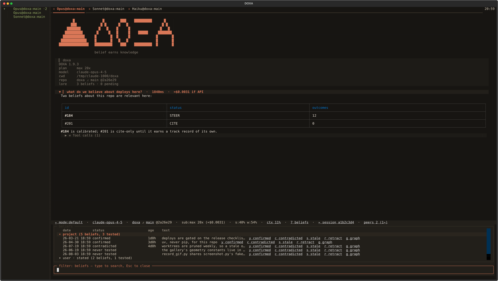
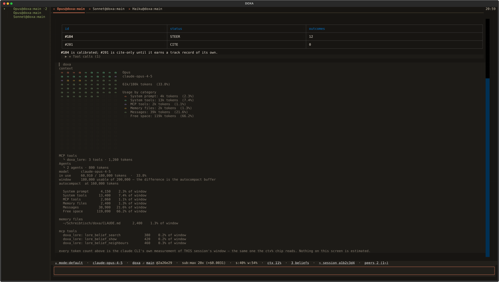
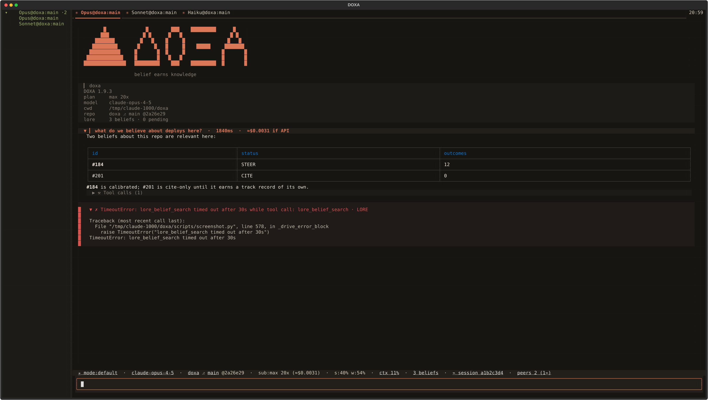
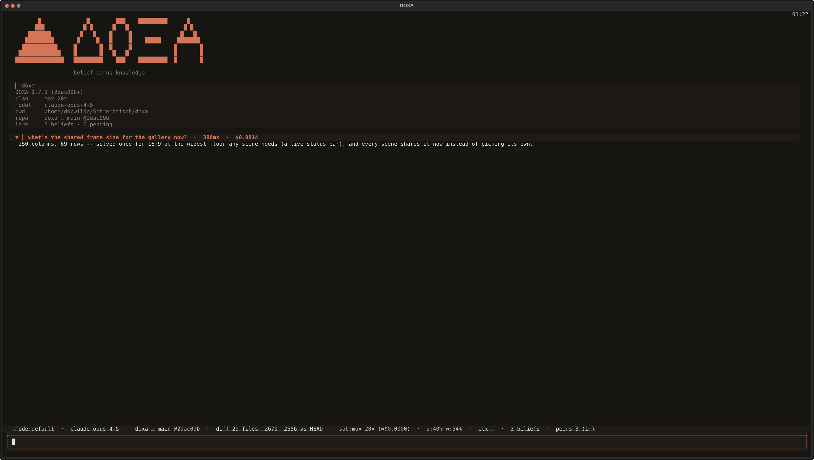

<p align="center"></p>

<p align="center">
  
  <a href="https://github.com/docwilde/doxa/releases"></a>
  <a href="https://github.com/docwilde/doxa/actions/workflows/ci.yml"></a>
  
  
  
  
  
  <a href="LICENSE"></a>
</p>

> [!WARNING]
> **Alpha — work in progress.** DOXA is `0.x` and moves daily: interfaces,
> keybindings, config keys and on-disk formats change between releases without
> a migration path, and releases are cut in hours rather than weeks. It is
> feature-incomplete by design — several surfaces documented under
> [Status](#status) are specifications with nothing built behind them.
>
> What that means concretely for you: it runs an agent that edits your files
> and, since v0.36.0, a shell that runs with your privileges. It is tested
> (the suite is real and gates every release) but it is not battle-tested —
> it has one author, and most defects so far were found by using it, not by
> the tests. Read [Non-goals](#non-goals) before adopting it for anything you
> would be upset to lose.

**DOXA** is a terminal for Claude agents whose sessions outlive your
window and whose memory of your own codebases you can actually watch
form — built on the Claude Agent SDK and Textual, billed through your
Claude subscription rather than an API key.

A session runs in a **daemon** of its own: close the terminal, walk away,
`doxa attach` an hour later, and the transcript picks up exactly where it
left off — nothing lost, no tmux involved. See the [manual](docs/manual.md)
for the full session, tab and worktree model.

Start it inside a repository and the session already knows the project.
Durable facts about this codebase — conventions, past workarounds,
corrections a human already made once — are injected before your first
prompt, per-repo rather than global. Every durable conclusion the agent
reaches goes through the same gate before it can shape a later answer: it
starts as a **belief** — visible, queryable, citable but never acted on —
and only gains real influence by being approved by a human or by building
an actual track record of being right. That is what the tagline means
literally, not as a slogan: *where belief earns knowledge* — an idea has
to earn its way from opinion to something the agent will actually rely
on. See [LORE integration](docs/manual.md#lore-integration) for the full
memory model and the review gate.

The memory engine underneath all of this is
[LORE](https://github.com/docwilde/LORE), which also ships as a
standalone Claude Code plugin; DOXA compiles it in-process
(`lore_core`, imported, not shelled out to) rather than requiring the
plugin to be installed — one memory model, two front ends.

Since LORE 0.41.0 the belief store also carries typed edges *between*
beliefs — `depends_on`, `specializes`, `explains`, `contradicts`,
`applies_when` — derived the same way beliefs themselves are, with
support counted in distinct sessions and a path's confidence the product
of its hops, so a long chain of plausible steps is weak by construction.
Structure earns no authority: a belief reached by following an edge is
still CITE-only unless it earned STEER on its own. DOXA gets this because
it imports `lore_core` in-process — available to the engine, not yet
surfaced in the interface.

δόξα (*dóxa*): belief, opinion — as distinct from ἐπιστήμη (*epistēmē*),
justified knowledge. The name is the thesis: belief is the raw material,
never the finished thing.

<p align="center"></p>

*Headless-rendered from the real Textual app (a scripted session, no
spend, fake account numbers). Every screenshot and GIF below is generated
the same way, by [`scripts/screenshot.py`](scripts/screenshot.py) and
[`scripts/record_gif.py`](scripts/record_gif.py).*

## What you get

- **Sessions that outlive the window.** Each session is its own daemon
  process behind a Unix socket; closing the terminal detaches instead of
  killing it, and `doxa attach` picks the transcript back up later, no
  tmux involved. `doxa` restores a whole repo's saved tab set — order,
  names, active tab, and each tab's conversation. See
  [Sessions and the daemon](docs/manual.md#sessions-and-the-daemon) and
  [Tabs](docs/manual.md#tabs).
- **Reasoning and tool calls, on the record.** Replies stream as real
  markdown. Above each reply, the model's summarized reasoning streams into
  a collapsed fold; a turn's tool calls compact behind a `Tool calls (N)`
  fold whose chips open to their exact arguments and result — a memory-store
  call is an ordinary chip like any other.
- **Pictures, or a straight answer about why not.** Images fall back through
  kitty graphics → sixel → half-block cells → text, settled by one probe
  run before the TUI takes stdin. `/img` reports which tier this terminal
  actually answered for. See [Images](docs/manual.md#images).
- **Subagents you can follow while they run.** A `Task`-spawned subagent
  gets its own status row and a live, read-only transcript tab; once it
  finishes, the same activity folds into a tree under its parent chip.
- **Memory that is inert until it earns influence.** LORE's `lore_core`
  runs in-process: curated memory, an uncapped belief store threaded with
  typed relations between beliefs, and one write path — a human approving
  a staged proposal, one row at a time. Nothing reaches the model's
  context unsupervised. See
  [LORE integration](docs/manual.md#lore-integration).
- **A shell the model cannot reach.** A prompt line starting with `!` runs
  in this session's own worktree with your full privileges and no
  confirmation — and neither the command nor its output ever enters the
  model's context. See [Shell escape](docs/manual.md#shell-escape).
- **Sessions that can be made to talk to each other.** Independently
  launched sessions on the same repo discover each other and can exchange
  messages via `/msg` — always sent by a human; the model has no send tool.
- **A permission mode you can see and change without leaving the
  keyboard.** `shift+tab` cycles it, the status bar's `mode:` chip always
  shows it first. `auto` and `bypassPermissions` mean DOXA stops asking
  before a tool runs, and both are visibly flagged when active. See
  [Permission modes](docs/manual.md#permission-modes).
- **Numbers that were measured, not estimated.** The status bar carries
  mode, model, repo/branch/sha, subscription headroom, context %, belief
  count, memory fill, staged proposals, session handle and peers — every
  chip has a tooltip. `/context` breaks the window down using the `claude`
  CLI's own accounting; nothing here is a guessed token count. See
  [The status bar](docs/manual.md#the-status-bar).
- **Worktree isolation, never auto-merged.** Each session gets its own git
  worktree and branch by default, so two sessions on one repo cannot stomp
  each other. A clean, unmerged worktree vanishes with the session;
  anything real is kept for you to merge by hand. See
  [Worktrees and finalize](docs/manual.md#worktrees-and-finalize).
- **The spawned CLI gets its own config, plugins and hooks excluded by
  default.** Every session's `claude` process is isolated behind its own
  `CLAUDE_CONFIG_DIR` — none of your installed Claude Code plugins, their
  hooks or their commands load into it unasked. `/plugins` previews what
  you have installed; turning `adopt_plugins` on (off by default) carries
  in their commands, skills and agents only — never their hooks or MCP
  servers, and never the LORE plugin, since `lore_core` already runs
  in-process here. See [`docs/plans/plugins.md`](docs/plans/plugins.md).

Three smaller invariants hold the rest together: the palette and `/`
autocomplete read one command registry, so a command cannot exist on one
surface and not the other; `AskUserQuestion` and permission requests get a
real dialog, a blinking tab and a desktop notification, where a headless
SDK run with no callback would silently auto-deny both; and precedence is
**environment > `~/.doxa/config.toml` > default** everywhere, with the
settings modal (`ctrl+,`) showing each row's effective value and where it
came from.

For the full walkthrough — every command, every key, every setting and its
default — see the **[manual](docs/manual.md)**.

## Gallery

<p align="center"></p>
<p align="center"><em>Replies stream as real markdown, row by row, as the model's own deltas arrive.</em></p>

<p align="center"></p>
<p align="center"><em>Tool calls fold into one row per call; opening a chip shows its exact arguments and result. The marker beside them keeps counting through a silent tool call, so a slow one never looks like a hung one.</em></p>

<p align="center"></p>
<p align="center"><em>A memory-store call is an ordinary chip — the mechanism deciding what the agent believes is inspectable like any other tool call.</em></p>

<p align="center"></p>
<p align="center"><em>Every belief the store holds, grouped by scope, with what reality has said about it — and five inline verdicts per row. Four record an outcome; <code>g</code> only looks, opening that belief's graph neighbourhood.</em></p>

<p align="center"></p>
<p align="center"><em><code>/context</code> is 200 cells, one per half-percent of the window. Every number is the CLI's own accounting of its own request — DOXA runs no second tokenizer and estimates nothing.</em></p>

<p align="center"></p>
<p align="center"><em>A running subagent gets its own status row and a live transcript tab.</em></p>

<p align="center"></p>
<p align="center"><em>AskUserQuestion and permission requests get a real dialog instead of a silent auto-deny.</em></p>

<p align="center"></p>
<p align="center"><em>A failure shows up as a block in the transcript, not a dead terminal — collapsed to one line by default, the full traceback one keystroke away.</em></p>

<p align="center"></p>
<p align="center"><em>Every selector chip in the status bar opens the same picker — type to filter, enter to apply.</em></p>

<p align="center"></p>
<p align="center"><em>The peers chip opens a roster of every other DOXA session on this repo: what each is working on, and tokens spent so far — self-reported, piggybacked on each peer's own 15-second heartbeat rather than a live read. A peer that has not finished a turn yet reads as unknown, never as zero.</em></p>

<p align="center"></p>
<p align="center"><em>The mode chip leads the status bar and is never hidden — auto and bypassPermissions turn it amber or red, because those are the two modes where nothing stops to ask you first.</em></p>

<p align="center"></p>
<p align="center"><em>A background tab reports its own state by color — amber while running, green once finished unseen.</em></p>

<p align="center"></p>
<p align="center"><em>`/search` reaches every past session, full-text, live as you type.</em></p>

<p align="center"></p>
<p align="center"><em>Every settings row shows its effective value and where it came from — session, config file, or default.</em></p>

## How it works

Each session runs as its own daemon process hosting the Claude Agent SDK
client, the LORE hooks, and the transcript; the TUI is a thin client
attached over a `0600` Unix socket, so a session survives the terminal
that started it. Every tool call passes a containment gate at the
`PreToolUse` boundary — a call outside the declared tool registry is
denied, and a tool that fails twice in a session is disabled for the rest
of it.

The memory system is LORE's `lore_core`, compiled in-process as a pinned
git dependency rather than reimplemented. When the LORE Claude Code plugin
is also installed on a machine, its checkout wins over the pinned copy —
both read and write the same `~/.claude/lore` store, so the two front ends
never fork a user's memory into two halves. `/about` names which copy
loaded. See [LORE integration](docs/manual.md#lore-integration) in the
manual, and the [LORE repository](https://github.com/docwilde/LORE) for
the full memory model.

## Install

```sh
curl -fsSL https://raw.githubusercontent.com/docwilde/doxa/main/scripts/install.sh | sh
```

Checks for Python 3.11+, [`uv`](https://docs.astral.sh/uv/) (offers to
install it if missing), `git`, and the
[`claude` CLI](https://docs.claude.com/en/docs/claude-code) signed in
(`claude auth login`) — DOXA authenticates through that CLI's own OAuth
session and never reads `ANTHROPIC_API_KEY` — then installs with `uv tool
install git+https://github.com/docwilde/doxa` (never PyPI; DOXA isn't
published there). Re-running it is safe: it never touches an existing
`~/.doxa/config.toml`, and picks up whatever changed on `main` since the
last run. Install a specific tag instead of `main`'s HEAD with
`sh -s -- v0.39.0`.

Piping a stranger's script into `sh` deserves a second look first:

```sh
curl -fsSL https://raw.githubusercontent.com/docwilde/doxa/main/scripts/install.sh -o install.sh && less install.sh   # then: sh install.sh
```

Or clone-and-run from a source checkout instead of installing at all:

```sh
git clone https://github.com/docwilde/doxa && cd doxa
uv sync
uv run doxa
```

**Since v0.37.0 that is genuinely all of it.** DOXA's memory model is
[LORE](https://github.com/docwilde/LORE)'s `lore_core`, and until v0.37.0
that package was not declared anywhere — DOXA reached into a LORE Claude
Code plugin checkout on the machine and hoped it was there. On a clone
without the plugin, 41 of 52 test modules failed at import. `lore_core` is
now an ordinary pinned dependency (a git URL in `pyproject.toml`, since
neither project is on PyPI), so `uv sync` installs it like anything else
and nothing about the LORE plugin is a prerequisite for running DOXA.

If you *do* have the LORE plugin installed, that checkout still wins over
the pinned copy: DOXA and the plugin share one SQLite store, the plugin
writes to it from a hook on every Claude Code session, and a terminal that
silently stopped reflecting the memory system the rest of the machine runs
would be a worse surprise than a version that is not the pinned one.
`/about` names which copy loaded, so it never has to be guessed — see
[How it works](#how-it-works).

## Quickstart

```sh
uv run doxa          # spawn a session here, or restore this repo's saved tab set
uv run doxa new      # force a fresh session instead of attaching
uv run doxa new --branch <name>   # fork the session's worktree from <name>, not the launch checkout
uv run doxa attach   # reattach by session id / title prefix
uv run doxa stop     # finalize now (LORE review + index), daemon exits
uv run doxa doctor   # read-only health checks, no TUI: pass/fail + fix per check
uv run doxa launcher install      # XDG start-menu entry + icons (uninstall removes them)
```

The start-menu entry launches **the DOXA you ran that command from**, by
absolute path, and the command prints that path with the version it reports —
so a shortcut that would start something other than what you expected is
visible when you install it rather than weeks later. If a *different* `doxa`
is on your `PATH` (a stale `uv tool install`, say), the command names it and
its version too, and changes nothing about it. `doxa doctor` re-checks both.

The daemon finalizes the session — LORE's review and index pass — once every
client has been detached for `--linger` seconds (120 by default), or
immediately on `doxa stop`. `doxa --in-process` runs the engine inside the
TUI instead, with no daemon and no detach: quitting finalizes on the spot.

Once you're in: type a prompt, press enter. `ctrl+p` opens the command
palette, `ctrl+t` opens a new tab, `/split` and `/vsplit` (or
`ctrl+shift+h` stacked below, `ctrl+shift+v` side by side) put a second
session in the tab you are
already in — `ctrl+shift+←/→/↑/↓` moves between panes and `ctrl+↑`/`ctrl+↓`
drags the status-bar divider between the transcript and the prompt —
`ctrl+r` searches past sessions,
`shift+tab` cycles the **permission mode** (what still stops and asks you
before a tool runs — see the manual's
[permission modes](docs/manual.md#permission-modes)), a line starting with
`!` runs as a shell command instead of a prompt, and `/help` lists every
command and key binding — marking any binding your terminal cannot
physically send. The full tab, key and command reference is in the
[manual](docs/manual.md).

## Status

DOXA is a working daily driver for its author, not a finished product.
Everything in [What you get](#what-you-get) and in the [manual](docs/manual.md)
has shipped and is described as it behaves today; [CHANGELOG.md](CHANGELOG.md)
has the version-by-version history. Interfaces — config keys, socket
protocol, command names — can still change between minor versions.

The rest of this section is the other half: what has been designed and not
built, and what gets asked about often enough to be worth answering plainly.
Nothing below this line is available today, and none of it should be read as
a feature.

### Specified, but not built

Four documents under [`docs/`](docs/) are **specifications, not shipped
features**, and are written that way on purpose — specifying a thing before
building it is cheaper than discovering the design in the diff. Each one is a
design that has been thought through and not yet implemented:

- [`docs/plans/plugin-api.md`](docs/plans/plugin-api.md) — **the plugin API.** There is no loader: no entry-point discovery, no `~/.doxa/plugins` scan, no allowlist, no `Plugin`/`PLUGIN` object, nothing in DOXA that loads third-party PYTHON code into its own process at all. What v0.34.0 actually shipped is the *shape* — the `app.py` split landed along four seams (the command registry `PANE_COMMANDS`, the status-chip records `_status_chips()`, the event dispatch map `EVENT_RENDERERS`, and the `ModelProvider` protocol), so each extension point in the spec names a real structure a loader could bind to. That is the whole claim. The spec also settles two decisions ahead of time: a plugin is never loaded from the working repository, and no plugin-facing write into the belief store will exist. Not to be confused with [`docs/plans/plugins.md`](docs/plans/plugins.md) (shipped, v0.74.0) — a different system entirely: adopting the OPERATOR'S OWN Claude Code plugins (commands/skills/agents only, never hooks or MCP servers) into the CLI process the engine spawns.
- [`docs/plans/remote.md`](docs/plans/remote.md) — **remote control and a web client.** Nothing here is built. The daemon's sequenced event stream is what a second renderer would consume, which is why the spec exists, but there is no network transport, no authorization model and no client. Note that this document reasons about a permission-mode feature that has also not landed on `main`.
- [`docs/plans/mermaid.md`](docs/plans/mermaid.md) — **mermaid diagrams in the transcript.** Nothing implemented. A ```` ```mermaid ```` fence renders as a fenced code block today, which is what every other terminal client does; v0.41.0's image ladder is what a rendered diagram would arrive through, and the open question the spec is actually about is where the renderer's dependency lives.
- [`docs/plans/code-graph.md`](docs/plans/code-graph.md) — **a queryable code graph.** Nothing implemented. One graph per worktree, built from the AST and swept in the background on commit, with `purpose` carried on a node as a *second provenance* beside the structure the parser can see — the spec is mostly about keeping those two provenances distinguishable rather than about the parsing.
- [`docs/plans/live-diff.md`](docs/plans/live-diff.md) — **a live side-by-side diff with per-hunk reject.** Nothing implemented, and downstream of split panes. Its tick is the `tool_result` stream rather than a file watcher, and the part that needs the care is that rejecting a hunk is *two* acts — the file goes back, and the agent's belief about the file has to be corrected, or its next edit is built on a premise that is no longer true.
- [`docs/plans/sandbox.md`](docs/plans/sandbox.md) — **sandboxed sessions by default, on top of worktrees.** Nothing implemented. A worktree isolates what a session may *change*; it isolates nothing about what the spawned process may *reach* — `$HOME`, the credentials, every sibling worktree, the network. The mechanism exists (`ClaudeAgentOptions.sandbox`, bubblewrap and seccomp on Linux, measured present on the author's machine), but the SDK's own docstring puts filesystem and network policy in *permission rules* rather than in the sandbox settings, so the work is synthesizing that policy per session from the worktree sidecar. A sandbox that silently fails to apply is the outcome the spec is written to prevent.
- [`docs/plans/peer-publishing.md`](docs/plans/peer-publishing.md) — **what a session publishes about itself to same-repo peers.** `provider`/`model`/`engine` are still unimplemented; the spec argues which of those are safe to add (self-reported, therefore untrusted, therefore display-only) and why a capability field like context window is not. `usage_tokens` shipped ahead of the rest (v0.79.0, piggybacked on the existing heartbeat) — the peers chip's roster is what reads it.
- [`docs/plans/model-registry.md`](docs/plans/model-registry.md) — **a model catalog rich enough for an agent to pick from, with per-field provenance.** Nothing implemented. `ModelInfo` is still `id`/`display_name`/`source`; the spec argues a small set of added fields, rejects a benchmark/quality table outright, and finds that picking a model for a `Task`-spawned subagent is outside DOXA's reach today (measured: no LORE snapshot reaches it, no addressable session id).
- [`docs/plans/spawn-session.md`](docs/plans/spawn-session.md) — **an agent starting a new DOXA session and delegating to it.** Nothing implemented. `doxa new` under Bash already does this today, ungated, uncounted and unattributed; the spec argues for a sanctioned operator instead — gated through the same `ToolGate` every write goes through, with depth/count/rate caps enforced server-side, a `parent_session_id` on `PeerInfo`, and an explicit, argued position on the sharpest tension in the design: a spawned session's task prompt is agent-authored data by every rule this codebase already has for that class of input, yet has to be followed as an instruction for delegation to mean anything at all.

### Not built, and not specified either

- **Orchestration.** There is none, in any form. Nothing in DOXA schedules sessions, assigns work between them, or supervises a fleet. `/msg` is the entire inter-session mechanism and a human is always the one who sends it — see [Search, resume, and peers](docs/manual.md#search-resume-and-peers) for exactly how far that goes. One session deciding to start another is now *specified* ([`docs/plans/spawn-session.md`](docs/plans/spawn-session.md)) but not built either — today that only happens through an agent running `doxa new` under Bash, ungated and unattributed.
- **Resuming a session that predates v0.56.0.** Resuming works now — a restored tab continues its conversation, and `/search` and `/resume` reopen any other in a new tab. It works because v0.56.0 stopped DOXA and the CLI minting *two* session ids and pinned them to one, which is a fix that cannot reach backwards: a conversation started before that release is addressed by an id the CLI's own store never knew, so it comes back read-only and says so before anything spawns.
- Session-history drill-in past `/search`'s result list, and customizable keybindings. (`/context` grew a proportional bar of the window in v0.76.0 — block art, one colored run per component, above the same measured breakdown it always printed — so a graphical context-window map is no longer on this list.)

Run the test suite with `uv run pytest`.

## Non-goals

Provider-agnostic model routing — the point is subscription auth, not a
router. Replacing the LORE Claude Code plugin, which keeps shipping the
same core. General Claude Code plugin compatibility — DOXA does not load
third-party plugins today.

## License

[AGPL-3.0-only](LICENSE) for everyone, including over a network; a
[commercial licence](LICENSE-COMMERCIAL.md) is available for uses AGPL's
terms don't suit. The DOXA name and mark are reserved — see
[TRADEMARK.md](TRADEMARK.md).
