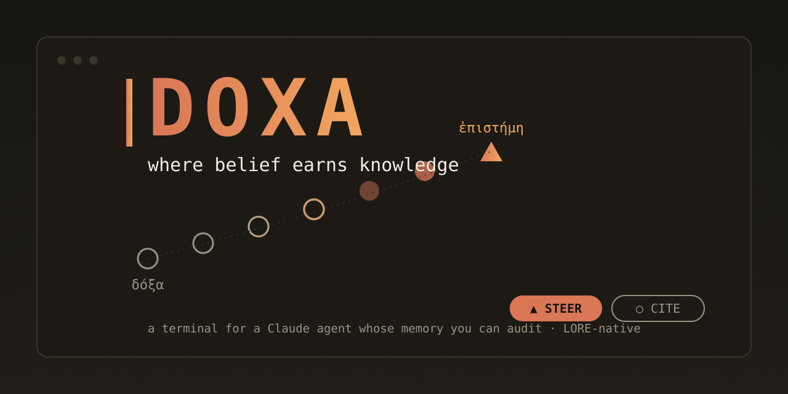

#  DOXA

**Where belief earns knowledge.**

A terminal for working with a Claude agent whose memory you can audit. DOXA is
the native home for [LORE](https://github.com/docwilde/LORE)'s memory model —
built on the Claude Agent SDK (engine) and Textual (TUI), billed through your
Claude subscription, not API keys.

δόξα (*dóxa*): belief, opinion — as distinct from ἐπιστήμη (*epistēmē*),
justified knowledge. Greek epistemology drew the line; DOXA implements it.
Everything the agent derives starts as doxa: visible, queryable, cite-only.
Only what survives the dialectic — human approval, or a calibrated record of
being right — ascends to steer. LORE holds the engrams; DOXA is where they
are examined.

## The one property everything serves

**Nothing steers the agent that isn't human-approved or outcome-calibrated.**
Curated memory writes pass a review gate. Skills pass the same gate and carry
usage track records. Derived beliefs never enter context uninvited; at
decision time they split STEER (calibrated, may shape the call) from
CITE-ONLY (mention, never follow). Every new ingestion path routes through
one secret-scrubbing choke point. A terminal that owns the whole loop can
enforce this at every tool-call boundary — a plugin can only enforce it where
the host offers hooks.

## What DOXA is (functionality by subsystem)

**Engine — Claude Agent SDK daemon.** One daemon per session runs the agentic
loop: streaming completions, tool execution, subagents. Authenticates through
the local Claude Code OAuth session (subscription-billed — verified in the
Phase 0 spike, no `ANTHROPIC_API_KEY` involved). The TUI is a thin client
over a Unix socket, so sessions detach and reattach without tmux.

**LORE, in-process.** The memory system is imported as `lore_core`, not
shelled out to: hard-capped curated memory (user + project), the uncapped
belief store with its FTS index and evidence trails, the deriver / dreamer /
dialectic split, the calibration outcomes ledger, the pending-proposal review
gate, per-stage toggles. Same files, same SQLite database, byte-compatible
with the LORE Claude Code plugin — one codebase, two carriers.

**Blocks, panes, palette (Warp/tmux ergonomics).** Each turn is a foldable
block with metadata chips: model, duration, cost, exit code. Split panes —
agent | logs | belief-inspector — plus a read-only Profile pane showing the
derived interaction model live (transparency as the safeguard). Ctrl+P
command palette; Ctrl+R history search backed by LORE's own FTS index, so
search is instant BM25 over every session ever, not a scrollback scan.

**Trace transparency (DeepSeek-harness grade, redaction kept).** Every tool
call is inspectable: exact arguments, full results, timing; subagent calls
nest as an indented, foldable tree under their parent. Traces persist and
are searchable. One deliberate divergence from the unredacted-by-design
reference: trace bodies pass the same scrubber as everything else —
`[REDACTED:kind]` markers inline, the call's shape fully visible, credential
payloads withheld.

**Streaming deriver.** Beliefs derive incrementally as the session runs
(debounced, capped per session, cheap-model only) instead of only at session
end — generalizing LORE's live-index watermark pattern. A belief minted
30 seconds ago obeys the same read-time gate as one minted last month: the
calibration gate is cadence-agnostic by construction.

**Multi-agent, isolated by default.** Parallel subagents each run in their
own git worktree with a single-consumer merge queue (agents race to finish;
merges land one at a time — conflict flags the pane, never clobbers the
checkout). An opt-in container tier (rootless Podman) sandboxes risk-classed
tasks: only the task's worktree mounted, no credentials inside the container
at all — the SDK loop and its OAuth stay on the host.

**Claude Code plugin compatibility.** DOXA loads existing Claude Code
plugins: hooks (all observed events, both manifest conventions) and slash
commands first; skills and tool-scoped custom agents next. Verified against
a real plugin set, not a spec — because there is no public spec, and the
compat layer ships with regression fixtures for exactly that reason.

**Crush-grade look, Claude-orange.** Rounded borders, OKLab gradient
accents, pill chips, dimmed modal overlays, native Markdown rendering — a
dark theme built on `#D97757`. Calibration is encoded visually: `▲ STEER`
is a filled orange pill; `○ CITE` is outline-only — a belief that hasn't
earned color. The context-usage chip turns amber, then red, as a containment
signal, not decoration.

## Status

Phase 0 (validation spike) is complete — see `PHASE0_FINDINGS.md`:
subscription auth confirmed, PreCompact and UserPromptSubmit hooks fire,
SessionStart fires (despite missing type hints), SessionEnd is absent (the
daemon finalizes sessions itself — deterministic beats hoping a hook fires).
Verdict: GO with four small redesigns, all itemized.

| Phase | Scope | State |
|---|---|---|
| 0 | SDK lifecycle validation, Textual coexistence, auth | **done** |
| 1 | `lore_core` extraction; single-pane shell; block rendering; session-end review; ask | **in progress** |
| 2 | Palette, FTS search, panes, daemon split + detach/reattach, review pane, theme | planned |
| 3 | Streaming deriver, multi-agent panes + merge queue, act-time consult, trace tree | planned |
| 4 | Container isolation tier, calibration dashboard, plugin-compat hardening | planned |

## Non-goals

Provider-agnostic model routing (the subscription-auth path is the point);
replacing the LORE plugin (it keeps shipping — same core, one gets the fixes
of the other); general Claude Code plugin compatibility claims (scoped to
tested plugins at tested versions — the contract is reverse-engineered and
Anthropic may change it any release).
