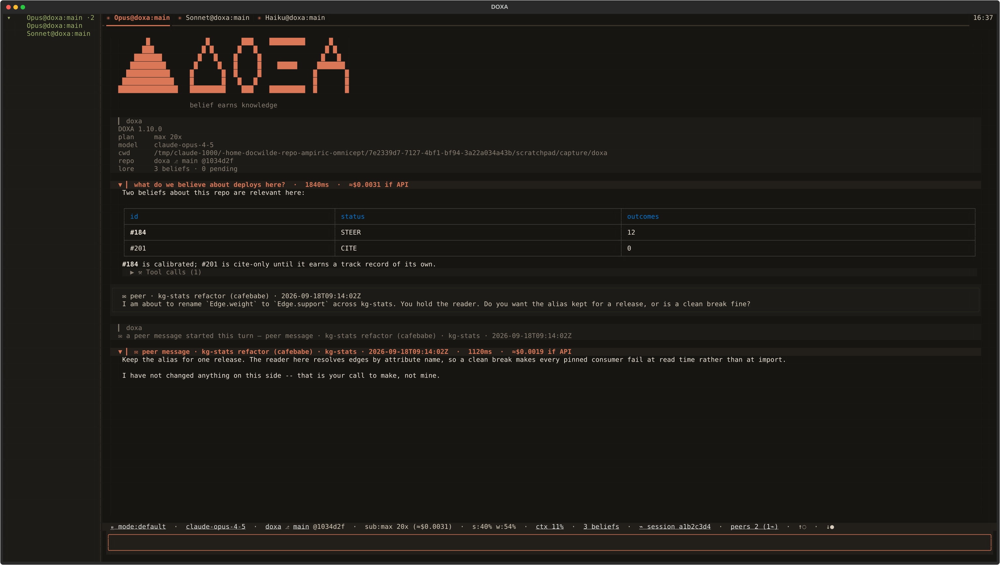
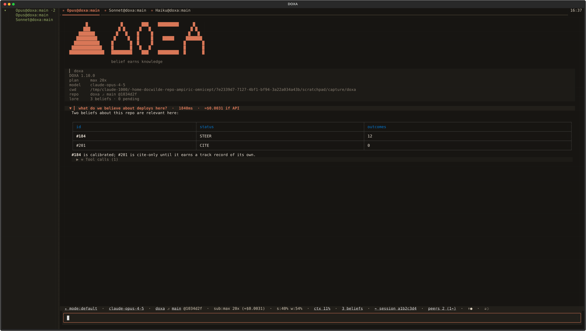

<p align="center"></p>

<p align="center">
  
  <a href="https://github.com/docwilde/doxa/releases"></a>
  <a href="https://github.com/docwilde/doxa/actions/workflows/ci.yml"></a>
  
  
  
</p>

> [!WARNING]
> **Beta.** DOXA reached `1.0` and still moves fast: 112 releases took it from
> `0.1.0` to `1.11.1` between 23 August and 18 September 2026. Config keys, the
> socket protocol and on-disk formats can still change between minor versions,
> with no migration path.
> It runs an agent that edits your files and a shell with your privileges.
> The suite gates every release, but the project has one author and most
> defects so far were found by using it, not by the tests. Read
> [Non-goals](#non-goals) before trusting it with anything you would mind
> losing.

**DOXA** is a terminal for coding agents, built on the Claude Agent SDK
and Textual. Four engines: **Claude** on your Claude subscription, **Codex**
through the Codex CLI on whatever it is signed into (a ChatGPT subscription
or an API key), and **DeepSeek** and **GLM** on their own API keys. Pick one
per session with `--engine` or `/engine`; the [table below](#quickstart)
says what each can do. A Claude session runs in a **daemon** of its own:
close the terminal, `doxa attach` an hour later, and the transcript picks up
where it stopped. No tmux involved.

Start DOXA inside a repository and the session already knows the project.
Durable facts about that codebase — conventions, past workarounds,
corrections a human made once — reach the model before your first prompt,
per-repo rather than global. Every durable conclusion the agent draws
enters as a **belief**: visible, queryable, citable, never acted on. It
earns influence only when a human approves it or it builds a track record
of being right. The tagline is meant literally.

δόξα (*dóxa*): belief, opinion — as distinct from ἐπιστήμη (*epistēmē*),
justified knowledge. The name is the thesis: belief is the raw material,
never the finished thing.

Memory is [LORE](https://github.com/docwilde/LORE)'s `lore_core`, imported
in-process rather than shelled out to. LORE also ships as a Claude Code
plugin; both front ends share one store. See
[LORE integration](docs/manual.md#lore-integration).


*Every image here is rendered headlessly from the real app — scripted, no
spend, fake account numbers. See
[screenshots](docs/manual.md#screenshots).*

## What you get

- **[Sessions outlive the window.](docs/manual.md#sessions-and-the-daemon)**
  Each is a daemon behind a `0600` socket; closing the terminal detaches,
  and `doxa` restores the repo's tab set.
- **[Reasoning and tool calls on the record.](docs/manual.md#the-transcript)**
  Markdown under a collapsed reasoning fold; each `⚒ Tool calls (N)` chip
  opens to its arguments and result.
- **[Pane groups own their tabs.](docs/manual.md#pane-groups)** `ctrl+n`
  splits side by side, `ctrl+o` stacked; `ctrl+←/→` cycles one group and
  leaves the rest alone.
- **[A live diff you can reject one hunk of.](docs/manual.md#the-live-diff)**
  `f2` opens it beside the session, live. A rejected hunk reverts and the
  agent is told why.
- **[Type while it works.](docs/manual.md#typing-while-a-turn-runs)** A
  prompt submitted mid-turn is queued, never refused, and starts when the
  running turn ends. `/queue` lists what waits and cancels one.
- **[Memory stays inert until it earns influence.](docs/manual.md#lore-integration)**
  `lore_core` runs in-process; nothing new reaches the model until a human
  approves a staged row.
- **[A shell the model cannot reach.](docs/manual.md#shell-escape)** A `!`
  line runs in this session's worktree, with your privileges, outside the
  model's context.
- **[Worktrees, never auto-merged.](docs/manual.md#worktrees-and-finalize)**
  Each session gets its own worktree and branch. A clean one vanishes;
  real work waits for you.
- **[A permission mode you can see and change.](docs/manual.md#permission-modes)**
  `shift+tab` cycles it; the chip leads the bar, and the modes that stop
  asking are amber or red.
- **[A tool gate that counts strikes.](docs/manual.md#containment)** Every
  call passes `PreToolUse`; a tool failing hard twice is disabled for the
  session.
- **[Numbers that were measured.](docs/manual.md#the-status-bar)**
  Twenty-one tooltipped chips and a `/context` the CLI itself counted. A
  chip an engine cannot answer for is hidden, never painted blank.
- **[Pictures, or a straight answer why not.](docs/manual.md#images)**
  kitty graphics → sixel → half-block → text, settled by one probe.
- **[Sessions talk to each other.](docs/manual.md#search-resume-and-peers)**
  Same-repo sessions exchange `/msg`. The model's own send tool is off by
  default; on, every message is rate limited, ledgered with its body and
  flashed on the status bar. An arriving message *starting* a turn is a
  second switch, also off.
- **[A fleet, measured rather than managed.](docs/fleet.md)** `doxa-fleet`
  spawns N sessions on one prompt at one moment, deals engines and models
  from a pool, runs K without memory, splits a run budget, waits for quiet
  and tears down. Clean to N=64 on Claude; a mixed pool of Codex, DeepSeek
  and GLM ran, messaged across vendors and quiesced (see [Status](#status)).
- **[Peers on another machine, once you say so.](docs/fleet.md)** A tailnet
  bridge behind `tailscale serve` puts a second box's sessions in the
  roster, refused until `remote_enabled` is on and an allow-list names you.
- **[Memory is a setting, not a premise.](docs/manual.md#lore-integration)**
  `doxa --no-lore` gives a session no snapshot, no writes and no `lore_*`
  tools; the fleet flips it per agent. With [LORE](https://github.com/docwilde/LORE)
  sync on, a `⇅ sync` chip shows staleness, unpushed ops and conflicts;
  off, no chip.
- **[An isolated CLI config.](docs/manual.md#the-spawned-cli)** Spawned
  `claude` processes use a config directory DOXA owns, not your
  `~/.claude`; your plugins load only if you opt in.

A `Task` subagent also gets a status row and a live read-only tab, and
`/dir` says [where a session is](docs/manual.md#where-a-session-is)
outside a repo. `alt+d` / `alt+s` / `alt+g` reach the split and diff
actions too, but only on a kitty-protocol terminal; `/help` marks every
binding yours cannot send.

## Gallery


*`f2` (or `/diff`) opens the live diff beside the session. **Reject** reverse-applies that hunk and tells the agent why; mid-turn it queues, and says so.*


*A split spawns a **second session**, not a second view of the first. Each group owns its own tab strip since v0.97.0 — the left group has three tabs and draws one; the right holds a single tab, and a strip of one is chrome, so it draws none.*


*Calls fold to one row each, opening to exact arguments and result. The marker counts through a silent call, so a slow one never reads as hung.*


*A memory call is an ordinary chip: what decides the agent's beliefs is as inspectable as anything else it does.*


*Every belief, grouped by scope, with what reality has said about it. Four verdicts record an outcome; `g` only looks.*


*One cell per half-percent. Every number is the CLI's own accounting of its own request — DOXA runs no second tokenizer.*


*Questions and permission requests get a real dialog. A headless run with no callback auto-denies both, silently.*


*Who else is on this repo, what each says it is running, and tokens spent — self-reported on each peer's 15-second heartbeat, except a model change, which publishes at once because a stale model id is a wrong answer rather than an old number. A peer mid-first-turn reads as unknown, never zero.*



*A turn nobody in this window asked for says so three times before it has finished costing anything: the message as it arrived, a line naming who started it, and a turn header carrying that sender instead of a prompt. The model reads the same attribution, as the first paragraph of the prompt itself rather than a flag beside it.*



*Two lamps beside the peer count, one per direction. Filled is traffic in the last four seconds, hollow is a channel that exists and is quiet — a filled glyph beside an outlined one, because a colour change alone survives neither peripheral vision nor a screenshot. They appear as a pair or not at all, so neither arrives by shifting the row sideways at the moment traffic does.*


*The chip leads the bar at every width — `auto` amber, `bypassPermissions` and `dontAsk` red, the modes where nothing stops to ask.*


*Outside a repo the chip is a different shape, not the same one with a hole in it. `/cd` opens the target in a new tab and says the session stayed put.*


*With [LORE](https://github.com/docwilde/LORE) sync configured: how long since a pull landed here, how much this machine has not sent yet, and how many ops failed their integrity check and were staged rather than applied. Amber because that last number is waiting on a person. Sync is off by default, and then the chip is absent — never a zero, never an error.*

Eighteen more scenes are catalogued in the
[manual](docs/manual.md#screenshots); between the two documents every
rendered asset is named exactly once. An asset named nowhere is how
`beliefs-browser.png` rotted for eighteen releases before v0.87.0 deleted
it. The gallery is at mixed versions and always has been — a stale
picture of a feature that still looks like that is fine; a caption that
describes something else is not.

## Install

```sh
curl -fsSL https://raw.githubusercontent.com/docwilde/doxa/main/scripts/install.sh | sh
```

It checks Python 3.11+, [`uv`](https://docs.astral.sh/uv/) (offering to
install it), `git`, and the
[`claude` CLI](https://docs.claude.com/en/docs/claude-code) signed in —
DOXA authenticates through that CLI's OAuth session, never through
`ANTHROPIC_API_KEY`, which it reads for one thing only: listing the model
catalogue in the picker when a key happens to be in the environment —
then runs `uv tool install
git+https://github.com/docwilde/doxa`. DOXA is not on PyPI. Re-running is
safe and never touches an existing `~/.doxa/config.toml`. Add `sh -s --
v1.11.1` to pin a tag instead of tracking `main`. Read it first if you
would rather not pipe a stranger's script into `sh`.

Or run from a checkout:

```sh
git clone https://github.com/docwilde/doxa && cd doxa
uv sync
uv run doxa
```

`uv sync` is all of it: `lore_core` is a pinned git dependency, so the
LORE plugin is not a prerequisite. Install that plugin anyway and its
checkout deliberately wins over the pinned copy — both share one store,
and a terminal quietly disagreeing with the rest of the machine is the
worse surprise. `/about` names which copy loaded.

## Quickstart

```sh
uv run doxa          # spawn a session here, or restore this repo's saved tab set
uv run doxa new      # force a fresh session instead of attaching
uv run doxa new --branch <name>   # fork the session's worktree from <name>
uv run doxa attach   # reattach by session id / title prefix
uv run doxa stop     # finalize now (LORE review + index), daemon exits
uv run doxa doctor   # read-only health checks, no TUI: pass/fail + fix per check
uv run doxa launcher install      # XDG start-menu entry + icons
uv run doxa --engine codex        # drive the session with Codex instead
uv run doxa --engine deepseek     # or DeepSeek, on DEEPSEEK_API_KEY
uv run doxa --engine glm          # or GLM (Z.ai), on ZAI_API_KEY
```

| | claude | codex | deepseek | glm |
|---|---|---|---|---|
| billed on | Claude subscription | Codex CLI sign-in | `DEEPSEEK_API_KEY` | `ZAI_API_KEY` |
| daemon, detach, `doxa attach` | yes | yes | yes | yes |
| LORE tools and the tool gate | yes | yes, via MCP | yes | yes |
| permission modes, hooks, plugins | yes | no | no | no |
| cost and context-window chips | yes | no | no | no |
| `/msg` to a peer | yes | yes | yes | yes |
| `peer_list`, `peer_history` tools for the model | yes | yes | yes | yes |
| `peer_send` tool for the model | yes | yes | yes | yes |
| budgets, `Task` spawns | yes | no | no | no |
| fleet slot | yes | yes | yes | yes |
| `--no-lore` honoured | yes | yes | yes | yes |

The rows are `doxa.engines.get(<id>).supports()` read off the registry, not
a promise; `/engine` prints the same counts live.

**[Other engines](docs/manual.md#engines).** `--engine` (or the `engine`
setting, or `/engine <id>` for the sessions and tabs you open next) runs a
DOXA session on something other than the `claude` CLI, and
each one declares what it can actually do rather than inheriting Claude's
list. `codex` (v1.4.0) drives the Codex CLI. `deepseek` and `glm`
(v1.10.0) are two third-party chat-completions APIs behind one
implementation and one capability map — eleven of eighteen fields true —
so a run can mix vendors without also mixing what the terminal supports.
Both are billed on their own API key, not on your Claude subscription, and
refuse to start without it.

What an engine does not report, DOXA does not paint. Codex counts tokens
but never reports a window size, so there is no ctx chip; it reports no
cost either and has one fixed permission posture rather than modes to
cycle. Its DOXA tools arrive through a stdio MCP server DOXA registers on
every `codex exec` (`doxa/mcpserver.py`), executed through the same tool
gate the vendors use, and the memory snapshot rides the first prompt
because Codex has no system message and no hook. A `peer_send` from that
server is not performed there: it is forwarded to the session's engine
over a control socket and sent on the session's own rate limiter and
ledger, so a Codex model's message and a human's `/msg` are bounded,
recorded and lit identically. DeepSeek and GLM carry
the tools in-process — the model only ever *names* a call and DOXA
executes it, so the allowed set, the refusals and the two-strikes disable
all apply — but they report no window size either and no per-session
dollar figure, and they have no modes to cycle for a different reason:
DOXA owns their whole tool surface, so a mode would configure nothing.
Since 1.13.0 every engine runs in a daemon, so `ctrl+q` detaches and
`doxa attach` reattaches whatever the engine; `--in-process` is the one
door that still hosts an engine inside the TUI.
`doxa.engines.get("deepseek").supports()` is the whole map for any of
them.

`launcher install` points at **the DOXA you ran it from**, by absolute
path, and prints that path and version — so a shortcut that would start
something unexpected shows up now, not in a month. It names any other
`doxa` on your `PATH` and changes nothing about it.

A daemon finalizes once every client has been detached for `--linger`
seconds (120 by default), or at once on `doxa stop`. `doxa --in-process`
runs the engine inside the TUI: no daemon, no detach, quitting finalizes
on the spot.

Then type a prompt and press enter. `ctrl+p` opens the palette, `ctrl+t` a
tab, `ctrl+r` searches past sessions, `shift+tab` cycles the permission
mode, a `!` line runs as a shell command, and `/help` lists every command
and key — marking any your terminal cannot send.

## Status

Beta, and a working daily driver for its author. Everything in
[What you get](#what-you-get) and in the [manual](docs/manual.md) is on
`main` and behaves as described; [CHANGELOG.md](CHANGELOG.md) has the
history. `main` is what the install script tracks by default, and `v1.12.0`
names it: the model's send tool, the cross-machine peer bridge, the fleet
harness, session and run budgets and the engine picker are all in the
newest tag, so a pinned install has them. Config keys, socket protocol and
command names can still change between minor versions.

**Specified, not built.** Seventeen documents sit in
[`docs/plans/`](docs/plans/) and each states its own status in its opening
lines — but two of those headers now lag their own code, so read them
against this list rather than instead of it. **Five have nothing behind
them:** `plugin-api` (no loader exists — v0.34.0 shipped only the seams one
could bind to), `mermaid`, `code-graph`, `sandbox`, `model-registry`.
**One is part-built:** `remote`. v1.8.0 shipped `doxa/remote_policy.py`,
the decision layer that refuses by default, and `doxa/peernet.py` has
since added the one transport that asks it — peer traffic between
machines, bound to loopback behind `tailscale serve`, refused until
`remote_enabled` is on and an allow-list names you. There is still no
remote driver and no second renderer. `remote.md`'s own header reads
"Nothing implemented", which is now two releases behind. **One is an
experiment nobody has run:** `emergent-organization`, whose header calls
its messaging substrate unbuilt — that substrate is precisely what
shipped, while the experiment did not.

**Ten left that list by shipping:** `plugins` (v0.74.0), `split-panes`
(v0.91.0), `live-diff` (v0.92.0), `pane-groups` (v0.97.0, which inverted
the first), `session-sidebar` (v1.0.0), `peer-publishing` (v1.0.2),
`spawn-session` (v1.1.0), `collection-triage` (parts 0, 1 and 1b in v1.2.0;
parts 2 and 3 deliberately not), `engine-providers` (v1.4.0, the second
engine) and `rail-interaction` (v1.5.0). `plugins` is a different system
from `plugin-api` and is easy to confuse with it — it adopts *your own*
Claude Code plugins (commands, skills, agents; never hooks or MCP servers)
into the spawned CLI.

**The fleet is a measurement harness, not an orchestrator.** Nothing
schedules sessions, assigns work between them or supervises them, and no
document proposes that it should — the one plan about multi-agent
structure asks whether structure appears when nobody imposes it
([`docs/plans/emergent-organization.md`](docs/plans/emergent-organization.md)).
What `doxa-fleet` does: spawns N daemons into a `DOXA_HOME` and a peer
registry of the run's own, hands every one the byte-identical prompt at
the same moment, deals each slot an engine and model from `--pool
engine:model@weight` and runs it on that engine, runs `--memory-off K` of
them without memory, arms the peer tools for the run, splits
`--run-budget` per session, waits for the run to go quiet, tears it all
down and reports what leaked. The manifest carries the seed, the
assignment and the dispatch spread; the ledger carries every message.

Measured on 1.13.0: `--pool deepseek@1,glm@1,codex@1 -n 5` dealt two
Codex, two DeepSeek and one GLM slot; all five spawned on their engine,
exchanged 17 messages (DeepSeek and GLM sent `ready` to every peer and
`ack` back across vendors; the Codex slots received six and sent none),
quiesced in 37 s and left no process behind. Three limits, all stated by
the harness itself: a Codex model has no `peer_send` yet (it reaches
DOXA's tools through an MCP sidecar that carries no delivery seam), so a
Codex slot is receive-only; slots on codex, deepseek or glm report no
dollar figure and are not bounded by `--run-budget` (`--allow-unbudgeted`
is the switch that admits that); and a run's root must be a short path,
because every session's socket lives under it and `AF_UNIX` allows 108
bytes. [`docs/fleet.md`](docs/fleet.md) has the whole of it, including
what the harness could not do at 128 sessions.

**`/msg` is no longer the only way a message is sent — this README said
otherwise until now.** A human typing `/msg` was the whole mechanism, and
a test asserted the operator registry never mentioned peers at all. That
sentence is retired: `peer_list` enumerates the sessions a model may
address — across repositories, not only this one — `peer_history` shows it
its own traffic so it can notice a loop, and `peer_send` reaches one
session or broadcasts to every one of them, and an arriving message can
start a turn in a session sitting idle. Both are off unless armed
(`agent_peer_send`, `peer_inbound_turns`) — though discovery is not, so a
model can enumerate your open sessions in other repositories with nothing
switched on — and both are read from your
environment or `~/.doxa/config.toml` — never from a file in the repository
a session happens to have open. The test was replaced rather than deleted:
it now pins the peer tool list to exactly three names, so a fourth fails
there before it reaches anyone. Every send, the model's and yours alike,
is rate-limited by deliveries rather than by calls and appended with its
full body to `$DOXA_HOME/peers/messages.jsonl`. `doxa/meshgraph.py` draws
that file as a live browser view of which session messages which — a graph
being the one artifact a terminal is honestly bad at — but nothing in the
TUI or the CLI opens it yet, so it is reachable today only from Python.

Also absent: history drill-in past `/search`, and custom keybindings.

**Claude sessions older than v0.56.0 cannot be resumed.** That release
stopped DOXA and the CLI minting two session ids and pinned them to one,
and the fix cannot reach backwards: an older conversation is addressed by
an id the CLI's own store never knew, so it returns read-only and says so
first. A Codex or vendor session resumes from the record its own engine
kept beside the transcript, and refuses in the same words when there is
none.

Run the suite with `uv run pytest`.

## Non-goals

Provider-agnostic model routing. `--engine` is a deliberate per-session
choice, not a router picking a backend for you, and nothing load-balances
or falls back between them. Subscription auth remains the default path and
the reason the Claude engine exists; the three others are there because a
study that needs different models cannot be run on one. Replacing the LORE
Claude Code plugin, which keeps shipping the same core. A plugin API of DOXA's own — `docs/plans/plugin-api.md` is a
design with no loader behind it. Full Claude Code plugin compatibility:
`adopt_plugins` carries in commands, skills and agents from the plugins
you already have, and refuses their hooks and MCP servers unconditionally
— that refusal is the design, not a gap waiting to be filled.

## License

[AGPL-3.0-only](LICENSE) for everyone, including over a network; a
[commercial licence](LICENSE-COMMERCIAL.md) is available for uses AGPL's
terms don't suit. The DOXA name and mark are reserved — see
[TRADEMARK.md](TRADEMARK.md).
