<p align="center"></p>

<p align="center">
  
  <a href="https://github.com/docwilde/doxa/releases"></a>
  <a href="https://github.com/docwilde/doxa/actions/workflows/ci.yml"></a>
  
  
  
  
  
  <a href="LICENSE"></a>
</p>

> [!WARNING]
> **Alpha — work in progress.** DOXA is `0.x` and moves daily: interfaces,
> keybindings, config keys and on-disk formats change between releases without
> a migration path, and releases are cut in hours rather than weeks. It is
> feature-incomplete by design — several surfaces documented under
> [Status](#status) are specifications with nothing built behind them.
>
> What that means concretely for you: it runs an agent that edits your files
> and, since v0.36.0, a shell that runs with your privileges. It is tested
> (the suite is real and gates every release) but it is not battle-tested —
> it has one author, and most defects so far were found by using it, not by
> the tests. Read [Non-goals](#non-goals) before adopting it for anything you
> would be upset to lose.

**DOXA** is a terminal for Claude agents whose sessions outlive your
window and whose memory of your own codebases you can actually watch
form — built on the Claude Agent SDK and Textual, billed through your
Claude subscription rather than an API key.

A session runs in a **daemon** of its own: close the terminal, walk away,
`doxa attach` an hour later, and the transcript picks up exactly where it
left off — nothing lost, no tmux involved.

Start it inside a repository and the session already knows the project.
Durable facts about this codebase — its conventions, its past
workarounds, corrections a human already made once — are injected before
your first prompt, alongside a per-project file map (which files matter
and why) the agent consults instead of grepping blind. That context is
per-repo, not global: a tab open in this project and a tab open in
another carry different project memory, on purpose. Procedures that
worked before — captured as reusable runbooks, approved by you — are
available to the agent here too, not just in the session that learned
them.

Every durable conclusion the agent reaches about you or your code goes
through the same gate before it can shape a later answer: it starts as a
**belief** — visible, queryable, citable but never acted on — and only
gains real influence by being approved by a human or by building an
actual track record of being right. Nothing writes itself into the
model's context unsupervised; the running count sits in the status bar,
and `/search` reaches every past session, not just the current one. This
is what the tagline means literally, not as a slogan: *where belief earns
knowledge* — an idea has to earn its way from opinion to something the
agent will actually rely on.

The memory engine underneath all of this is
[LORE](https://github.com/docwilde/LORE), which also ships as a
standalone Claude Code plugin; DOXA compiles it in-process
(`lore_core`, imported, not shelled out to) rather than requiring the
plugin to be installed — one memory model, two front ends.

δόξα (*dóxa*): belief, opinion — as distinct from ἐπιστήμη (*epistēmē*),
justified knowledge. The name is the thesis: belief is the raw material,
never the finished thing.

<p align="center">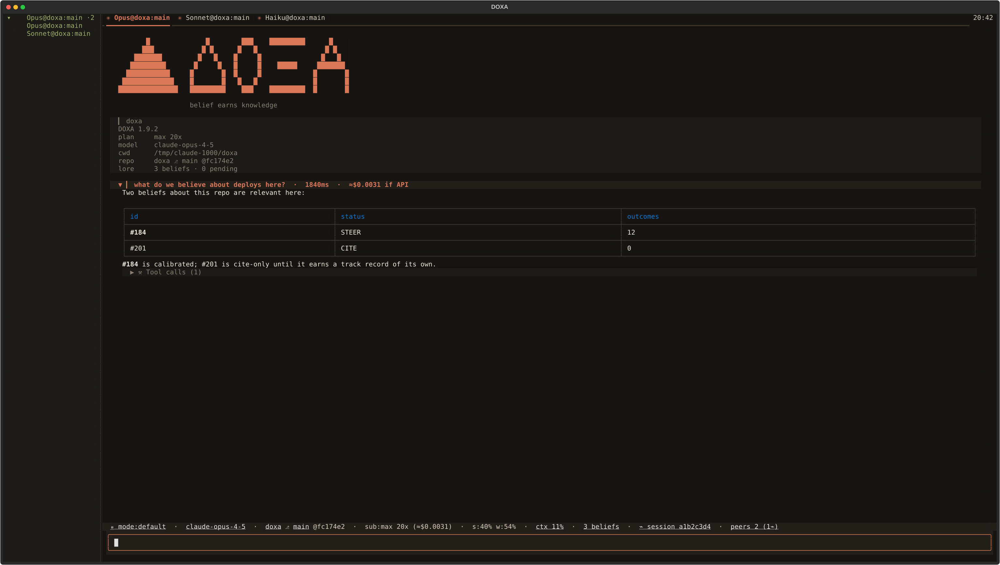</p>

*Headless-rendered from the real Textual app (a scripted session, no
spend, fake account numbers). Every screenshot and GIF below is generated
the same way, by [`scripts/screenshot.py`](scripts/screenshot.py) and
[`scripts/record_gif.py`](scripts/record_gif.py).*

## Install

```sh
curl -fsSL https://raw.githubusercontent.com/docwilde/doxa/main/scripts/install.sh | sh
```

Checks for Python 3.11+, [`uv`](https://docs.astral.sh/uv/) (offers to
install it if missing), `git`, and the
[`claude` CLI](https://docs.claude.com/en/docs/claude-code) signed in
(`claude auth login`) — DOXA authenticates through that CLI's own OAuth
session and never reads `ANTHROPIC_API_KEY` — then installs with `uv tool
install git+https://github.com/docwilde/doxa` (never PyPI; DOXA isn't
published there). Re-running it is safe: it never touches an existing
`~/.doxa/config.toml`, and picks up whatever changed on `main` since the
last run. Install a specific tag instead of `main`'s HEAD with
`sh -s -- v0.39.0`.

Piping a stranger's script into `sh` deserves a second look first:

```sh
curl -fsSL https://raw.githubusercontent.com/docwilde/doxa/main/scripts/install.sh -o install.sh && less install.sh   # then: sh install.sh
```

Or clone-and-run from a source checkout instead of installing at all:

```sh
git clone https://github.com/docwilde/doxa && cd doxa
uv sync
uv run doxa
```

**Since v0.37.0 that is genuinely all of it.** DOXA's memory model is
[LORE](https://github.com/docwilde/LORE)'s `lore_core`, and until v0.37.0
that package was not declared anywhere — DOXA reached into a LORE Claude
Code plugin checkout on the machine and hoped it was there. On a clone
without the plugin, 41 of 52 test modules failed at import. `lore_core` is
now an ordinary pinned dependency (`lore-core @ git+…LORE@v0.35.1`, a git
URL because neither project is on PyPI), so `uv sync` installs it like
anything else and nothing about the LORE plugin is a prerequisite for
running DOXA.

If you *do* have the LORE plugin installed, that checkout still wins over
the pinned copy: DOXA and the plugin share one SQLite store, the plugin
writes to it from a hook on every Claude Code session, and a terminal that
silently stopped reflecting the memory system the rest of the machine runs
would be a worse surprise than a version that is not the pinned one.
`/about` names which copy loaded, so it never has to be guessed — see
[How it works](#how-it-works).

## Quickstart

```sh
uv run doxa          # spawn a session here, or restore this repo's saved tab set
uv run doxa new      # force a fresh session instead of attaching
uv run doxa new --branch <name>   # fork the session's worktree from <name>, not the launch checkout
uv run doxa attach   # reattach by session id / title prefix
uv run doxa stop     # finalize now (LORE review + index), daemon exits
uv run doxa doctor   # read-only health checks, no TUI: pass/fail + fix per check
uv run doxa launcher install      # XDG start-menu entry + icons (uninstall removes them)
```

The start-menu entry launches **the DOXA you ran that command from**, by
absolute path, and the command prints that path with the version it reports —
so a shortcut that would start something other than what you expected is
visible when you install it rather than weeks later. If a *different* `doxa`
is on your `PATH` (a stale `uv tool install`, say), the command names it and
its version too, and changes nothing about it. `doxa doctor` re-checks both.

The daemon finalizes the session — LORE's review and index pass — once every
client has been detached for `--linger` seconds (120 by default), or
immediately on `doxa stop`. `doxa --in-process` runs the engine inside the
TUI instead, with no daemon and no detach: quitting finalizes on the spot.

Once you're in: type a prompt, press enter. `ctrl+p` opens the command
palette, `ctrl+t` opens a new tab, `ctrl+r` searches past sessions,
`shift+tab` cycles the **permission mode** (what still stops and asks you
before a tool runs — see
[Permission mode](#permission-mode--what-still-stops-and-asks-you)), a
line starting with `!` runs as a shell command instead of a prompt, and
`/help` lists every command and key binding — marking any binding your
terminal cannot physically send.

## What you get

- **Sessions that outlive the window.** Each session is its own daemon process and the TUI is a thin client over a 0600 Unix socket, so closing the terminal detaches instead of killing; every event carries a monotonic `seq` into a bounded ring, and `doxa attach` replays from a cursor onto the live tail of that same stream. Each session also takes its own git worktree, so two sessions on one repo cannot stomp each other, and plain `doxa` brings back this repo's whole saved tab set — order, pinned names, active tab, and each tab's conversation read back from its on-disk transcript rather than from whatever still fit in the ring. No tmux is involved anywhere in that. **A tab whose session ended comes back continuing it** — restore now resumes, with no gesture and no key, because a daemon finalizing on its linger timer while the window is shut is the ordinary way a session ends, and the read-only transcript that used to be the answer was therefore the ordinary result of a restart. Read-only, marked `⏺`, is now the fallback, and it says which of three reasons it was. A finished conversation can also be **resumed** on demand — `enter` on its row in `/search`, or `/resume` — reopening in a new tab with the model's history reloaded and the prior turns re-rendered from that same transcript, so what the model remembers and what you can read are one thing. Resuming only works because DOXA and the `claude` CLI now share **one session id**: until v0.45.0 each minted its own, so the id every search row is keyed by was an id `--resume` would have rejected, and a conversation recorded before that release stays searchable and readable but says so rather than pretending. A session still *running* is attached, never forked — a live conversation has one writer. Nothing DOXA leaves behind is auto-merged: the closing message names the branch and the merge is yours.
- **Reasoning and tool calls, on the record.** Replies stream as real markdown through Textual's append-only delta path, so a table fills row by row rather than appearing whole at the end. Above each reply, the model's summarized reasoning streams into a collapsed `✻ Reasoning (N chars)` fold, and the turn's tool calls compact behind one `Tool calls (N)` fold whose chips open to their exact arguments and exact result. Both folds are created lazily on first content, so a turn that used neither grows neither section, and formatting happens only for a chip somebody actually opened. A call against the memory store is an ordinary chip, so the mechanism that decides what the agent believes opens with the same two clicks as a `Grep`. What the fold shows is the model's **summarized** thinking, not its raw chain of thought — the API does not return that on any model at any setting, and turning the fold off stops DOXA asking to see the summary, not the thinking (or its billing).
- **Pictures, or a straight answer about why not.** Images take a ladder — kitty graphics protocol → sixel → half-block cells → a plain text line — settled by one probe that runs before the TUI takes stdin. The opening block draws the DOXA mark itself, and which way round is deliberate: a **drawn** ring around a triangle — authored cell by cell out of `█` and spaces, one codepoint plus space, with the wordmark and strapline beside it as plain text — is the normal path, and the raster `logo.png` is the exception, spent only on `kgp`/`sixel` — the tiers carrying a real bitmap. Half-block is a 2×-vertical approximation, so a six-row logo there is twelve vertical samples for a 238-row image, and a downscale that *averages* is mush where a cell chosen by hand is as sharp as the font. `boot_banner` (`auto` · `blocks` · `image` · `off`) pins either form, and the raster keeps its declared six-row budget (`rows × cell aspect × content aspect ≈ 47 columns`) so it never outweighs the identity block beneath it. Neither form ever renders a useless `[image: doxa logo]` line. `/img` with no argument reports what this terminal actually answered and then draws the same asset **in each tier it answered for**. Nothing in that report is inferred: a rung the ladder short-circuited past is named as never asked and not drawn, a cell size textual-image defaulted to is labelled defaulted rather than reported as measured, and a settled `text` mode says whether the terminal declined or whether there was never an interactive terminal to ask. Pushing a kitty escape at a terminal without kitty support produces litter, not a picture.
- **Subagents you can follow while they run.** A `Task`-spawned subagent appears as a `⧉ N agents` chip plus a second status row under the status bar, one clickable entry per subagent in flight; clicking one opens a **read-only transcript tab** that mirrors what its live `Task` chip has buffered and stays fed from there, leaving the original chip exactly where the trace tree put it. Once the call lands, the same activity is a foldable tree under the parent chip. A nested subagent gets its **own row**, not a recursive tree inside its parent's tab — a tab shows one subagent's narration and its direct subcalls, nothing deeper — and the tab is a view only: no engine behind it, no prompt to type into, `ctrl+w` just removes it.
- **Memory that is inert until it earns influence.** LORE's `lore_core` runs in-process — hard-capped curated memory (user + project), an uncapped belief store with an FTS index and evidence trails, one SQLite store shared with the LORE Claude Code plugin. A `mem u63% p39%` chip next to the belief count says how full each cap is — **two percentages, not one merged figure**, because the caps fill at different rates and a single number would hide whichever one is about to start refusing writes. It counts characters read from the file `lore_core` itself writes, against that same module's own cap (4500 and 8800 by default), so the chip cannot disagree with the write path the way an `st_size` approximation would on any multi-byte character; an unreadable store or an older `lore_core` makes it absent rather than wrong. The agent's whole tool surface is five operators: four read-only (`lore_belief_search`, `lore_belief_show`, `lore_memory_list`, `lore_session_search`) and one write, `lore_remember`, which only *stages* a proposal for the review gate. At act time a single FTS pass over the prompt may attach one belief note, labelled CITE-ONLY — no LLM call, no second injection path. One write path into curated memory exists and it is a human clicking a control on one row: `/beliefs` opens a full-height browser where each staged proposal states what approving it would do and carries its own approve and reject, arming before it applies, one item at a time, with no bulk form anywhere in the UI or the API — and every approval goes through LORE's own approve path, so the entry is labelled `via approved` by LORE rather than by DOXA. On a `lore_core` too old to record that, the browser degrades to read-only and says so. No embeddings, no relevance model, no API call in any of it.
- **A shell the model cannot reach.** A prompt line starting with `!` (`!git status`, `!pytest -q`) runs in this session's own worktree under a Textual worker, with stdin on `/dev/null`, output capped at 64 KB, and the whole process group killed at 120 seconds so a stray `!tail -f` cannot outlive the tab. It is not a slash command and not a tool, so nothing that dispatches by name and no model call can land there; exactly one module imports the executor and a test asserts that. It runs with your full privileges and **asks nothing first** — `!rm -rf ~` deletes your home directory. Neither the command nor its output enters the model's context, which also means it never reaches LORE and never survives a tab restore.
- **Sessions that can be made to talk to each other.** Independently launched sessions on the same repo discover each other through a same-user runtime registry (0700, per-session presence file, heartbeat, dead pids reaped by any reader); `/peers` and `/sessions` list them, and `/msg <session> <text>` delivers one framed line-JSON message over the target's own 0600 socket. Every received field is scrubbed before display, and peer text reaches the model only behind an untrusted-peer preamble that names it as data, never instructions. **The model has no send tool** — its five operators are the LORE ones above — so every peer message crosses because a human typed `/msg`. Sessions can be *made* to talk; they do not talk on their own, and nothing here schedules them, routes work between them, or supervises them.
- **A permission mode you can see and change without leaving the keyboard.** `mode:` leads the status bar and says what still stops and asks you before a tool runs; **Shift+Tab** cycles it, `/mode` sets it by name, and clicking the chip opens the same picker every other selector chip uses. The ring is most oversight to least and wraps home, so one more press is always the way *out* of the most permissive mode. **What is in the ring depends on how the session was launched**: normally `default → acceptEdits → plan → auto → default`, and `bypassPermissions` joins it only for sessions spawned with `allow_bypass` on — because the `claude` CLI arms that capability at launch and refuses it at runtime otherwise. A mode a session cannot enter is **not shown at all** rather than shown and refused; an option you can see is an option that works. `auto` (a model classifier decides instead of you) and `bypassPermissions` (every call runs unapproved) mean DOXA stops asking, so entering one paints the chip red and writes a transcript line naming what stopped. `dontAsk` is deliberately off the hotkey and confirms first. **Nothing wider than `plan` can be persisted.** The glyphs and colours are Claude Code's own, read out of the installed CLI rather than guessed. The keycap is Shift+Tab and not Ctrl+Tab because DOXA measured the difference: under the legacy key encoding there is no byte for Ctrl+Tab at all. Both are bound; `/help` marks the one your terminal cannot send.
- **Numbers that were measured, not estimated.** The status bar carries `mode:<permission mode>` (first, so it is never what falls off a narrow row) · model · `⚑ needs input` · effort · `repo ⎇ branch @sha` · subscription headroom · context % · belief count · curated-memory fill · staged proposals · session handle · peers; every chip has a one-line tooltip, the inert ones included, and nine are clickable. `/context` breaks the window down by component in tokens using the `claude` CLI's own accounting of its own request — DOXA runs no tokenizer and estimates nothing, a context limit the CLI never reported reads `?` and stays `?`, and the one component that can only be counted in characters is reported in characters. `/about` is the screen a bug report is copied from, down to which `lore_core` loaded and which keyboard protocol your terminal actually granted — a binding it cannot physically transmit is marked `✗` in `/help` instead of silently doing nothing, and silence from the terminal reads as *not measured*, never as "legacy". There is **no clock-driven chrome**: two timers exist in the whole app, a test asserts no third is ever armed, and the one thing that does animate — the in-flight spinner — is ticked by the engine’s delta stream rather than by an interval.

Three smaller invariants hold the rest together. The `ctrl+p` palette and `/`
autocomplete read one registry, so a command cannot exist on one surface and
not the other. `AskUserQuestion` and permission requests get a real dialog, a
blinking tab and a desktop notification — a headless SDK run with no
`can_use_tool` callback silently auto-denies both, and DOXA supplies one.
Precedence is **environment > `~/.doxa/config.toml` > default** everywhere, so
the settings modal (`ctrl+,`) shows each row's effective value next to where it
came from and makes a row the environment is winning read-only rather than a
silent no-op.

## A session, end to end

The section above says what exists. This is one path through it, in roughly
the order you meet each surface: start a session, watch a turn stream,
open up what the agent did, answer something it asks, watch the window
fill, detach, come back, pick an old conversation back up, and read what
the deriver staged while you were gone.

### 1. Start it in a repo

`doxa` inside a git repository spawns a daemon and attaches to it. The
opening block states what you got: the DOXA version, the plan the `claude`
CLI actually reports, the model, the working directory, the repo and
branch, and what LORE is holding for this project — how many beliefs, how
many proposals are staged waiting for you, and how many entries and how
full each of user and project curated memory is. Those numbers are the
point of the whole program, so they are on screen before the first prompt
rather than behind a command. The percentages are the same measured
character counts the status bar's memory chip quotes, off the same files,
so the two cannot disagree.

The session gets its own worktree (`git worktree add
~/.doxa/worktrees/<repo>-<id> -b doxa/<id>`) off the branch you were on.
Two sessions on the same repo, even the same branch, therefore never stomp
each other — git itself refuses the same branch checked out twice, which
is exactly the constraint two sessions sharing one checkout would hit. The
status bar's git chip shows the worktree's own session branch; the **tab**
shows the base branch it forked from, so a glance at the tab strip answers
"what am I based on", not "which throwaway branch is this". A session that
ends clean leaves no trace; anything you actually wrote is kept and never
auto-merged, and the closing message names the branch to merge by hand.

The base is explicit, not just inherited. `doxa new --branch <name>` forks
the worktree from `<name>` instead of whatever the launch directory has
checked out, failing with an actionable message if `<name>` does not
resolve; with `worktree_per_session` off, `--branch` refuses by default
rather than silently moving your real checkout — pass `--checkout` on a
clean tree to allow that explicitly. Mid-session, `/branch` lists local
branches with the current base marked, and `/branch <name>` switches it:
free (a fast-forward rebase, nothing to replay) while the worktree is
clean and carries no commits of its own, refused the moment there is real
work a base switch would silently carry across. The session's own
`doxa/<id>` is not among the branches offered — it is this session's
identity, not a base to fork from, and a session based on itself has
nothing left to measure unmerged work against.

*The shot at the top of this page is that state, a few turns in: three
tabs on one repo, each labelled with its model tier and the base branch it
forked from, over an opening block and a first answer.*

### 2. Type a prompt, watch the turn stream

The prompt is a `TextArea`, not a single-line `Input` — it grows with what
you type, up to 10 rows, then scrolls internally rather than displacing the
transcript above it. Enter submits; Shift+Enter and Alt+Enter both insert a
literal newline, whichever your terminal actually distinguishes from bare
Enter (`/about` says which). Bracketed paste is **one edit** no matter how
many lines land — never one submit per embedded newline — and CRLF/CR
normalize to LF. A paste past 4 lines or 4 KB collapses to
`⧉ pasted N lines (X KB)`; `ctrl+g` expands it back in place to look, and
the full text goes out on submit either way. `ctrl+v` is deliberately
unbound: it would paste from this app's own in-process clipboard variable,
not the terminal's, and be silently stale — the terminal's own paste
delivers the real clipboard content directly. An image on the clipboard
cannot reach a terminal app at all, since no escape sequence carries binary
data; DOXA notices the empty paste that results, checks `wl-paste`/`xclip`
for what is actually there, and says so rather than pretending to attach it.

The reply arrives as real markdown, not literal text, through
`Markdown.get_stream` — Textual 5's append-only path built for LLM deltas.
Chunk boundaries split mid-row and mid-span exactly like a real model
stream does, so a table fills in row by row as the deltas that complete it
arrive rather than appearing all at once when the message ends.

<p align="center">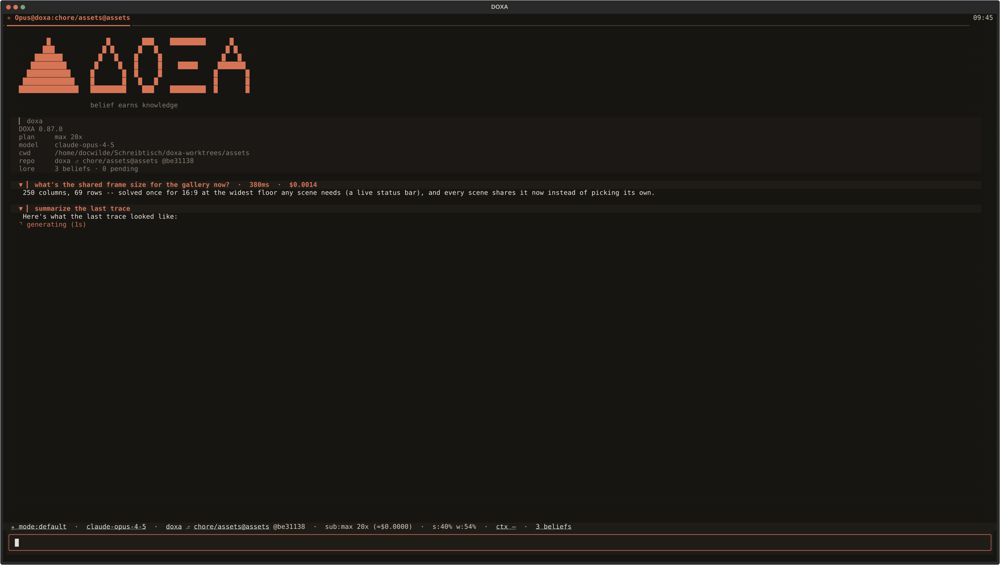</p>

Above the reply, each turn asks the model for its own **summarized**
reasoning and streams it into a `✻ Reasoning (N chars)` fold, collapsed by
default and created lazily on the first chunk — a turn the model answers
without thinking grows no section at all. The count updates while
collapsed; expanding mid-turn never collapses itself back on you. What
this is and is not — summarized is not raw chain of thought, and turning
it off is not turning thinking off — is spelled out under
[Reasoning](#reasoning), because the distinction is billable.

<p align="center">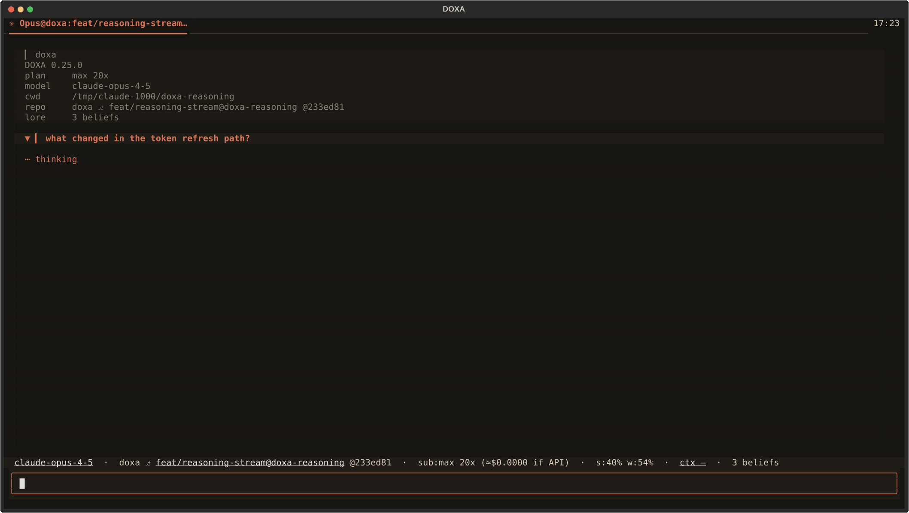</p>

The in-flight marker trails a running turn and names the phase it is in —
`⋯ thinking` before anything has arrived, then `reasoning`, `generating`
or `working` — and it spins. It is **ticked by the engine's delta stream,
not by a clock**: a token arriving is a frame, so a turn in flight
animates while an idle DOXA repaints nothing and arms no timer. A rate
floor stops a fast model buying itself a repaint per token — a measured
700-delta answer advances the glyph four times. The marker goes on
turn_done, on a failed turn, and on a restored transcript.

### 3. Inspect what it actually did

A turn's own top-level tool calls compact behind one `Tool calls (N)`
fold, collapsed by default and created lazily on the first call, so a turn
with none grows no section. N updates live as calls land. Opening the
fold, then a chip inside it, shows that chip's exact arguments and exact
result — formatted only on that first look, never for chips nobody opened.
The fold is **one row per call and nothing else**: an expanded three-call
section used to cost 15 rows, 11 of them chip borders, chip margins and
blank padding. It costs 4 now, and what separates one chip from the next
is indentation and the fold arrow, because a separator that costs a row is
paid once per call.

<p align="center">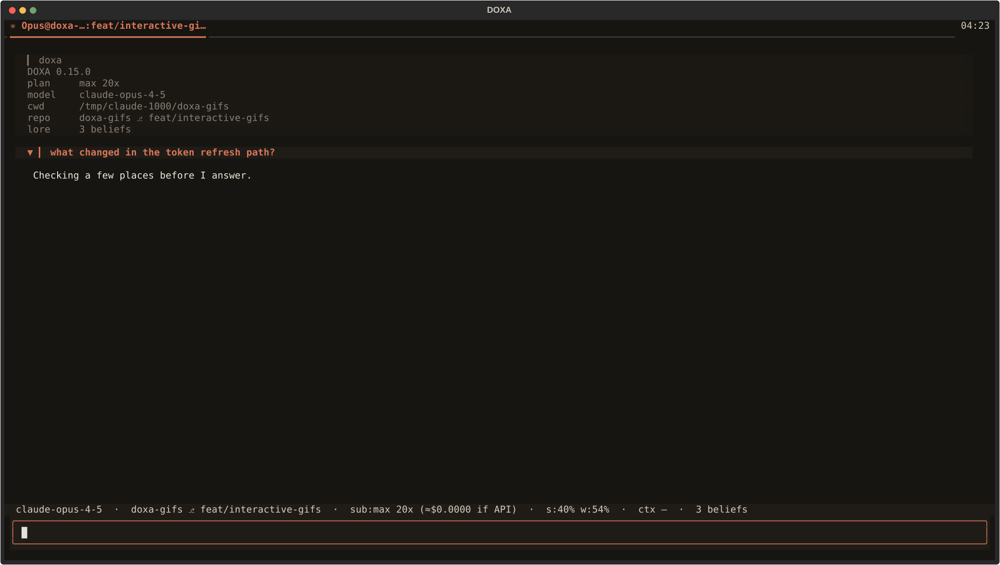</p>

A call against the memory store is an ordinary chip like any other. That
matters more than it sounds: the mechanism that decides what the agent
believes is inspectable with the same two clicks as a `Grep`. Here one
belief comes back calibrated (`STEER`, with its outcome count) and one
still cite-only.

<p align="center">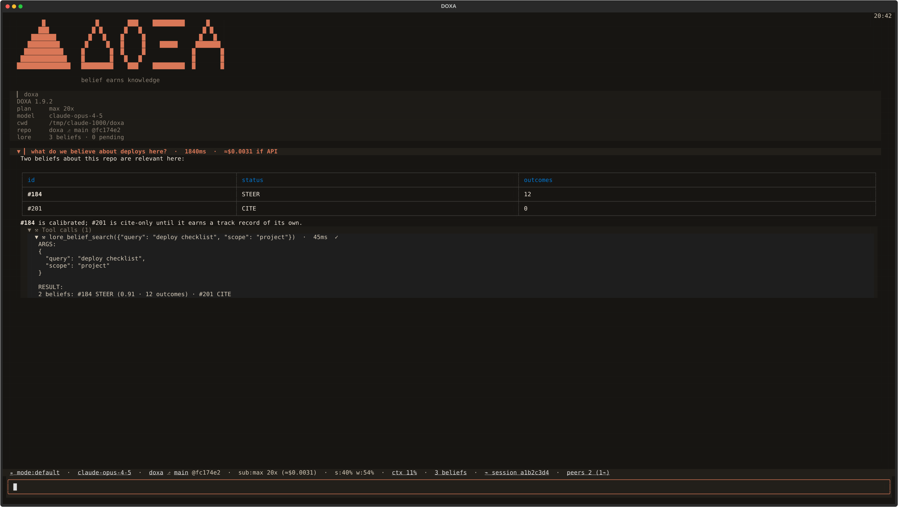</p>

### 4. Follow a subagent

While a `Task`-spawned subagent is still running, a second status row
appears under the status bar — `⧉ N agents` in the bar itself, hidden
below one exactly like the peers chip — with one clickable entry per
subagent in flight, labelled with the description it gave itself. Clicking
one opens a **read-only transcript tab**: no engine, no prompt, just that
subagent's narration and its own tool calls, seeded from whatever its Task
chip already buffered and kept live from there. The tab marks itself `✓`
when the subagent finishes, and closing it is instant — there is no
session behind it to ask about.

<p align="center">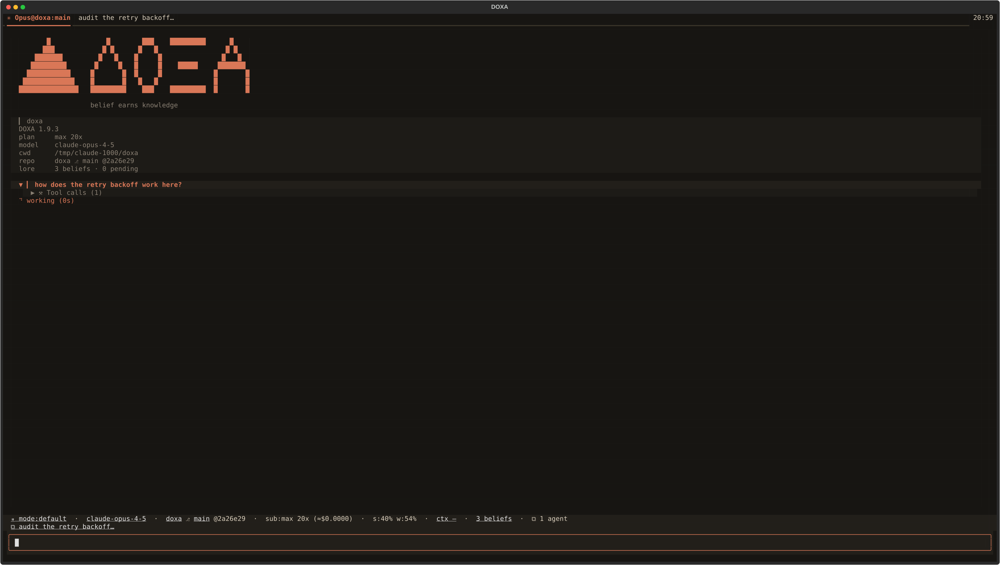</p>

Once the `Task` call finishes, the same activity is where you would look
for it afterwards: nested as a foldable tree under the parent chip rather
than interleaved with the main thread. Formatting happens lazily, only
once a chip is opened, and subagent text passes the same secret-scrubber
as everything else before it reaches a block.

<p align="center">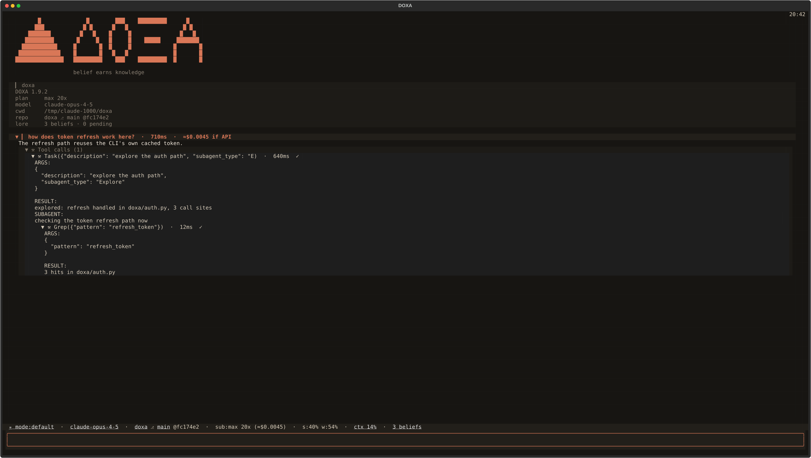</p>

### 5. Answer something it asks you

Without a `can_use_tool` callback, a headless SDK run silently auto-denies
everything the `claude` CLI would normally have shown its own interactive
UI for — an `AskUserQuestion`, a permission prompt for a tool call it
isn't sure about. DOXA supplies one, and surfaces those two genuinely
interactive cases as a dialog above the prompt: question and options for
`AskUserQuestion` (number keys 1-9, arrows plus Enter, Esc to decline),
tool name and input summary with Allow/Deny for a permission request.
DOXA's own `PreToolUse` containment gate is unchanged and stays the
security layer; this is only about the cases that were never asked.

<p align="center">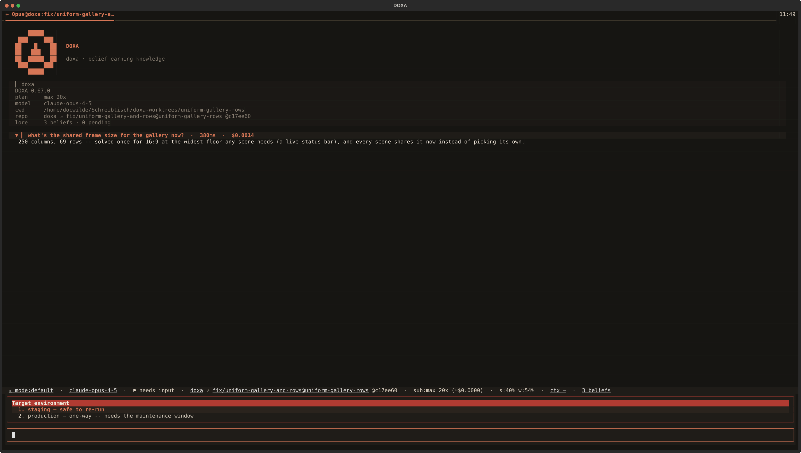</p>

While one is open the status bar reads `⚑ needs input` and the tab blinks
red. The blink clears the instant you look at the tab; the dialog itself
waits for an actual answer. A session you are not watching still tells
you — a desktop notification fires whenever the window is unfocused, and a
session with **no attached client at all** notifies unconditionally rather
than blinking a tab nobody can see, parking the question for whenever
`doxa attach` picks it back up.

<p align="center">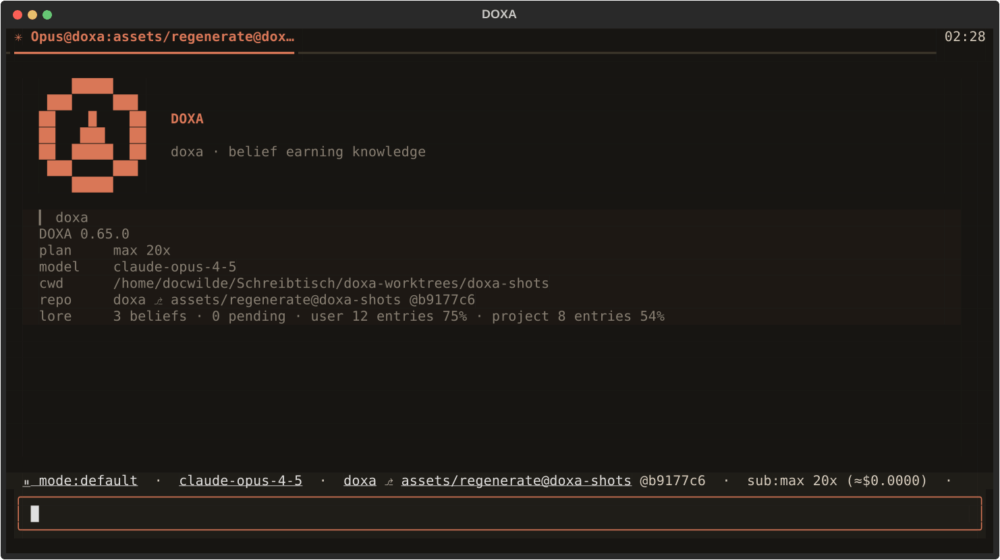</p>

### Permission mode — what still stops and asks you

Whether that dialog ever appears is the session's **permission mode**, and
the `mode:` chip beside the model is where it says so. **Shift+Tab**
cycles it, `/mode` sets it by name, clicking the chip opens the same
picker every other selector chip uses.

The chip's glyphs and colours are **Claude Code's own**, read out of the
installed CLI's permission-mode table rather than guessed — a safety
indicator whose colour means one thing in one client and something else
in another is worse than no convention at all:

| mode | chip | what it does | on the hotkey? |
|---|---|---|---|
| `default` | `⏸ mode:default` grey | the CLI asks you before anything it considers dangerous | ✔ |
| `acceptEdits` | `⏵⏵ mode:acceptEdits` purple | file edits run unasked; everything else still asks | ✔ |
| `plan` | `⏸ mode:plan` teal | no tool runs at all — planning only | ✔ |
| `auto` | `⏵⏵ mode:auto` amber | a model classifier approves or denies each call **instead of you** | ✔ |
| `bypassPermissions` | `⏵⏵ mode:bypassPermissions` **bold red** | **every** tool call runs unapproved; nothing asks | only if the session was armed |
| `dontAsk` | `⏵⏵ mode:dontAsk` **bold red** | anything not pre-approved is **denied**, with no prompt shown | `/mode`, confirms first |

**`bypassPermissions` needs a session that was launched for it.** The
`claude` CLI arms that capability with `--allow-dangerously-skip-permissions`
at launch and refuses it at runtime otherwise — v0.50.0 offered the mode
anyway and users hit the refusal after the keystroke. DOXA now spawns the
flag only when `allow_bypass` is on (`/settings`, or `DOXA_ALLOW_BYPASS=1`),
**off by default**, and a session without it simply does not have the mode:
not in the cycle, not in the picker, not in `/mode`'s list. Typing
`/mode bypassPermissions` in such a session explains which flag is missing
and how to start one that has it, rather than failing. Arming is decided at
launch, so turning the setting on affects sessions started *afterwards* —
`/clear` or `ctrl+t` gets you one.

`⏸` marks the two modes that pause and ask; `⏵⏵` the four that run
something without stopping. The one place DOXA deviates from what it
measured is weight: Claude Code's own cycler cannot reach
`bypassPermissions` at all, DOXA's can, and a colour calibrated for a
mode you had to go out of your way to select is not calibrated for one a
stray keystroke lands on — so the two modes where nothing is checked get
the measured hue plus **bold**.

The chip sits **first on the row**, ahead of the model. The status bar has
no overflow behaviour — a chip that does not fit is simply gone — so
position is the only real guarantee that the one chip reporting whether
this session still asks is never the one that falls off the end. On a
narrow terminal it shrinks (`⏵⏵ mode:bypass`) rather than vanishing;
only a chip that would have said `default` stands down, and only when the
row is cramped.

Entering `auto` or `bypassPermissions` also writes a line in the
transcript, not just a chip. The chip is persistent but peripheral, and
someone who did not mean to press the key is by definition not looking at
the corner of the screen; the transcript lands in the same column as the
work, names what *stopped* ("there is nothing left to decline"), and says
the mode was not saved.

**Two of these were explicit user overrides.** v0.42.0 kept `auto` and
`bypassPermissions` off the hotkey on the argument that a key you tap to
move between conveniences should not reach a mode where nothing asks;
the user read that and asked for both anyway, in two separate decisions.
`dontAsk` was not asked for and is not on the cycler. What is still
guaranteed is narrower and checkable, and since v0.56.0 it is a property
of the *session* rather than a constant: the set a keystroke can reach is
**exactly** this session's own ring — four modes normally, five when it
was launched armed — `dontAsk` is unreachable by any key sequence,
and the step function is total over that set — so putting a sixth mode on
the keyboard means editing a named constant and failing a test.

**About the keycap.** The request was `Ctrl+Tab`. DOXA's own
keyboard-protocol measurement answers
`unreachable_under_legacy('ctrl+tab') → True` — under the legacy key
encoding there is no byte for it, so on most terminals that binding would
have been present, documented and dead. `Shift+Tab` measures `False`
(back-tab, `CSI Z`, older than the problem), is deliverable everywhere,
and is almost certainly why Claude Code uses it too. So Shift+Tab is the
primary binding and **Ctrl+Tab is bound as well**, for terminals speaking
the kitty protocol — with `/help` marking it `✗` where it is not, rather
than leaving you to wonder. Taking Shift+Tab costs Textual's *reverse*
focus traversal; forward `Tab` still traverses and wraps, so nothing
becomes unreachable.

**Session-scoped, not saved.** `/mode` and the hotkey change *this*
session and never write your settings: a permission mode is a posture
adopted for a piece of work, and one Shift+Tab tap should not silently
rewrite the default for every future session. The persistent default is
its own settings row (`permission_mode`), and it takes **only `default`,
`acceptEdits` and `plan`** — narrower than what the hotkey reaches, on
purpose. Cycling into `bypassPermissions` is per-session, visible and
announced, in a session you are looking at; a *stored* bypass is silent,
unbounded in time, and applies to sessions opened in repositories you
have not read yet. Those are different decisions, and no config file or
env var can make the second one. `/mode` says
so out loud if it finds a value it had to ignore. A detached session's
mode lives with its daemon and rides the status and hello frames, so
reattaching shows what the session is *actually* doing, and a switch made
in one tab reaches every other tab on that daemon.

### 6. Run something yourself, without spending a turn

A prompt line beginning with `!` (`!git status`, `!ls -la`, `!pytest -q`)
runs in **this session's own directory** — its linked worktree, so
`!git status` reports on the tree the agent is actually editing. Output
lands in the transcript as its own kind of block: a green left rule and a
`❯` command line, never the `▎` a turn wears, because shell output must
not be mistakable for the assistant's words. The exit code and duration
are always shown, including for a command that printed nothing. stdout and
stderr interleave in order; stdin is `/dev/null`, so a command wanting an
editor or a password fails immediately instead of hanging on a terminal it
can never get. Output past 64 KB is capped and the block says how much it
dropped; a command still running after 120 seconds has its whole process
group killed, so a stray `!tail -f` cannot outlive the tab. It runs under a
Textual worker, so the prompt stays live and the session keeps streaming.

Two things about `!` are deliberate and worth stating plainly.

*It runs with your full privileges and there is no confirmation step.*
`!rm -rf ~` deletes your home directory. That is the point of a shell
escape, and it is safe for exactly one reason: **only a line you type at
the prompt can reach it.** `!` is not a slash command (so nothing that
dispatches a command *by name* — a status-chip click, a future plugin row
— can name it), it is not a tool (so it is absent from the SDK tool
surface and the model has no call that lands there), and text arriving
from outside the window — another session's `/msg`, a tool result, a
replayed transcript — is rendered as a block and never dispatched. Exactly
one module in the package even imports the executor, and a test asserts
that, so wiring a second route in fails loudly rather than shipping
quietly.

*Nothing about it enters the model's context.* Neither the command nor its
output is sent as a turn or written to the session transcript, so neither
survives a tab restore and neither reaches LORE's deriver. `!` is your
private side-channel; if you want the model to see the output, paste it
into a prompt yourself.

### 7. Watch the window fill

The status bar's `ctx` chip escalates normal → amber at 70% → red at 90%,
and hovering it says how many tokens are in the window, how many the
window holds, and how many are left — because 12% of a 200k window and 12%
of a 1M window are different situations, and DOXA drives models with both.
The percentage alone is what the chip costs the bar by default;
`ctx_absolute` prints `24k/200k` beside it, and drops that segment again
below 100 columns rather than pushing other chips off the row. A context
limit the CLI never reported reads `?` and stays `?` — DOXA does not
substitute a window size it did not measure.

`/context` is the breakdown behind that one number: which components are
occupying the window right now, in tokens — system prompt, tools,
messages, free space — plus the `CLAUDE.md` files that got loaded and what
each MCP tool costs. Every figure is the `claude` CLI's own accounting of
its own request, the same measurement the chip reads, so the two cannot
disagree; DOXA runs no tokenizer of its own and estimates nothing. A
component whose size can only be guessed at is either labelled for what is
actually known about it or left out — the LORE snapshot DOXA appends to
the system prompt is reported as an exact **character** count, with a note
saying its tokens are counted inside the system-prompt row, rather than a
token number nobody measured. A session that cannot be asked prints one
sentence saying so and no numbers at all. `/usage` prints the same figures
with separators. All three are reads of one measurement.

Clicking the ctx chip is the one chip action that **asks first**:
compacting is lossy and irreversible, so the click opens a confirm stating
the current percentage and that accepting discards earlier detail, and
only an explicit accept sends `/compact`.

Five other targets open the same dropdown picker — type to filter, arrows
or a click to choose, Enter or a click applies. The model chip and the
**branch half** of the git chip go through the exact `/model` and
`/branch` paths; the effort chip opens with an upfront note that a pick
only ever reaches a *future* session, since the SDK sets effort at connect
time and nothing can make it live on this one; the **`mode:` chip** lists
all six permission modes grouped by whether the Shift+Tab cycle reaches
them, and picking one of the three it does not goes through `/mode`'s own
confirmation; and the **repo half** of the same git chip opens a
directory-walking picker, where a plain
directory descends into it and one marked `⎇` opens in a new tab — the
running session's own cwd never moves under it.

Clicking `peers N` runs `/sessions` directly. That accounts for eight
clickable chips and nine targets; the belief count and the session handle
are the other two, and they come up in steps 11 and 9. Every chip carries
a one-line hover tooltip explaining what it means — the **inert** ones
included, so hovering answers "what is this number" even where there is
nothing to click. Cost and sha stay plain text: not every chip is a
button, only the ones that are.

<p align="center">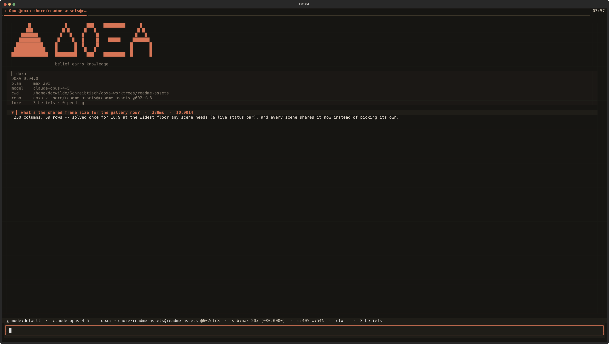</p>

### 8. Open a second tab, and a third

`ctrl+t` opens a fresh session in a new tab at the same repo scope;
`ctrl+w` closes a tab and detaches its daemon, leaving the session
running; `ctrl+←`/`ctrl+→` cycle. A tab not currently in view reports what
it is doing by **color**: amber while a turn runs on it, green the moment
that turn finishes unseen, clearing the instant you look. A background tab
never goes silently forgotten, and never demands a popup to say so either.

<p align="center">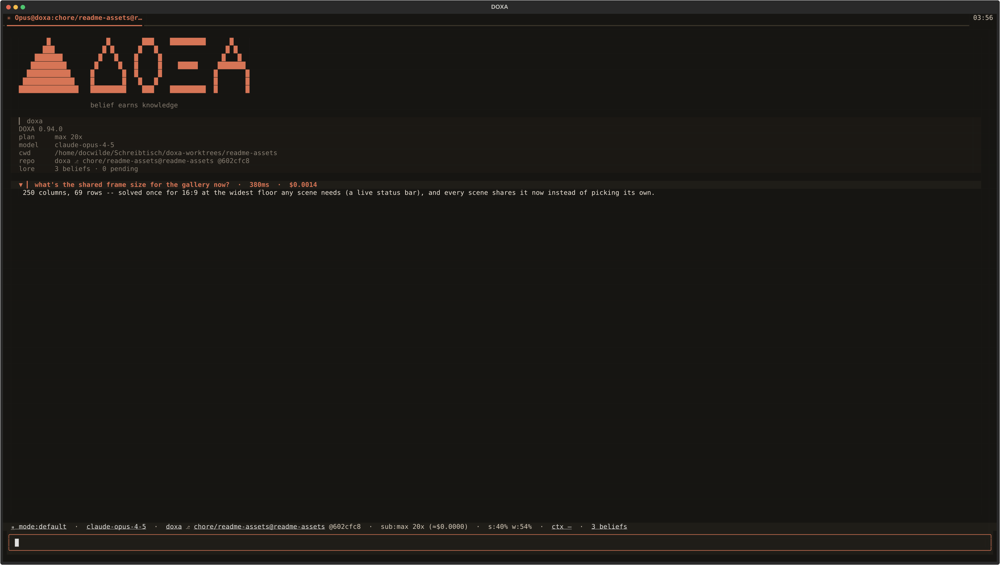</p>

Outside a git repo, or once a custom name is cleared, a tab names itself
from its first turn with one cheap Haiku call, cached in
`~/.doxa/names.toml` so a session is never renamed twice. Double-clicking
a tab header (or `/rename`) opens an inline editor in the tab strip
itself: Enter commits, Esc cancels, an empty name restores the automatic
label.

<p align="center">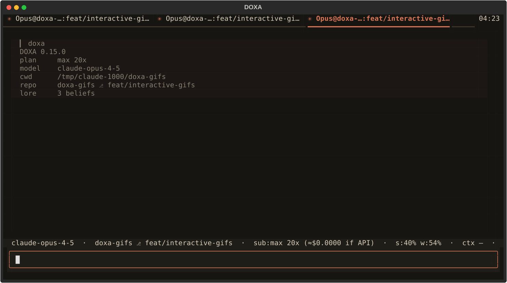</p>

`ctrl+p` opens a palette listing new-tab, the open tabs in tab-bar order
with the active one marked, every registered command grouped (Session ·
Memory · Panes & tabs · Tools & config · Maintenance), then live sessions
available to attach. Typing `/` at the start of the prompt opens the same
list as a dropdown above the input. Both read one registry
(`doxa/commands.py`), so a command cannot exist on one surface and not the
other.

<p align="center">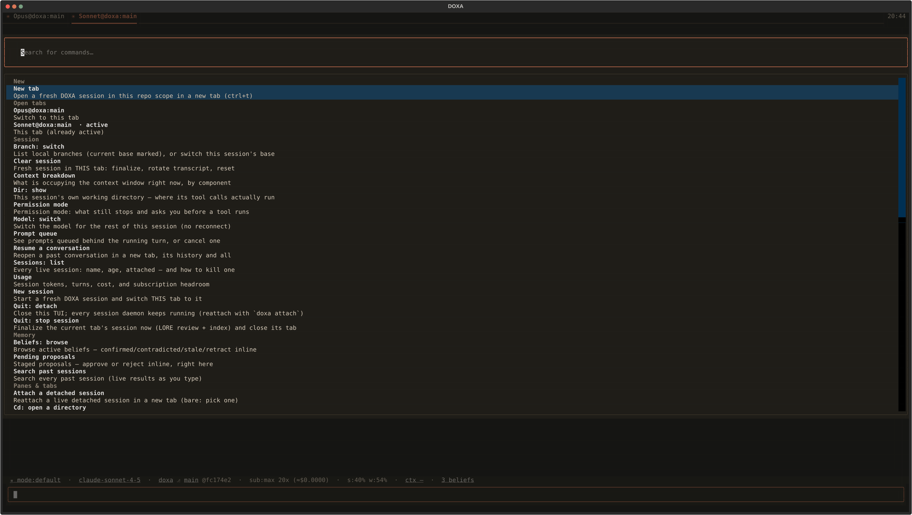</p>

### 9. Walk away, come back

Closing the TUI (`ctrl+c`, or the palette's "Quit: detach") detaches every
tab and leaves each daemon running — pressing it twice stops the sessions
instead. `ctrl+q` and `/detach` are the single-tab doors: `ctrl+q` ends
that tab's session for real, `/detach` (the same as `ctrl+w`) leaves it
running. Running `doxa` again
in the same repo restores the **whole tab set** you left — order, pinned
names, which tab was active, and the conversation that was on each tab
(`restore_tabs`, on by default) — reattaching every session still alive
and reporting what it did, rather than just the single most recent one.

The scrollback is read back from the session's own transcript on disk, so
it is the whole conversation and not just whatever still fit in the
daemon's replay buffer; a restore that had to leave earlier turns out says
so where they would have been. A session that finalized in the meantime —
its `--linger` expiring while the window was shut — is **resumed**: the
tab comes back as a live session continuing that conversation, with the
model's own history reloaded and the turns so far already on screen. That
is the ordinary case, not the exception, which is exactly why it needs no
gesture: a linger timer expiring behind a closed window is how sessions
normally end.

A conversation that *cannot* be continued comes back **read-only** over
its transcript, marked `⏺` — v0.32.0's behaviour, now the fallback — and
its first block says which of three reasons it was: the session is
somehow still running, its directory is gone, or the `claude` CLI has no
history under its id (true of every conversation DOXA recorded before
v0.45.0, when the two kept separate session ids). Restore never spawns a
*replacement* for a session that is gone, never lets a transcript pass
for a live tab, and never resumes one that is still running — a live
conversation has one writer. Only a saved tab with no session *and* no
transcript is skipped, and the report says which is which:

```
tab restore: restored 2 tabs, resumed 1 ended conversation, skipped 1 session no longer running.
```

`resume_restored` (on by default) is the switch. Off is the old
behaviour exactly. On, a restart starts one `claude` process per resumed
tab — a process, not tokens: the CLI loads that conversation from its own
store and nothing is sent until you type.

A tab you closed with `ctrl+w` stays in the set — it only detached, the
session is still running. **A tab you ended with `ctrl+q` stays too** —
the session really is finalized, but the tab comes back exactly the way
any other ended conversation does: resumed live per `resume_restored`, or
read-only over its transcript. The one gesture that removes a session
from the set for good is reaping it by name (`/sessions kill <prefix>` or
`kill-detached`) — a tab merely closed, by any key, is never mistaken for
a tab the user asked to forget. Split
layouts are not restored, because DOXA does not have any; it is a tab
strip. `doxa new` always starts exactly one fresh tab and never restores,
`doxa attach <prefix>` stays the single-session path, and
`DOXA_RESTORE_TABS=0` returns to attaching only the most recent session.

The status bar's `⌁ session <id>` handle is the same idea without leaving
the keyboard: clicking it opens a dropdown of every session in scope, live
and detached (`⌁`) alike, the current one marked. Pick a detached one to
attach to it, in a **new tab** — the same path `doxa attach` takes, and
the same one `/attach` (below) reaches from the prompt — or pick one
already open in another tab to switch to that tab. Copying the handle to
the clipboard, which used to be all a click did, is still there as the
picker's own top row rather than dropped.

`/attach [prefix]` is that same door from the keyboard, and the
counterpart `/detach` never had: bare, it attaches the one detached
session in scope outright, or opens the same picker when there are
several; a prefix takes one directly, refusing an unknown or ambiguous
one by naming what it found rather than guessing.

`/sessions` lists every live session with its age and whether it is
attached here or running detached, with a kill command for either.
Independently launched sessions on the same repo discover each other
through a same-user runtime registry — the `peers N (k⌁)` chip counts live
peers and how many are detached, and `/msg <session> <text>` sends a
message over the target's own socket.

<p align="center">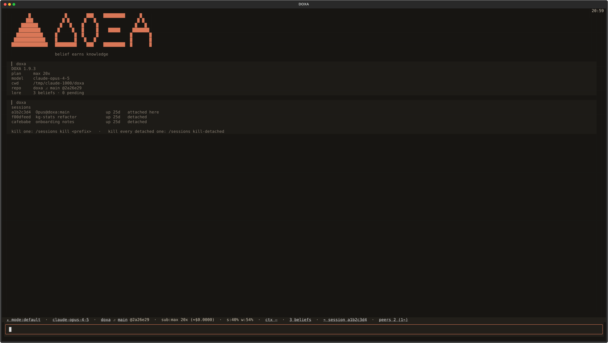</p>

### 10. Find what you said three sessions ago

`/search` opens a popup the moment you type `/search `, full-text over
LORE's session index. `ctrl+r` opens the same thing — this is the one
search path, not a second one. It is debounced and sequence-guarded, so a
slow query can never repaint over a newer one's results; an empty query
lists recent sessions. Matched terms are FTS5's own `snippet()` output,
highlighted rather than re-matched.

A result set spanning more than one session groups into a tree —
a collapsed session header (title, date, age, hit count) over its matching
snippets; a single-session result set has nothing to fold against and
stays flat. `↑`/`↓` move through visible rows, `→`/`←` open and close a
fold. Every row the fold reveals carries **its own age** in a fixed
gutter — messages inside one conversation can be days apart, and a list of
them with no times cannot be read in order.

`enter` means *activate this row*. On a snippet that inserts its excerpt
into the prompt: one citation line (which session, when) plus the text,
collapsed to a `⧉ pasted …` placeholder past the same size threshold a
clipboard paste uses, `ctrl+g` expandable, sent in full on submit either
way. On a **conversation header** it offers to resume that conversation —
see the next step. Folding did not lose a key: `→` and `←` already did it.

<p align="center">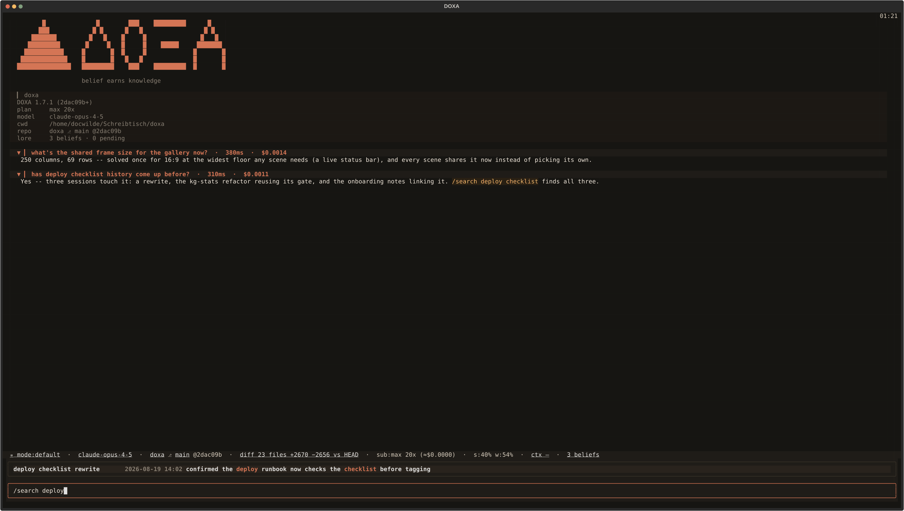</p>

### 11. Pick a conversation back up

Most of the time you will not do anything at all. Close DOXA with three
tabs open, come back tomorrow, and all three are there — including the
ones whose sessions ended overnight, which come back as live sessions
continuing their conversations rather than transcripts of them. The
restore line says so (`resumed 2 ended conversations`), and a tab that
could *not* be resumed comes back read-only exactly as before, with the
reason in its first block. `resume_restored` turns the whole thing off if
you would rather a restart not start a `claude` process per ended tab; it
costs a process, not tokens, since nothing is sent until you type.

For a conversation whose tab you closed months ago, there are two ways
back. Press `enter` on a conversation row in `/search` and DOXA asks
whether to resume it. The dialog states what will happen rather than asking whether
you are sure: it opens in a **new tab**, the model comes back with that
conversation's history in context, and the turns so far are re-rendered
from the transcript on disk so you can read what it remembers instead of
typing into a context you cannot see. The tab you were in keeps its own
session, untouched — `ctrl+w` undoes the whole thing.

`/resume` is the same act from the prompt or the palette. Bare, it lists
the recent conversations to pick from; `/resume <id>` takes one by id
prefix, and an ambiguous prefix is answered with the candidates rather
than by guessing.

Three things it refuses, in words, before spawning anything:

- **Still running.** A live conversation has one writer. DOXA *attaches*
  to its daemon in a new tab instead, and says that is what it did.
- **The directory is gone.** There is nowhere to reopen it.
- **Older than v0.45.0.** Until this release DOXA and the `claude` CLI
  each minted their own session id, so a conversation from before it is
  not one the CLI can continue. It stays readable and searchable; it is
  not resumable, and the dialog says so rather than letting you find out
  one prompt in.

### 12. Look at what the deriver staged

With `derive_secs` set, a background reviewer runs over the live
transcript between turns and stages whatever it judges worth remembering —
behind LORE's approval gate, where it waits for a human. DOXA says so on
three surfaces at once: a block in the transcript that **quotes** what was
staged (a count alone cannot tell you whether a batch is worth opening), a
calm steady tint on that session's tab, and a desktop notification gated
by window focus like every other trigger.

The tab tint is deliberately *not* the needs-input blink. A staged
proposal blocks nothing and expires never, and a signal that shouted would
be lying about the stakes.

**A `175 proposals` chip** sits beside the belief count whenever anything
is staged and disappears when nothing is — until it existed the staged pile
was reachable only by knowing `/pending` existed. Clicking it (or
`/pending`, or one click from the notification block) opens the list folded
by **kind** — `memory/user`, `memory/project`, `filemap`, `belief`,
`skill` — each fold carrying its count, because kind is what the verdict
acts on and a skill writes an executable file where a memory proposal
writes a sentence. Selecting a proposal opens *that proposal's* verbs:
approve, reject, or show it in full. Approve **arms** and applies on a
second, differently-worded selection; reject is one act. Approving writes
into the model's context, rejecting archives a file that stays on disk, and
the UI does not pretend those are the same.

The list itself never acts on a row you selected. Every row leads with the **proposed
verdict**: what approving it would actually do (`add → memory/user`,
`replace → memory/project:doxa`, `retract → belief #42`), what it would
supersede, and how long it has waited. A row that does not say what
approving it changes is not reviewable. The dropdown itself writes
nothing; its first row opens the browser.

The status bar's belief count is the standing version of the same
question. Clicking it opens a list grouped by scope (`user`, `project`,
`user model`), each group **folded behind a header carrying its own
count** — `project (412 beliefs, 3 tested)` — because 635 active beliefs
expanded at once is a wall rather than a glance. The counts are the answer
for most visits; one selection opens the group you came for. A small
enough store skips the folding entirely. Typing filters across **every**
belief whether its group is folded or not, because the matcher has always
scored the whole set rather than what is on screen. Rows carry the minute a
belief was derived, not just the day, and tested beliefs sort to the top of
their group. That is the **glance**.

Selecting a belief opens **that belief's own verbs**: record what reality
did to it — `confirmed`, `contradicted`, `stale`, straight into LORE's
outcome ledger as `source: user`, the same path `lore outcome` takes — or
retract it. Not "approve": a belief is a claim already in the store and
already steering the model, and approving is what happens to a *staged
proposal*, which is a different thing with its own controls below. Retract
takes a second, differently-worded selection, because it takes the belief
out of the working set and the model's context.

`/beliefs` is the session. A full-height tab holding every active belief
and every staged proposal at once. A belief row carries its scope, its
confidence, the date it was created, **what reality last said about it**,
its provenance (`via derived` / `via approved`, or *provenance unknown* for
anything predating LORE's ledger — never back-filled with a guess), and how
many pieces of evidence it rests on. Hovering any row shows its **full**
claim text; `Enter` expands the evidence trail underneath it, fetched for
that belief alone so a store of several hundred never has to cross the wire
with several hundred trails. Each row carries the same verbs as real
controls — `✓ confirmed`, `✗ contradicted`, `⌛ stale`, `⌫ retract…`, or
`c` / `x` / `d` on the focused row — because one widget per row is exactly
what a dropdown cannot give you and what this surface exists to.

That middle column is LORE's own outcome ledger, not an idle timer. Being
*cited* is not being *confirmed* — a belief the agent read back to itself
this morning has not been tested by anything — so the column shows the
newest row of `belief_outcomes`: `confirmed 2d`, `contradicted 2d`,
`stale 40d`, each in its own colour, because "confirmed" and "contradicted"
are opposite facts about one belief. A belief nothing has ever tested says
`never tested` — a state, not a large age, and by far the common case: on
the author's store, 31 outcome rows against 635 active beliefs, only 15 of
which carry a verdict at all. Tested beliefs sort to the top of their scope
group so the needles are not buried in the haystack. When it was last
*cited* is in the tooltip, labelled as what it is.

A staged-proposal row carries its verdict and its own **approve** and
**reject** controls. Reject is one click, or `r`. Approve *arms* on the
first click or `a` and applies on the second, on that same row, in a
different colour and different words — approve writes into the model's
context and reject archives a file that stays on disk, so the
irreversible one is the one that costs two deliberate acts. Arming a row
disarms every other; `Esc` disarms; `Enter` is bound to neither. There is
no "approve all" and no multi-select, on any surface or in any API: the
approval gate exists because a human looked at *this* proposal.

Every approval runs through LORE's own approve path, so an entry approved
here is labelled `via approved` by LORE itself rather than by DOXA. On a
`lore_core` that predates the provenance ledger (LORE 0.36.0) the browser
degrades to **read-only**, renders no approve or reject control, and says
which version it loaded and why — measured off the API it actually found,
not inferred from a version string.

### 13. Make it yours

`ctrl+,` opens the settings modal, grouped into category tabs (Session ·
Memory · Appearance · Notifications · Paths · About). Every row shows its
**effective** value next to where it came from — session, config file, or
default — so a value the environment is shadowing is never mistaken for
one the modal can edit. A row the environment is winning is read-only,
because an edit a live environment variable would immediately shadow is a
silent no-op.

<p align="center">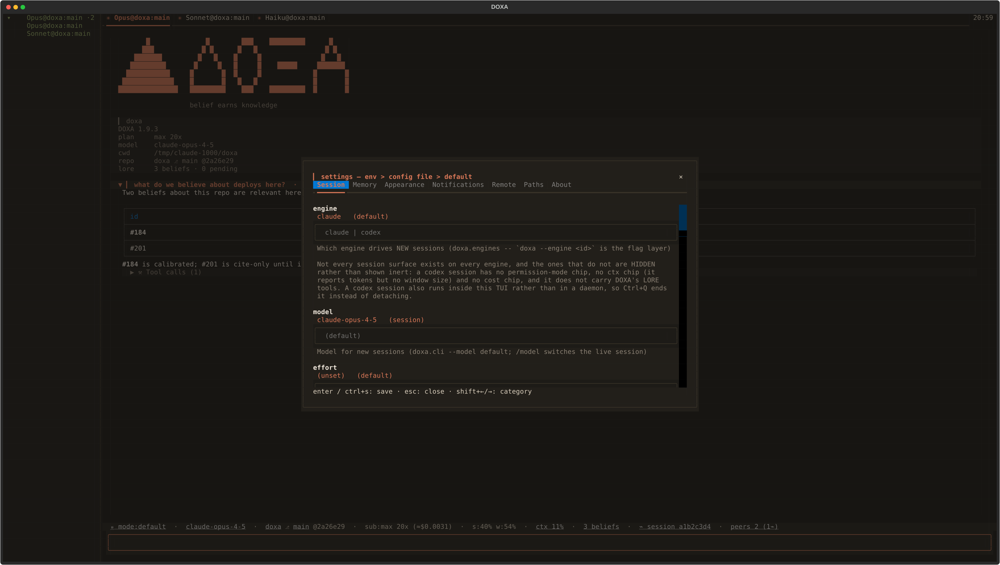</p>

The clock sits fixed-width at the right edge of the tab bar, on its own
compositing layer so it paints over that corner without ever displacing a
tab or narrowing a pane. It is configurable — 12/24-hour, a date prefix,
seconds, an IANA timezone, or a full custom `strftime`, validated on save,
with an unresolvable timezone or a format that stops producing text
falling back visibly rather than crashing. Its one timer is
boundary-aligned: it wakes at the next minute edge with seconds hidden,
the next second edge with them shown, never at a fixed Hz to repaint a
string that usually has not changed.

<p align="center">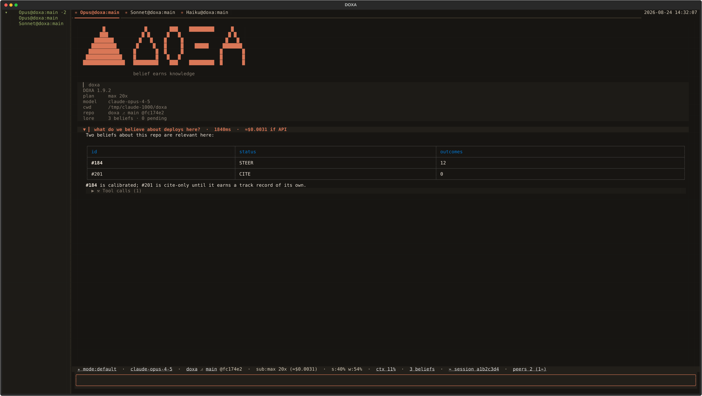</p>

DOXA paints its own `#171512` on the body by default. Set `background` to
`transparent` and it stops painting the base: the transcript, tab strip
and clock chip leave their cells at the terminal's own color instead of an
explicit RGB. **This alone does not make your terminal window
see-through** — that is your terminal emulator's or compositor's job
(kitty's `background_opacity`, WezTerm's `window_background_opacity`, a
macOS Terminal profile). What DOXA controls is only whether *it* paints;
if your terminal is opaque, `transparent` changes nothing visible. Every
other rung of the surface ramp — status bar, tool-calls section, tool
chips, and every popup and modal — keeps its own painted background
regardless, so role tints and floating surfaces stay legible against
whatever shows through. That palette is validated for a **dark** terminal
background: paired with a light one, body text built for a near-black
backdrop will be very low contrast.

<p align="center">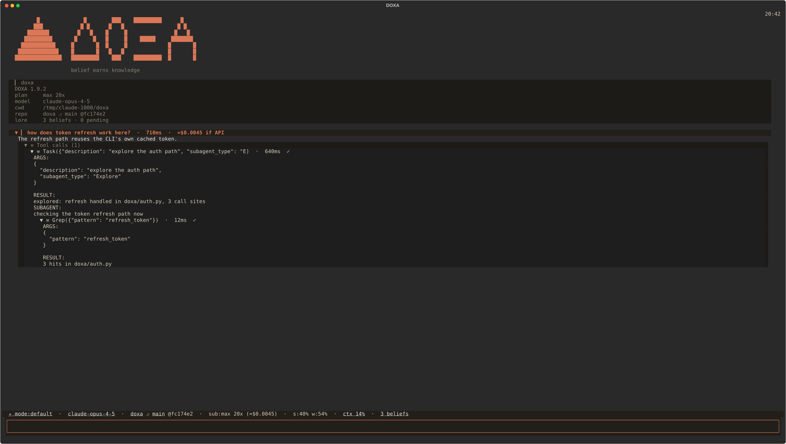</p>

Finally, `/about` is the screen a bug report is copied from (`c` copies the
whole thing): the DOXA version with its sha and a `+` when the checkout is
dirty, whether an update is waiting, the Python, Textual and Claude Agent
SDK versions, the LORE version and store path, **which `lore_core`
loaded** — pinned dependency or plugin checkout, with its directory — the
platform, **the keyboard protocol your terminal grants**, and the config
file actually in force. No row is a constant; each is read off the thing
it names, and one that cannot be filled is left out rather than guessed.

Two commands sit either side of `/about`. `/doctor` — and `doxa doctor`,
which runs the same checks with no TUI at all, exits 1 if anything failed,
and is what `scripts/install.sh` runs at the end of a fresh install — is
read-only: pass/fail plus the exact fix command for anything failing,
across the Python and DOXA versions, the `claude` CLI's version and auth
state, the LORE store's location and active belief count, whether
`config.toml` parses, live daemon count and stale presence files (report
only; `/doctor` never deletes what it counts), the detected terminal image
protocol, the keyboard protocol in force, and MCP reachability — which
passes trivially today, since DOXA has no setting for an external MCP
server yet and so has nothing to reach. `/setup`
is the write half: it checks the same state and fixes findings one at a
time, each behind its own confirmation showing exactly what applying it
will change — auth state (surfaced only; `/login` is what actually signs
in), the LORE store (env wins outright, a choice a previous run made is
remembered, and an existing store the Claude Code plugin uses is the one
case that asks rather than silently picking a side), `/migrate` when a
later DOXA version ships one, then model and effort defaults. It
auto-runs once, on a genuine first launch on this machine, and `/setup`
runs it again on demand.

The keyboard-protocol row exists because terminals differ in which key combinations
they can physically transmit. Under the legacy encoding there is no byte
for `Ctrl+,` and no way to tell `Shift+Enter` from plain Enter; the
[kitty keyboard protocol](https://sw.kovidgoyal.net/kitty/keyboard-protocol/)
fixes that, and Textual asks for it at startup — but never reports whether
the terminal agreed, so a documented key could simply do nothing with no
way to tell whether DOXA or the terminal was at fault. DOXA asks the
terminal itself, once, before the TUI takes over the keyboard, and reports
the answer on `/about` and in `/doctor`. A binding this terminal cannot
send is marked `✗` in `/help`, next to the slash command that reaches the
same place. Silence from the terminal reads as **not measured**, never as
"legacy" — nothing is marked unless the protocol was actually observed,
because a wrong "this key is dead" is worse than no annotation. Nothing is
re-mapped: this reports what your terminal can do, it does not move keys
around it.

## Configuration

Precedence is the same everywhere: **environment > `~/.doxa/config.toml` >
default.** The file is plain TOML, 0600, and safe to hand-edit; it is also
what the settings modal (`ctrl+,` / `/settings`) writes. Clearing a field
in the modal removes that key, which returns the setting to its default.
Unrecognized keys are preserved on save, so a file written by a newer DOXA
survives being opened by an older one.

| setting | env | default | what it controls |
|---|---|---|---|
| `model` | `DOXA_MODEL` | CLI default | model for new turns (`/model` also switches live) |
| `effort` | `DOXA_EFFORT` | CLI default | reasoning effort, new sessions only (connect-time SDK option) |
| `allow_bypass` | `DOXA_ALLOW_BYPASS` | off | let NEW sessions reach `bypassPermissions` at all, by spawning their CLI with `--allow-dangerously-skip-permissions`. Off by default: on, every session started afterwards is one keystroke from running tools unapproved, in every repo you open. Arming happens at launch, so this never affects a session already running |
| `permission_mode` | `DOXA_PERMISSION_MODE` | `default` | mode new sessions connect in. Accepts `default`/`acceptEdits`/`plan` only — **narrower than what Shift+Tab reaches**: cycling into `auto` or `bypassPermissions` is visible and lasts one session, a stored one would be silent and apply to every future session; an out-of-range value is ignored and `/mode` says so |
| `derive_secs` | `DOXA_DERIVE_SECS` | off | streaming-deriver interval; unset runs review only at session end |
| `linger_secs` | `DOXA_LINGER_SECS` | 120 | seconds a daemon outlives its last detached client |
| `worktree_per_session` | `DOXA_WORKTREE` | **on** | give each session its own git worktree instead of sharing the launch directory |
| `restore_tabs` | `DOXA_RESTORE_TABS` | **on** | plain `doxa` restores this repo's whole saved tab set — order, names, active tab and each tab's conversation — instead of just the most recent session |
| `consult_floor` | `DOXA_CONSULT_FLOOR` | 1.0 | act-time belief-consult threshold; 0 disables it |
| `background` | `DOXA_BACKGROUND` | `opaque` | `opaque` paints DOXA's own base (today's look); `transparent` stops painting it so an already-transparent terminal shows through — the terminal itself still has to be configured that way |
| `nerd_font` | `DOXA_NERD_FONT` | off | use a Nerd Font glyph for the branch chip |
| `ctx_absolute` | `DOXA_CTX_ABSOLUTE` | off | print `24k/200k` beside the `ctx%` chip; dropped again below 100 columns, and the numbers are in the chip's tooltip either way |
| `image_mode` | `DOXA_IMAGE_MODE` | probe | force a rung of the image ladder (`kgp`/`sixel`/`halfblock`/`text`) |
| *keyboard override* | `DOXA_KEYBOARD_PROTOCOL` | probe | `kitty`/`legacy`/`unknown`, for a terminal that lies about it. Env-only on purpose: a saved answer is a claim about a terminal you may not be sitting at any more |
| `show_reasoning` | `DOXA_SHOW_REASONING` | **on** | stream the model's summarized reasoning into a collapsed per-turn fold; `0` stops DOXA asking to see it |
| `notify` | `DOXA_NOTIFY` | `auto` | when desktop notifications fire: `auto` (only while the window is unfocused), `always`, or `off` |
| `notify_turn_done` | `DOXA_NOTIFY_TURN_DONE` | **on** | notify when a turn finishes |
| `notify_staged` | `DOXA_NOTIFY_STAGED` | **on** | notify when the background reviewer stages proposals; names the tab and quotes the first one |
| `notify_needs_input` | `DOXA_NOTIFY_NEEDS_INPUT` | **on** | notify when a session is waiting on you; a fully detached session notifies regardless of focus |
| `notify_update` | `DOXA_NOTIFY_UPDATE` | **on** | notify when `/update` has something to pull |
| `notify_lore` | `DOXA_NOTIFY_LORE` | **on** | `lore_core`'s own review banner, which knows nothing about window focus; held silent while `notify_staged` is on, so one staged batch produces one notification |
| `clock_show` | `DOXA_CLOCK_SHOW` | **on** | show the upper-right clock |
| `clock_date` | `DOXA_CLOCK_DATE` | off | prefix the clock with `%Y-%m-%d` |
| `clock_hour` | `DOXA_CLOCK_HOUR` | `24` | `12` or `24`-hour |
| `clock_seconds` | `DOXA_CLOCK_SECONDS` | off | show `:SS`; also re-aligns the clock's timer to the second instead of the minute |
| `clock_tz` | `DOXA_CLOCK_TZ` | system | IANA zone name, e.g. `Europe/Berlin`; unresolvable falls back to system local, visibly |
| `clock_format` | `DOXA_CLOCK_FORMAT` | (none) | custom `strftime`, overrides the toggles above; validated on save |
| *lore store* | `LORE_ROOT` | `~/.claude/lore` | `lore_core`'s own store path; `lore_root` in the file is `/setup`'s sticky choice, not the modal's to edit |

`~/.doxa/` holds durable state (this config); the runtime directory
(`$DOXA_RUNTIME_DIR` → `$XDG_RUNTIME_DIR/doxa` → `~/.local/share/doxa`)
holds ephemeral daemon sockets and the peer registry — kept out of the
home directory because a home directory can be network-mounted, where Unix
sockets misbehave. The LORE store is neither: it stays `lore_core`'s own
path, shared with the LORE Claude Code plugin on purpose, so switching
between the two never forks your memory into two divergent halves.

## Reasoning

What streams into the "Reasoning" fold is **summarized** reasoning, not
Claude's raw chain of thought: DOXA requests `thinking: {"type": "adaptive",
"display": "summarized"}`, and on every current model that field's other
value — `"omitted"` — is the *default*, meaning the API would otherwise send
back a `thinking` block whose text is an empty string. The raw internal
reasoning is never returned by the API at all, on any model, at any setting;
`"summarized"` is a real (and, per Anthropic's own docs, differently-billed —
you're charged for the full thinking tokens generated, not the shorter
summary you're shown) pass over that reasoning by a separate summarizing
model, not a truncation of it.

`show_reasoning` off does **not** assert `thinking: {"type": "disabled"}` —
it asserts nothing at all. Claude Fable 5, Claude Mythos 5 and Claude Mythos
Preview reject an explicit disable outright (thinking cannot be turned off on
those models under any configuration), and the session's actual model is
usually still unknown at the point these options are built — the CLI only
reports it after connecting — so there is no way to special-case around that
per model. Concretely: off means DOXA stops *asking to see* the reasoning;
on a model where thinking always runs, it still runs, and is still billed,
independent of this toggle. On a model where thinking is optional (most
non-5-generation models), off is a real zero-thinking-cost toggle. This is a
real API constraint, not a DOXA limitation the setting works around.

## How it works

Each session runs as its own **daemon process** hosting the Claude Agent
SDK client, the LORE hooks, and the transcript; the TUI is a thin client
attached over a 0600 Unix socket, so detaching and reattaching never
depends on the terminal that started the session staying open. Every tool
call the agent makes passes a containment gate at the PreToolUse
boundary — a call outside the declared tool registry is denied, and a tool
that fails twice in a session is disabled for the rest of it rather than
retried into the step budget.

LORE's memory model is summarized above; the full model — curated memory,
the belief store, the derive/dream/dialectic split, calibration — is
documented in the [LORE repository](https://github.com/docwilde/LORE),
which DOXA embeds as `lore_core` rather than reimplementing.

`lore_core` is a declared dependency — `lore-core @ git+…LORE@v0.35.1` in
`pyproject.toml`, pinned to a tag rather than a branch — so a bare clone
gets it from `uv sync` and needs nothing else. It is packaged out of the
LORE repo, where the plugin manifest stays the one place the version is
written.

**A pin is only as current as whatever moves it, so something does.**
`.github/workflows/lore-bump.yml` runs weekly (Mondays, 04:17 UTC) and on
demand: it reads the pinned ref, asks GitHub for LORE's newest `vX.Y.Z`
tag, and if that tag is ahead of the pin it rewrites `pyproject.toml`,
re-locks, runs the full suite against the result, and opens a pull
request. It never merges and never pushes to `main` — a green PR means the
upgrade is safe and waiting for a human, a red one means LORE moved in a
way DOXA cannot take yet. There is at most one such PR at a time: the
proposal lives on a single machine-owned branch (`automation/lore-bump`)
that a newer tag supersedes in place, and a proposal a maintainer closes
unmerged is not re-opened. When no LORE tag is newer than the pin the run
is green and silent, which is its ordinary outcome.
`scripts/lore_bump.py` is that decision on its own and answers in about a
second from a terminal.

That is the *staleness* half. CI's third matrix leg, which checks LORE out
at `main`, is the *breakage* half: it goes red when a LORE change breaks
DOXA, and it can never tell you that a LORE release exists which DOXA has
not adopted. Note also what a bump does **not** change, per the next
paragraph — on a machine with the LORE plugin installed the plugin's copy
wins regardless of the pin, so this matters for bare installs and for CI.

**Two copies can exist on one machine, and the plugin's wins.** A user
with the LORE Claude Code plugin installed has a checkout that DOXA
prepends to `sys.path` (`doxa/_lore_bootstrap.py`), ahead of the pinned
one. That is deliberate: both read and write the same `~/.claude/lore`
store, the plugin writes to it from a hook on every Claude Code session
start, end and compaction, and pointing two different `lore_core` versions
at one SQLite file is how a migration gets read by the version that did
not perform it. It also means a checkout you are editing is the one DOXA
sees, which is the behaviour that has been true since the shim was
written.

The price is that `pyproject.toml` no longer tells you what loaded, so
DOXA says it: `/about` carries a **`lore from`** row naming the source
(`plugin` or `package`) and its directory, measured off the imported
module rather than restated from the rule. Two env vars steer it —
`DOXA_LORE_CORE_PATH` points at a plugin checkout somewhere other than the
default `~/.claude/plugins/marketplaces/lore`, and `DOXA_LORE_SOURCE=package`
ignores any checkout and takes the pinned dependency, which is how you
reproduce a bug against exactly what CI runs.

## Status

DOXA is a working daily driver for its author, not a finished product.
Everything in [What you get](#what-you-get) and in the walkthrough above has
shipped and is described as it behaves today; [CHANGELOG.md](CHANGELOG.md) has
the version-by-version history. Interfaces — config keys, socket protocol,
command names — can still change between minor versions.

The rest of this section is the other half: what has been designed and not
built, and what gets asked about often enough to be worth answering plainly.
Nothing below this line is available today, and none of it should be read as
a feature.

### Specified, but not built

Four documents under [`docs/`](docs/) are **specifications, not shipped
features**, and are written that way on purpose — specifying a thing before
building it is cheaper than discovering the design in the diff. Each one is a
design that has been thought through and not yet implemented:

- [`docs/plugin-api.md`](docs/plugin-api.md) — **the plugin API.** There is no loader: no entry-point discovery, no `~/.doxa/plugins` scan, no allowlist, no `Plugin`/`PLUGIN` object, nothing in DOXA that loads third-party code at all. What v0.34.0 actually shipped is the *shape* — the `app.py` split landed along four seams (the command registry `PANE_COMMANDS`, the status-chip records `_status_chips()`, the event dispatch map `EVENT_RENDERERS`, and the `ModelProvider` protocol), so each extension point in the spec names a real structure a loader could bind to. That is the whole claim. The spec also settles two decisions ahead of time: a plugin is never loaded from the working repository, and no plugin-facing write into the belief store will exist.
- [`docs/split-panes.md`](docs/split-panes.md) — **split panes.** DOXA is a tab strip today; nothing here is built, and a saved tab set restores no layout because there is none to save.
- [`docs/remote.md`](docs/remote.md) — **remote control and a web client.** Nothing here is built. The daemon's sequenced event stream is what a second renderer would consume, which is why the spec exists, but there is no network transport, no authorization model and no client. Note that this document reasons about a permission-mode feature that has also not landed on `main`.
- [`docs/mermaid.md`](docs/mermaid.md) — **mermaid diagrams in the transcript.** Nothing implemented. A ```` ```mermaid ```` fence renders as a fenced code block today, which is what every other terminal client does; v0.41.0's image ladder is what a rendered diagram would arrive through, and the open question the spec is actually about is where the renderer's dependency lives.
- [`docs/code-graph.md`](docs/code-graph.md) — **a queryable code graph.** Nothing implemented. One graph per worktree, built from the AST and swept in the background on commit, with `purpose` carried on a node as a *second provenance* beside the structure the parser can see — the spec is mostly about keeping those two provenances distinguishable rather than about the parsing.
- [`docs/live-diff.md`](docs/live-diff.md) — **a live side-by-side diff with per-hunk reject.** Nothing implemented, and downstream of split panes. Its tick is the `tool_result` stream rather than a file watcher, and the part that needs the care is that rejecting a hunk is *two* acts — the file goes back, and the agent's belief about the file has to be corrected, or its next edit is built on a premise that is no longer true.
- [`docs/sandbox.md`](docs/sandbox.md) — **sandboxed sessions by default, on top of worktrees.** Nothing implemented. A worktree isolates what a session may *change*; it isolates nothing about what the spawned process may *reach* — `$HOME`, the credentials, every sibling worktree, the network. The mechanism exists (`ClaudeAgentOptions.sandbox`, bubblewrap and seccomp on Linux, measured present on the author's machine), but the SDK's own docstring puts filesystem and network policy in *permission rules* rather than in the sandbox settings, so the work is synthesizing that policy per session from the worktree sidecar. A sandbox that silently fails to apply is the outcome the spec is written to prevent.

### Not built, and not specified either

- **Orchestration.** There is none, in any form. Nothing in DOXA schedules sessions, assigns work between them, supervises a fleet, or decides that one session should start another. `/msg` is the entire inter-session mechanism and a human is always the one who sends it — see the peers bullet above for exactly how far that goes.
- **Resuming a session that predates v0.56.0.** Resuming works now — a restored tab continues its conversation, and `/search` and `/resume` reopen any other in a new tab. It works because v0.56.0 stopped DOXA and the CLI minting *two* session ids and pinned them to one, which is a fix that cannot reach backwards: a conversation started before that release is addressed by an id the CLI's own store never knew, so it comes back read-only and says so before anything spawns.
- Session-history drill-in past `/search`'s result list, customizable keybindings, and a graphical context-window map.

Run the test suite with `uv run pytest`.

## Non-goals

Provider-agnostic model routing — the point is subscription auth, not a
router. Replacing the LORE Claude Code plugin, which keeps shipping the
same core. General Claude Code plugin compatibility — DOXA does not load
third-party plugins today.

## License

[DOXA Noncommercial License 1.0](LICENSE) (PolyForm-Noncommercial-derived)
— free for personal use, research, education, and noncommercial
organizations; commercial use requires a separate arrangement with the
author. Same license family as [LORE](https://github.com/docwilde/LORE),
whose `lore_core` DOXA embeds.
