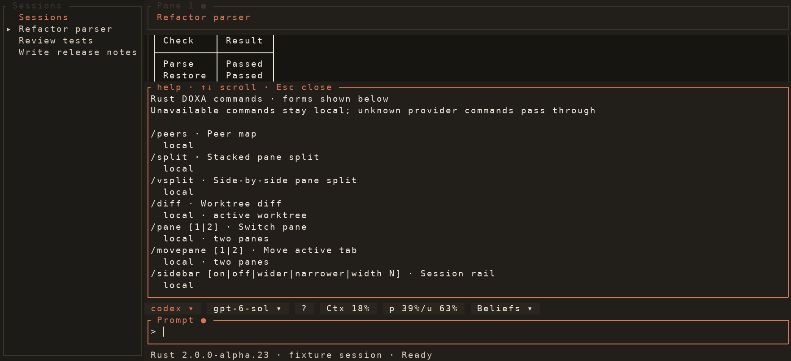
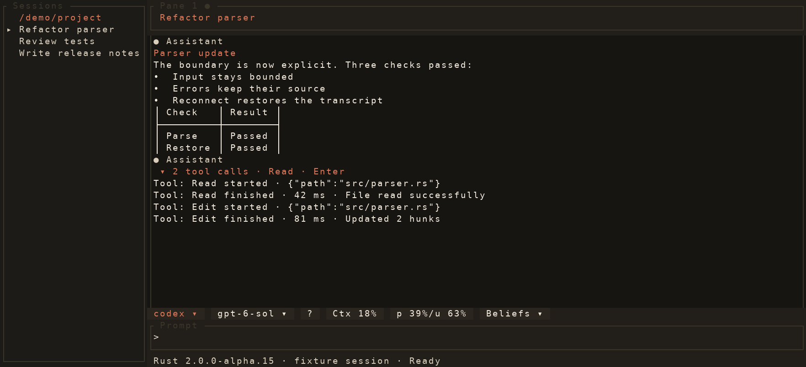
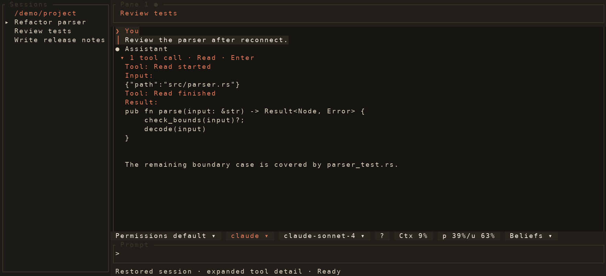
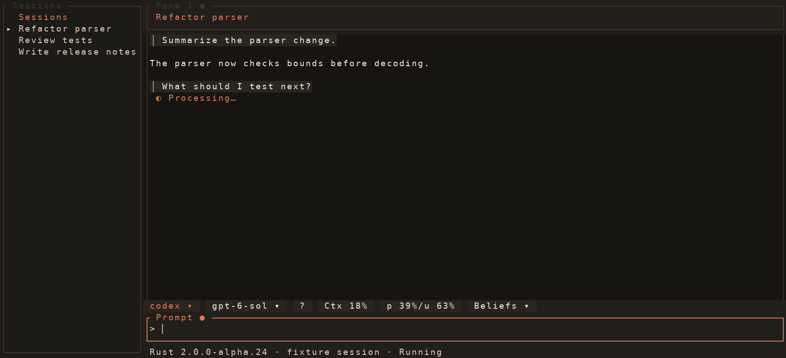
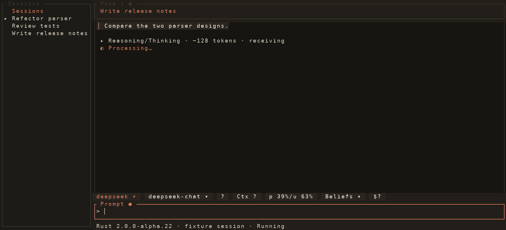
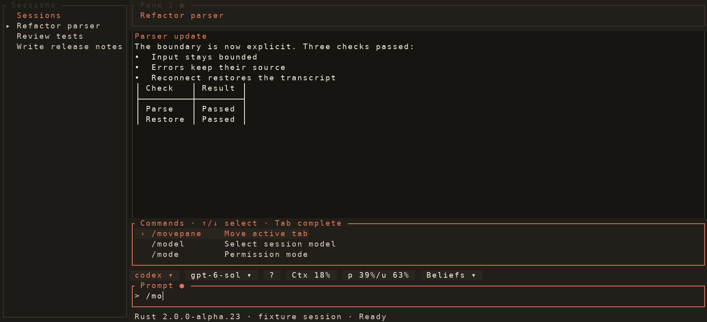
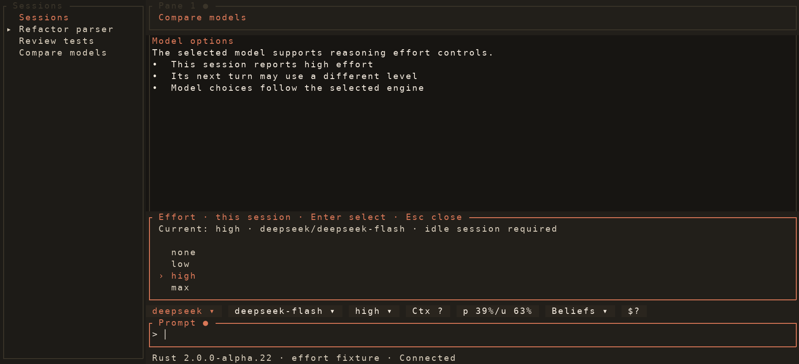
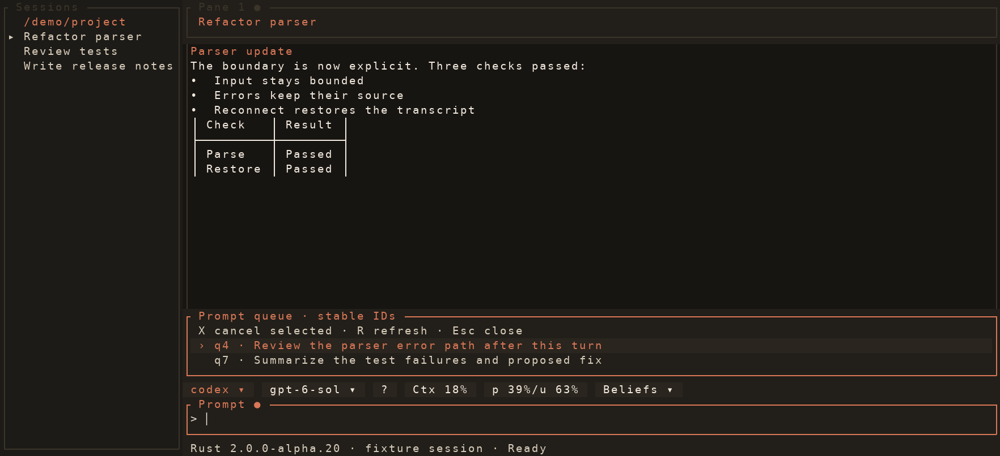
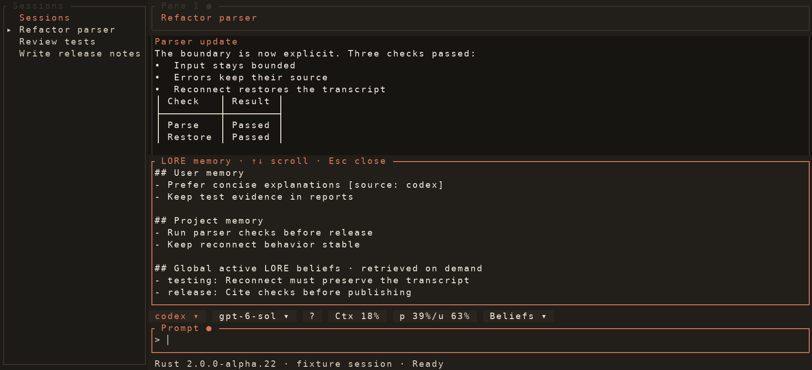

<p align="center"></p>

<p align="center">
  
  <a href="https://github.com/docwilde/doxa/releases/tag/v2.0.0-alpha.24"></a>
  <a href="https://github.com/docwilde/doxa/actions/workflows/rust-ci.yml"></a>
  
  
</p>

> [!WARNING]
> **Alpha.** Rust 2.0 is the main DOXA frontend. Config and on-disk formats
> can change between alpha releases. Agents
> can edit files and run commands with your privileges. Read
> [Non-goals](#non-goals) before using it on important work.

The current Rust preview is [v2.0.0-alpha.24](https://github.com/docwilde/doxa/releases/tag/v2.0.0-alpha.24).
GitHub labels 1.19 as the latest stable release while Rust 2.0 remains a prerelease.

**DOXA** is a terminal for coding agents. Development now leads with the
**Rust 2.0 alpha**, built with Ratatui and a native daemon. Run Claude, Codex,
DeepSeek, or GLM in separate sessions; close the terminal and reattach to their
daemons later. Claude currently uses a bundled Python SDK sidecar.
[LORE](https://github.com/docwilde/LORE)
shares user and repo memory across DOXA, Claude Code, and Codex, with
evidence-backed beliefs and an informational source-engine label. See the
[engine setup and capabilities](rust/README.md) guide.


*The lead image and gallery below are rendered by the real Rust 2.0
Ratatui frontend from deterministic fixture events. No provider calls or
account data are used. The fixtures and renderer live in
[`scripts/rust_gallery.py`](scripts/rust_gallery.py).*

## What you get

Launch and reattach [four engines](rust/README.md), work
across grouped tabs and two-pane splits with separate prompts, move an active
tab with `/movepane`, inspect bounded
worktree diffs and tool cards, change supported models and permissions, and
browse LORE beliefs and peer activity. The [Rust guide](rust/README.md)
describes its current capabilities and limits. Managed worktrees, diff hunk
rejection, explicit clean Rust-orphan cleanup, guarded session checkout recovery,
reviewed LORE belief actions,
LORE proposal review, and Python-backed fleet operation are in the
alpha. Native fleet supervision and remote control are still being ported.
`/cd <path>` opens a new tab rooted in a different directory. Explicit
Claude `/compact` waits for a successful LORE review. Known DeepSeek and GLM
models can use dated-price native spend ceilings when every request reports
complete token usage. `doxa setup`, `doxa auth status`, and `doxa plugins`
offer setup diagnostics; `doxa settings` shows and changes native linger and
worktree preferences for future sessions.
`/usage` and `/context` open per-session detail panels, and `/collection`
organizes the session rail. Native fleet preflight reports supervisor capacity
and approval policy before handing execution to the Python bridge.
`/help` lists Rust support for all 42 DOXA 1.19 commands. `/search` consults
LORE's existing session index before its bounded transcript scan and shows
grouped, scrubbed excerpts as you type. Guarded `/clear` starts a fresh
session in the same tab after verifying a writable
tabset.
Processing appears inside each transcript; reasoning is folded behind a live
token counter, and expanded tool activity shows scrubbed result detail.
Restored Claude and newly persisted Codex sessions keep expandable tool details in the bounded transcript
view. User turns are highlighted without visible role headings. Transcript
HTTP(S) links open in the browser with Ctrl+left click and show a pointer cursor
in supporting terminals.

## Gallery

### Rust 2.0 alpha.24



*`/help` lists the supported Rust forms and calls out unavailable 1.19 commands.*


*Tool calls stay collapsed in the transcript until expanded.*



*Select a tool section and press Enter, or click it, to inspect the bounded details.*



*Claude tool details remain expandable after session recovery.*



*User messages have a warm highlight, agent replies keep the normal surface, and the pane shows processing while the next request runs.*



*Streamed reasoning stays folded while its approximate token count updates.*



*Typing a slash command filters local DOXA actions; Tab completes the selected entry.*


*A daemon input request expands above the active prompt.*


*The permission picker expands from the chip row above the active prompt.*



*The effort chip reports the current session; on supported vendor models, picker choices apply before its next turn when idle.*


*Session history searches attached and archived transcripts and groups
scrubbed indexed excerpts beneath each matching session.*



*The queue picker shows waiting prompts and cancels the selected item by its ID.*



*The memory chip opens scoped curated entries and a separate list of global beliefs.*

These images come from `python3 scripts/rust_gallery.py`, which renders the
production `doxa_tui::ui::App` through Ratatui's test backend. The sessions,
events, and usage numbers are fixtures; they are examples of UI behavior,
not a live provider run.

## Install

### Rust 2.0 alpha

```sh
curl -fsSL https://raw.githubusercontent.com/docwilde/doxa/main/scripts/install.sh | sh
```

The installer builds the Rust frontend and daemon from `main` and installs the
Rust `doxa` command in `~/.local/bin` (or `DOXA_RUST_BIN_DIR`). Pass a tag such
as `v2.0.0-alpha.24` after `sh -s --` to pin a release. It uses Git, Cargo,
Python 3.11+, and `uv`; the Python environment it creates is private to the
LORE and Claude sidecars. No Python frontend command is installed. See the
[Rust guide](rust/README.md) for provider setup and current limits.
On Linux, it also installs a per-user application menu entry and icons under
`$XDG_DATA_HOME` (default `~/.local/share`). The entry launches the installed
Rust `doxa` by absolute path. Set `DOXA_NO_LAUNCHER=1` to skip it.
If an older `uv tool` install owns `doxa`, run `uv tool uninstall doxa`
before installing Rust; the installer reports when another `doxa` on `PATH`
would shadow its launcher.

From a checkout, `cargo build --locked` builds the Rust frontend and daemon;
`./task build`, `./task run`, and `./task install` provide the matching local
launcher workflow. Install
builds committed `HEAD` with the same locked sidecars and launcher as the
release installer. If an existing local `main` predates the Rust files, run
`git pull --ff-only` after checking it out; `git checkout main` alone does not
fetch newer commits.
Use `doxa help` for commands and `doxa update` to rebuild an installed Rust
launcher from `main`.

## Quickstart

Check dependencies, start a session, and reattach later:

```sh
doxa doctor --engine codex
doxa new --engine codex
doxa list
```

The [Rust guide](rust/README.md) covers Claude, DeepSeek, and GLM setup.

## Status

Rust 2.0 alpha is the main line. The [Rust guide](rust/README.md) tracks
what is implemented and what still needs porting. Existing Python 1.x releases
and their [manual](docs/manual.md) remain available for historical reference;
the Python SDK and LORE sidecar modules remain internal runtime dependencies.

Rust CI tests the frontend, native daemon, protocol, LORE bridge, installer,
and compatibility paths. See the [Rust UI benchmark](docs/rust-ui-benchmark-2026-09-25.md)
for rendering, event-loop, scrolling, and resize measurements.

## Non-goals

- **Automatic model routing:** you choose an engine per session; DOXA does
  not load-balance or fail over between providers.
- **Replacing LORE:** DOXA uses the same core as the Claude Code and Codex
  plugins.
- **Full Claude plugin compatibility:** the 2.0 alpha uses a Claude SDK
  sidecar. DOXA's [plugin API](docs/plans/plugin-api.md) remains a design.

## License

[AGPL-3.0-only](LICENSE) for everyone, including over a network; a
[commercial licence](LICENSE-COMMERCIAL.md) is available for uses AGPL's
terms don't suit. The DOXA name and mark are reserved — see
[TRADEMARK.md](TRADEMARK.md).
