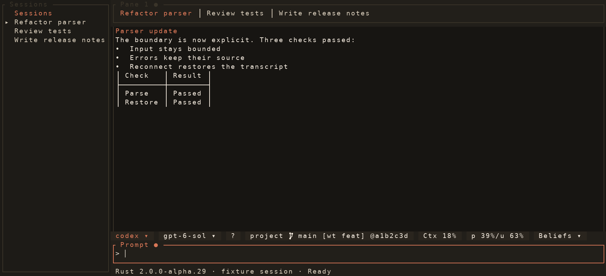
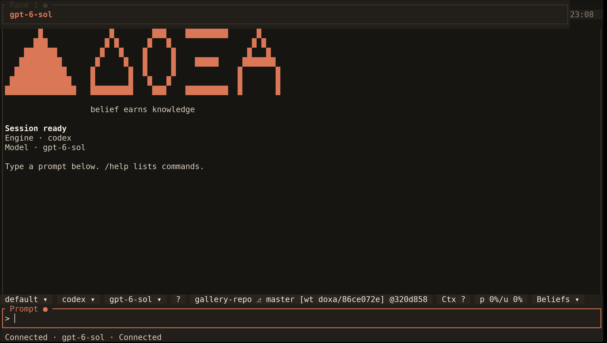
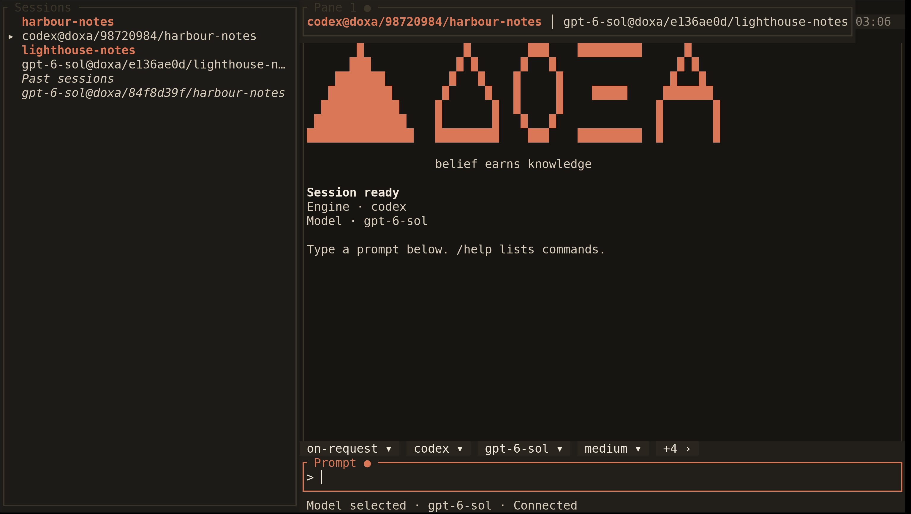
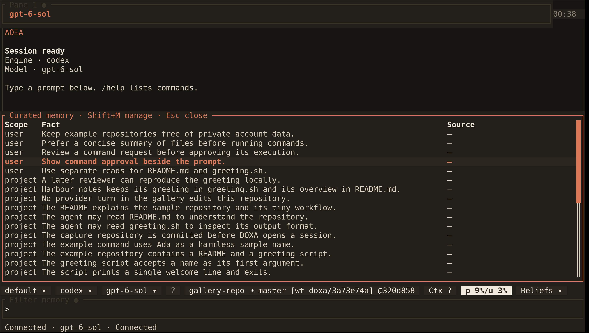
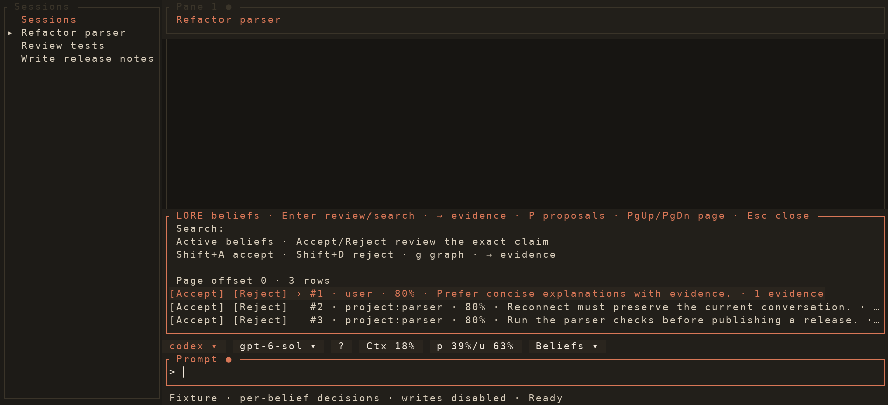
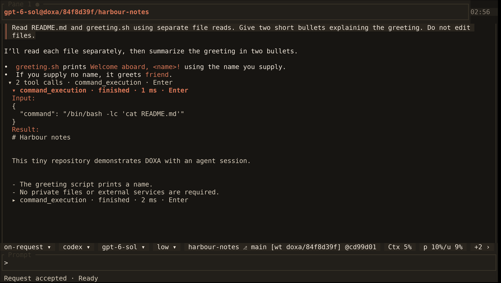
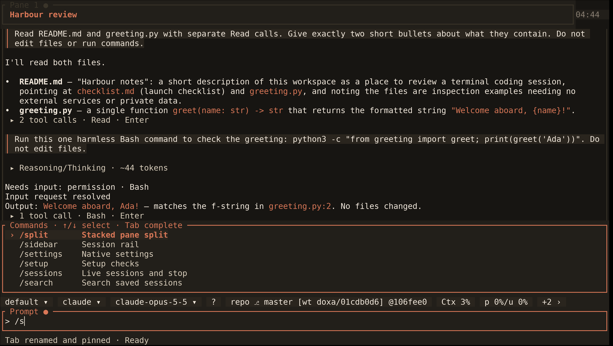
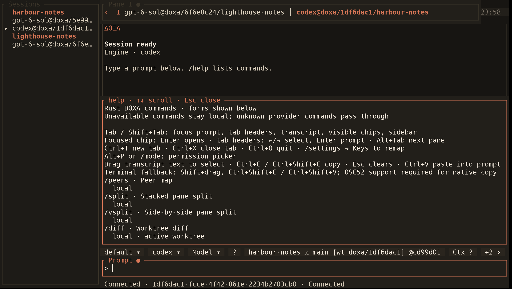
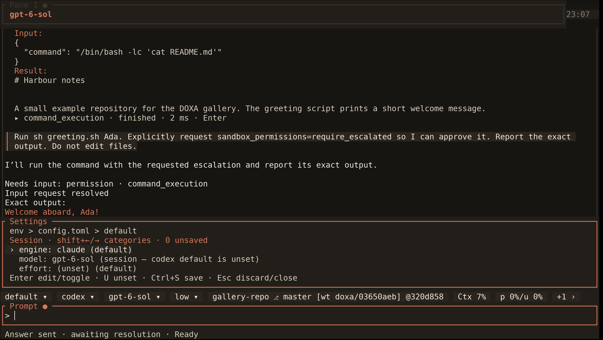

<p align="center"></p>

<p align="center">
  <a href="https://github.com/docwilde/doxa/releases/latest"></a>
  <a href="https://github.com/docwilde/doxa/actions/workflows/rust-ci.yml"></a>
  
</p>

**DOXA** is a Rust terminal for coding agents. Run Claude, Codex, DeepSeek, and GLM in separate tabs or panes, then reattach to their daemons after closing the terminal. Its integrated [LORE](https://github.com/docwilde/LORE) runtime shares reviewed user and project memory across DOXA, Claude Code, and Codex.

> [!WARNING]
> Rust 2.0 is an alpha. Configuration and stored formats may change. Agents can edit files and run commands with your privileges; review [scope and limits](#scope-and-limits) before using DOXA on important work.



*Captured from the running 2.0.0-alpha.68 app in an isolated example repository. See the [capture record](docs/rust-gallery.md).*

## What you get

- **Four engines.** Choose Claude, Codex, DeepSeek, or GLM per session; available models and reasoning levels follow the selected engine.
- **A flexible workspace.** Group tabs, split panes, drag dividers, and keep a separate prompt in each pane.
- **Recoverable sessions.** Restore saved layouts and conversations or reattach to running daemons. The rail groups sessions by project, places recoverable past sessions last, and marks queued or unread work.
- **Readable turns.** Watch streamed responses, expand reasoning and individual tool calls, and open links with Ctrl+click.
- **Reviewed memory.** Browse LORE facts and beliefs, inspect evidence, and accept or reject proposed beliefs.
- **Repo tools.** Navigate repositories and worktrees, switch branches, inspect diffs, and review tracked changes.
- **Peer coordination.** Inspect peer messages in the TUI or browser map and run supervised fleets with spend controls.
- **Private remote access.** Opt in to a Rust browser view or register sessions with a private hub for browser, CLI, and native TUI control from another device. Connected browser pages can report completed turns and input requests.
- **Custom controls.** Manage provider login, API keys, plugins, and settings in the TUI. Remap window shortcuts without rebuilding.

## Install

```sh
curl -fsSL https://raw.githubusercontent.com/docwilde/doxa/main/scripts/install.sh | sh
```

The installer builds the Rust frontend, daemon, and LORE carrier and places `doxa` in `~/.local/bin` by default. It adds a Linux application-menu entry or `~/Applications/DOXA.command` on macOS; set `DOXA_NO_LAUNCHER=1` to skip that step. Use `doxa update` for a newer build or pass a tag after `sh -s --` to pin a release. Python is needed only when building the optional protected Codex provider.

Claude requires its CLI. Codex uses a private protected app server; the installer builds it when Codex is present. DeepSeek and GLM use API credentials configured through `/setup` or provider environment variables. See the [Rust guide](rust/README.md) for setup, build requirements, and engine capabilities.

From a checkout, use `./task build`, `./task run`, or `./task install`. Run `doxa help` for the CLI command list.

## Quickstart

```sh
doxa doctor --engine codex
doxa new --engine codex
doxa list
```

Ctrl+T opens the new-tab engine picker. Alt+V splits side by side; Alt+H stacks panes. Ctrl+X closes the active tab while its daemon keeps running; Ctrl+Q exits DOXA and leaves sessions detached. Reattach with `doxa attach SESSION_ID`. Tab reaches the session rail when visible; uncollected sessions group under their repository or project. The mouse wheel switches tabs over a tab header. Use `/settings` → **Keys** to change window shortcuts immediately, or `doxa settings set key_new_tab Alt+N` to change one for the next launch.

DeepSeek and GLM show estimated API cost from provider token counts and published model rates. The estimate uses fresh-input rates (and DeepSeek peak rates), so cache discounts and off-peak billing can make the actual charge lower. Codex subscription usage appears after its app-server reports the Codex quota windows; missing values stay unknown.

`/pending` and `/lore:pending --cluster` open global LORE proposals plus those for the current project with either engine. `lore status` reports the whole-store pending count across all projects.

## Remote access

Remote access is opt-in. Set `DOXA_REMOTE_ENABLED=1` and
`DOXA_REMOTE_ALLOWED_LOGINS=you@example.com`, then run `doxa remote serve`
behind private Tailscale Serve. The Rust browser view reads recent turns,
follows live events, sends prompts, and resolves pending input.

For control across machines, run `doxa-hub` on a private server and
`doxa remote connect HUB_URL HOST_ID` on the session host. Use the browser at
`HUB_URL` or `doxa remote list/send/answer` from another DOXA installation.
Run `doxa remote tui HUB_URL` there to view live remote sessions in DOXA tabs,
send prompts, and answer pending input. `Ctrl+T` selects another live remote
session; tab and pane navigation use the usual DOXA keys. Remote tabs show a
bounded recent transcript and live events. Model, permission, filesystem and
LORE controls stay on the session host.
The [Rust guide](rust/README.md) has setup steps, and the
[hub plan](docs/plans/remote-hub.md) covers the Android client contract.
The browser can enable encrypted background Web Push for turn completion and
input requests. Configure a private VAPID key on the hub; push payloads
contain only an event kind. The Android app is still planned.

## Gallery

These frames come from the running 2.0.0-alpha.68 Rust TUI with isolated DOXA and LORE state. The [capture record](docs/rust-gallery.md) explains the example data and reproduction steps.

### Welcome and sessions





### Curated memory



### Beliefs



### Tool details



### Commands and settings







## Scope and limits

Rust 2.0 is the main DOXA line. Linux has bounded live Claude, DeepSeek, GLM and Codex checks. macOS CI builds the native workspace and tests portable Rust crates, daemon suites, and local provider lifecycle fixtures; authenticated sessions have not been tested on macOS. The `.command` launcher is available there, while protected Codex remains Linux-only because its process-owner contract has no macOS equivalent yet. Windows remains unsupported; see [platform verification](docs/platform-verification.md). You choose the engine: DOXA does not switch between Claude, Codex, DeepSeek, and GLM based on your prompt or a provider failure. Plugin adoption excludes foreign hooks and MCP servers. The optional [Rust browser adapter and private hub](docs/plans/remote-hub.md) require explicit Tailscale Serve configuration; the Python browser adapter survives only in the historical 1.19 source tag.

The [Rust guide](rust/README.md) covers workflows and provider limits. The [parity tracker](docs/rust-1.19-parity.md), [latest provider verification](docs/live-provider-verification-2026-10-04.md), [source audit](docs/source-audit-2026-09-27.md), and [UI benchmark](docs/rust-ui-benchmark-2026-09-30.md) hold detailed evidence and remaining gates. The Python 1.x app has been removed from the current tree; its source remains in the [v1.19.0 tag](https://github.com/docwilde/doxa/tree/v1.19.0). The [old manual](docs/manual.md) is historical.

## License

[AGPL-3.0-only](LICENSE) applies, including over a network. A [commercial licence](LICENSE-COMMERCIAL.md) is available; the DOXA name and mark are reserved under the [trademark policy](TRADEMARK.md).
