<p align="center"></p>

<p align="center">
  
  <a href="https://github.com/docwilde/doxa/releases/tag/v2.0.0-alpha.32"></a>
  <a href="https://github.com/docwilde/doxa/actions/workflows/rust-ci.yml"></a>
  
  
</p>

> [!WARNING]
> **Alpha.** Rust 2.0 is the main DOXA frontend. Config and on-disk formats
> can change between alpha releases. Agents
> can edit files and run commands with your privileges. Read
> [Non-goals](#non-goals) before using it on important work.

The current Rust preview is [v2.0.0-alpha.32](https://github.com/docwilde/doxa/releases/tag/v2.0.0-alpha.32).
GitHub labels 1.19 as the latest stable release while Rust 2.0 remains a prerelease.
Alpha.31 closes the audited Python 1.19 functional gaps: saved-session restoration,
full preferences, native LORE tools, interactive fleets, plugin commands and local
shell controls. The subsequent [source audit](docs/source-audit-2026-09-27.md)
documents the ownership/deadline fixes and remaining engineering debt. See the
[parity tracker](docs/rust-1.19-parity.md) for supported provider contracts and
retained safety boundaries.

**DOXA** is a terminal for coding agents. Development now leads with the
**Rust 2.0 alpha**, built with Ratatui and a native daemon. Run Claude, Codex,
DeepSeek, or GLM in separate sessions; close the terminal and reattach to their
daemons later. Claude currently uses a bundled Python SDK sidecar.
[LORE](https://github.com/docwilde/LORE)
shares user and repo memory across DOXA, Claude Code, and Codex, with
evidence-backed beliefs and an informational source-engine label. See the
[engine setup and capabilities](rust/README.md) guide.


*The lead image and gallery below are rendered by the real Rust 2.0
Ratatui frontend from deterministic fixture events. No provider calls or
account data are used. The fixtures and renderer live in
[`scripts/rust_gallery.py`](scripts/rust_gallery.py).*

## What you get

Launch and reattach [four engines](rust/README.md), work
across grouped tabs and nested splits with separate prompts, move an active
tab with `/movepane`, inspect bounded
worktree diffs and tool cards, change supported models, reasoning effort and permissions, and
browse LORE beliefs and peer activity. Accept or reject a belief from its
inline browser after reviewing the exact claim. The [Rust guide](rust/README.md)
describes its current capabilities and limits. Managed worktrees, diff hunk
rejection, explicit clean Rust-orphan cleanup, guarded session checkout recovery,
reviewed LORE belief actions,
LORE proposal review, and native fleet coordination are in the alpha. Fleets
include start barriers, explicit approval policies, durable spend guards and
verified resume without repeating ambiguous dispatches. The Python fleet
harness remains available through `fleet start-python`.
`/cd <path>` opens a new tab rooted in a different directory. Explicit
Claude and protected Codex `/compact` wait for completed LORE review.
The native Codex hook contract currently requires CLI 0.156.1; provider hook
infrastructure failures remain a [documented limitation](rust/doxa-engines/README.md#compaction-review).
Known Codex, DeepSeek and GLM models can use dated-price native spend ceilings
when every request reports complete token usage. `doxa setup` offers interactive
setup, `doxa auth login|logout claude|codex` runs the provider login flow,
and `doxa plugins` shows plugin inventory. `doxa settings` and `/settings` edit
categorized session, memory, appearance, notification and remote preferences,
including their effective sources. First launch offers setup once; plain `doxa`
restores saved tabs and safely resumes recorded conversations. `!<command>` runs
locally in the session directory without saving output or sending it to the model.
Tab cycles through tab headers, visible chips and the prompt; Shift+Tab reverses it.
Open menus and slash completion retain their own Tab behavior.
Drag transcript text to select it, then press Ctrl+C or Ctrl+Shift+C to send it
to the terminal clipboard (requires OSC52 support). Ctrl+V pastes into the prompt
when a supported clipboard reader is installed; terminal Ctrl+Shift+V also works.
Default startup skips terminal capability probes. On a terminal with Kitty
keyboard protocol support, set `DOXA_KEYBOARD_PROTOCOL=kitty` for enhanced keys;
legacy alternatives are shown in `/help`.
`/branch` opens a local branch picker for a managed session.
Clicking the repo chip opens a directory picker above the prompt; its top
border can be dragged to show more entries. Selectable rows highlight under
the pointer. Codex sessions now show current context usage when DOXA can
receive official app-server token usage; legacy CLI sessions use their verified owned rollout. New Codex sessions use app-server, with live estimated reasoning counts. Saved CLI sessions retain their existing transport.
`/usage` and `/context` open per-session detail panels, and `/collection`
organizes the session rail. `/fleet start` reviews the exact native plan before
launch, and saved fleet views track real run manifests separately from session
tabs. `/login codex --device-auth` supports the provider device login flow.
`/help` lists Rust support for all 42 DOXA 1.19 commands. `/search` consults
LORE's existing session index before its bounded transcript scan and shows
grouped, scrubbed excerpts above the prompt as you type. The memory chip
browses user/project entries and opens reviewed memory edits. Guarded `/clear` starts a fresh
session in the same tab after verifying a writable
tabset.
Processing appears inside each transcript; reasoning is folded behind a live
token counter. Codex reasoning content is scrubbed as a whole before becoming available to expand; its live count remains an estimate. Expanded tool activity shows scrubbed result detail.
Restored Claude and newly persisted Codex sessions keep expandable tool details in the bounded transcript
view. User turns are highlighted without visible role headings. Transcript
HTTP(S) links open in the browser with Ctrl+left click and show a pointer cursor
in supporting terminals.

## Gallery

### Rust 2.0 alpha.32


*Accept records a user confirmation in LORE. Reject retracts the belief from
active memory while retaining its history. Each action reviews the exact claim
above the prompt; retraction requires an explicit confirmation. Type in the
prompt to filter, or use Shift+A / Shift+R on the selected row. Hover an entry
for the delayed full-belief tooltip.*

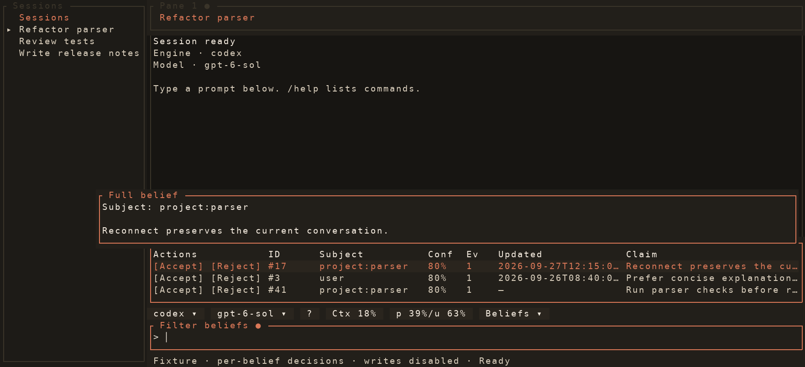

*Hover previews wrap the complete safe claim. Beliefs too large for the terminal
offer Enter to open the full review.*

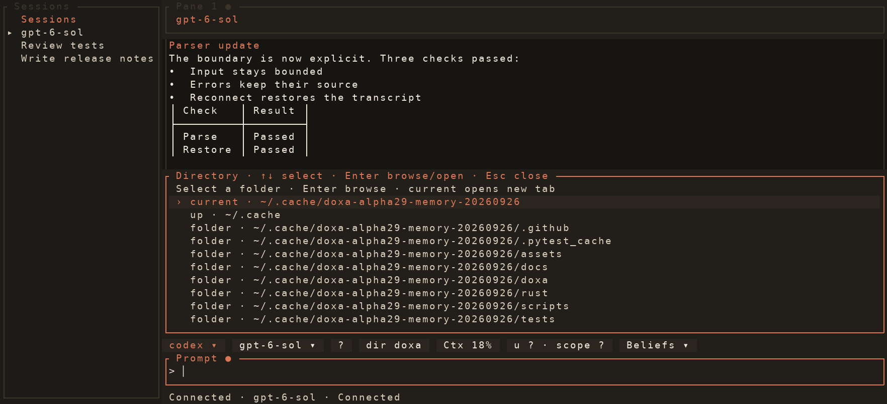

*Click the repo chip to browse folders. Enter opens the selected current folder
in a new tab; the upper border can be dragged to show more entries.*


*`/help` lists the supported Rust forms and describes local forms and provider boundaries.*

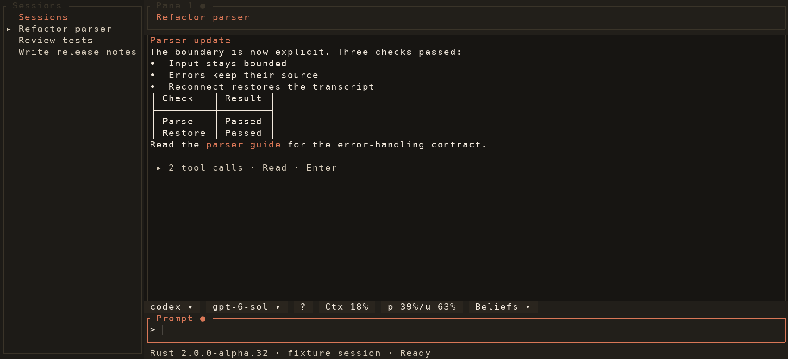

*Tool calls stay collapsed below the latest reply until expanded.*

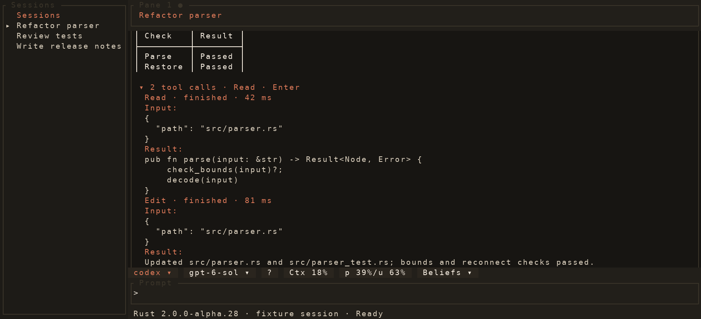

*Select a tool section and press Enter, or click it, to inspect the bounded details.*

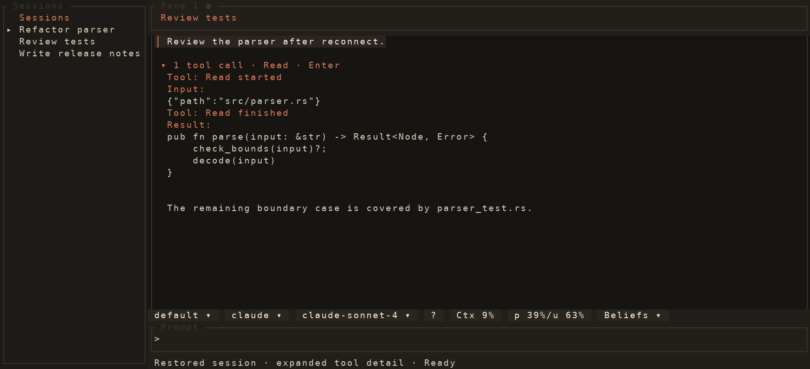

*Claude tool details remain expandable after session recovery.*

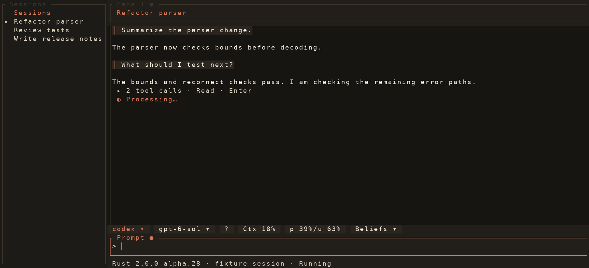

*User messages have a warm highlight. The latest reply appears above its tool section, followed by the processing spinner.*

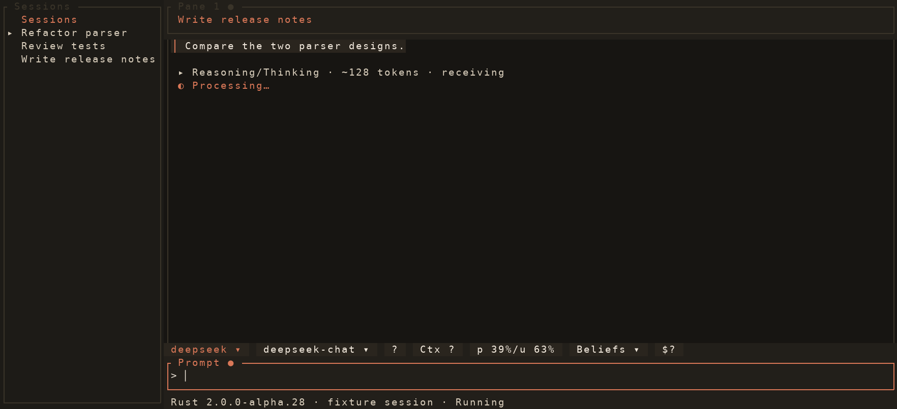

*Streamed reasoning stays folded while its approximate token count updates.*


*Typing a slash command filters local DOXA actions; Tab completes the selected entry.*

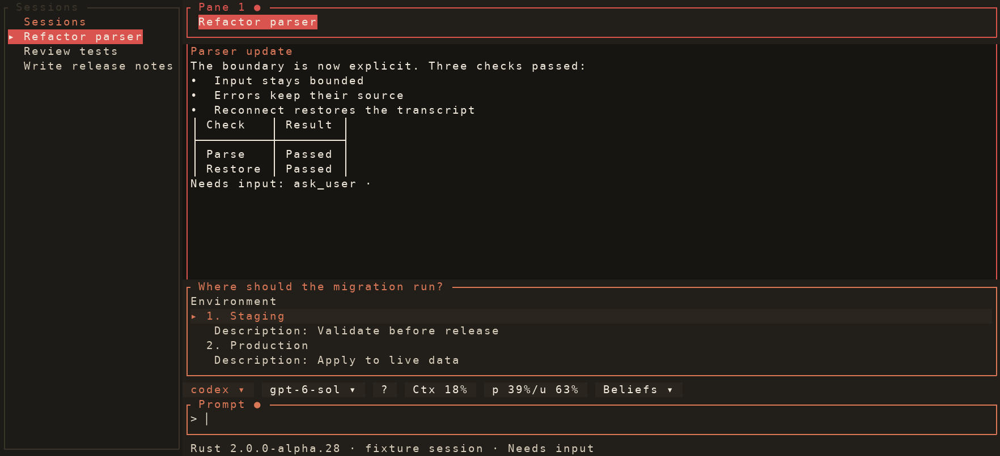

*A daemon input request expands above the active prompt.*

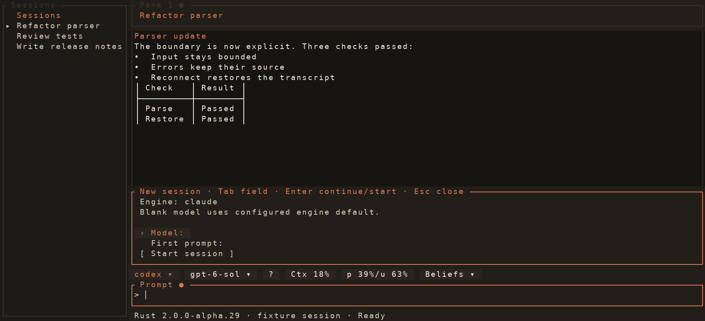

*Choosing Claude opens a session form. Click its fields and Start session, or use the keyboard.*

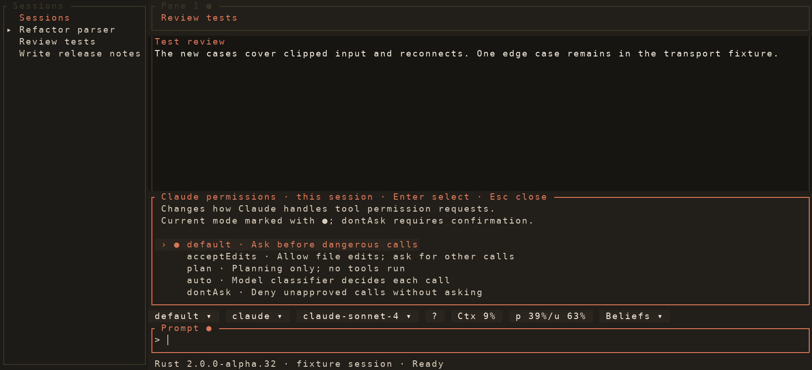

*The permission picker expands from the chip row above the active prompt.*

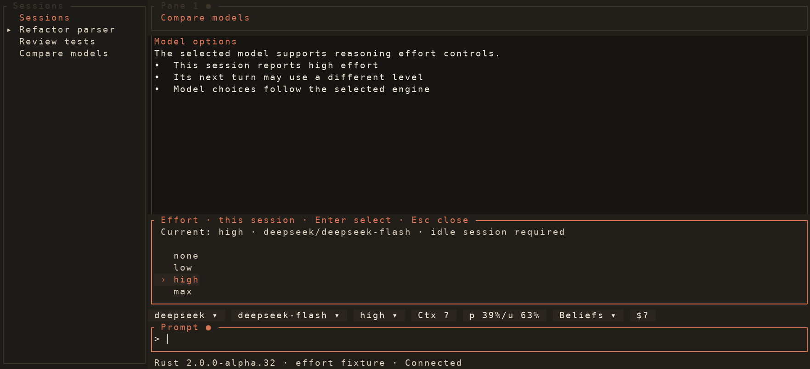

*The effort chip reports the current session. Supported Codex and vendor choices apply to its next turn when idle.*

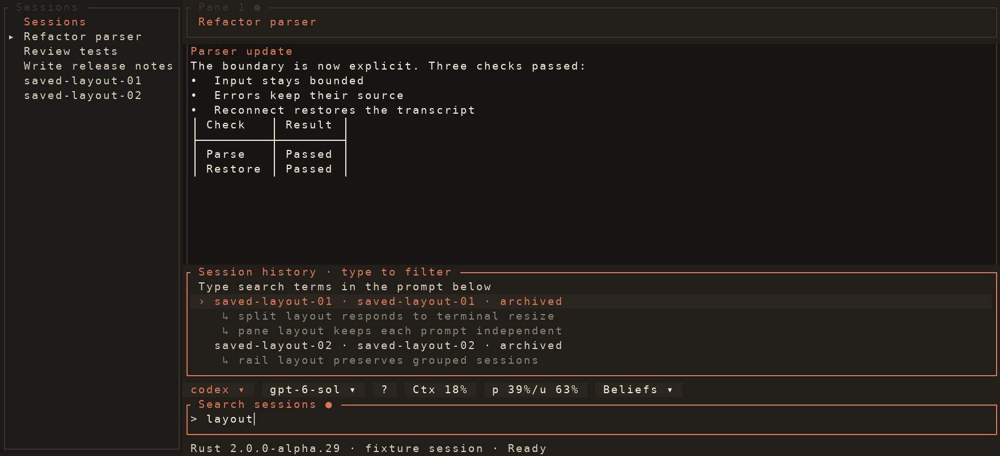

*Session history searches attached and archived transcripts and groups
scrubbed indexed excerpts beneath each matching session.*

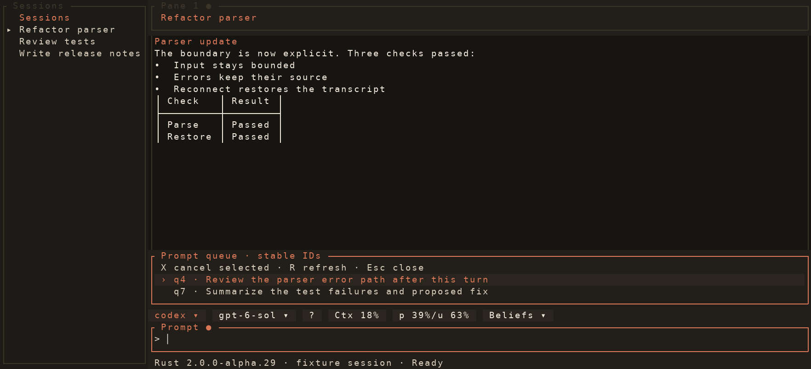

*The queue picker shows waiting prompts and cancels the selected item by its ID.*

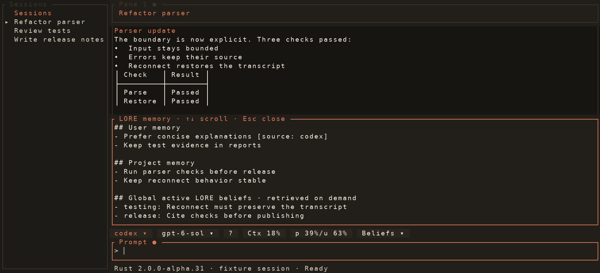

*The memory chip opens a table of individual curated facts with scope and
provenance. The prompt filters the rows while the submenu is open.*

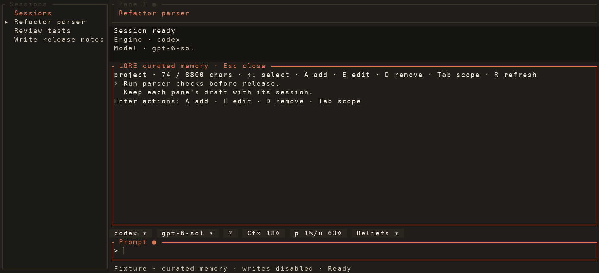

*Browse scoped entries and review memory changes before applying them.*

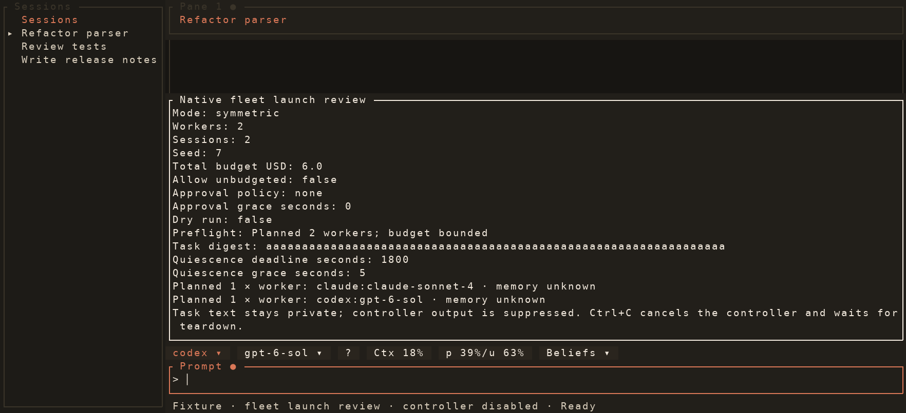

*Review the planned workers, budget and approval policy before launching a fleet.
The [extended gallery](docs/rust-gallery.md) also shows memory-change review and saved fleet views.*

These images come from `python3 scripts/rust_gallery.py`, which renders the
production `doxa_tui::ui::App` through Ratatui's test backend. The sessions,
events, and usage numbers are fixtures; they are examples of UI behavior,
not a live provider run.

## Install

### Rust 2.0 alpha

```sh
curl -fsSL https://raw.githubusercontent.com/docwilde/doxa/main/scripts/install.sh | sh
```

The installer builds the Rust frontend and daemon from `main` and installs the
Rust `doxa` command in `~/.local/bin` (or `DOXA_RUST_BIN_DIR`). Pass a tag such
as `v2.0.0-alpha.32` after `sh -s --` to pin a release. It uses Git, Cargo,
Python 3.11+, and `uv`; the Python environment it creates is private to the
LORE and Claude sidecars. No Python frontend command is installed. See the
[Rust guide](rust/README.md) for provider setup and current limits.
On Linux, it also installs a per-user application menu entry and icons under
`$XDG_DATA_HOME` (default `~/.local/share`). The entry launches the installed
Rust `doxa` by absolute path. Set `DOXA_NO_LAUNCHER=1` to skip it.
If an older `uv tool` install owns `doxa`, run `uv tool uninstall doxa`
before installing Rust; the installer reports when another `doxa` on `PATH`
would shadow its launcher.

From a checkout, `cargo build --locked` builds the Rust frontend and daemon;
`./task build`, `./task run`, and `./task install` provide the matching local
launcher workflow. Install
builds committed `HEAD` with the same locked sidecars and launcher as the
release installer. If an existing local `main` predates the Rust files, run
`git pull --ff-only` after checking it out; `git checkout main` alone does not
fetch newer commits.
Use `doxa help` for commands and `doxa update` to rebuild an installed Rust
launcher from `main`.

## Quickstart

Check dependencies, start a session, and reattach later:

```sh
doxa doctor --engine codex
doxa new --engine codex
doxa list
```

The [Rust guide](rust/README.md) covers Claude, DeepSeek, and GLM setup.

## Status

Rust 2.0 alpha is the main line. The [Rust guide](rust/README.md) tracks
what is implemented and what still needs porting. Existing Python 1.x releases
and their [manual](docs/manual.md) remain available for historical reference;
the Python SDK and LORE sidecar modules remain internal runtime dependencies.

Rust CI tests the frontend, native daemon, protocol, LORE bridge, installer,
and compatibility paths. See the [Rust UI benchmark](docs/rust-ui-benchmark-2026-09-27.md)
for rendering, event-loop, scrolling, and resize measurements.

## Non-goals

- **Automatic model routing:** you choose an engine per session; DOXA does
  not load-balance or fail over between providers.
- **Replacing LORE:** DOXA uses the same core as the Claude Code and Codex
  plugins.
- **Full Claude plugin compatibility:** the 2.0 alpha uses a Claude SDK
  sidecar. DOXA's [plugin API](docs/plans/plugin-api.md) remains a design.

## License

[AGPL-3.0-only](LICENSE) for everyone, including over a network; a
[commercial licence](LICENSE-COMMERCIAL.md) is available for uses AGPL's
terms don't suit. The DOXA name and mark are reserved — see
[TRADEMARK.md](TRADEMARK.md).
