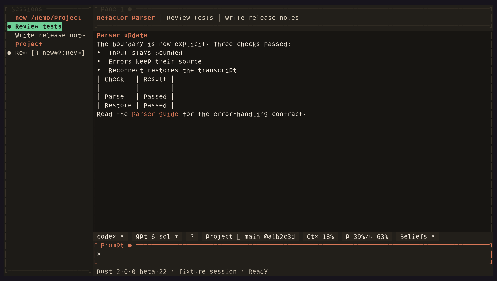
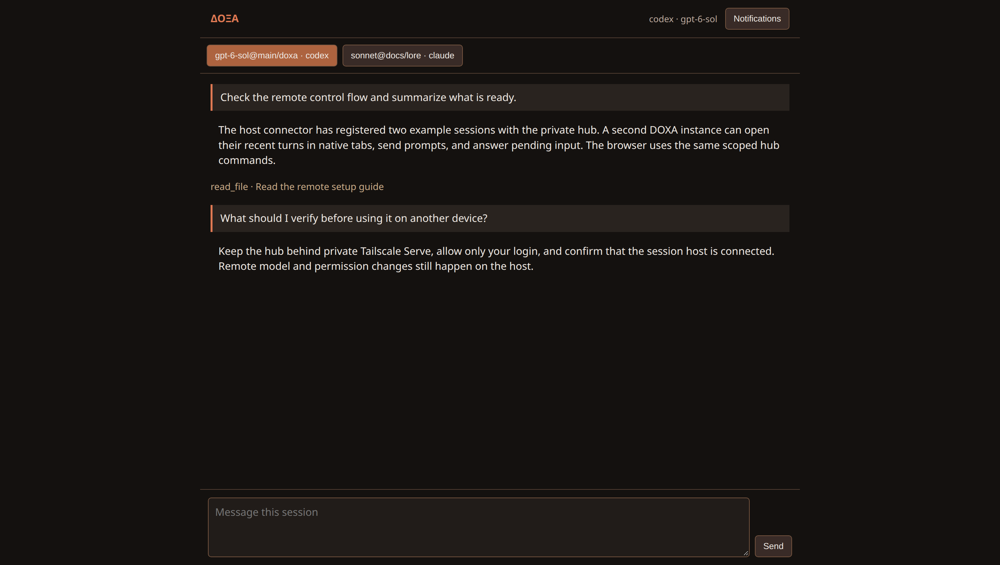
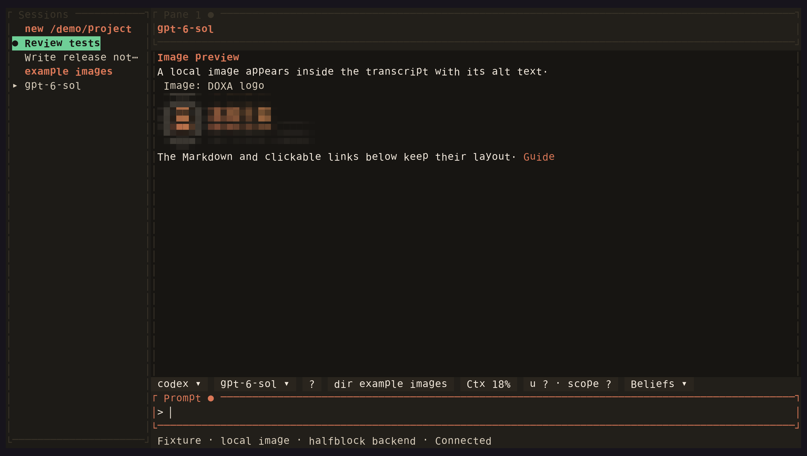
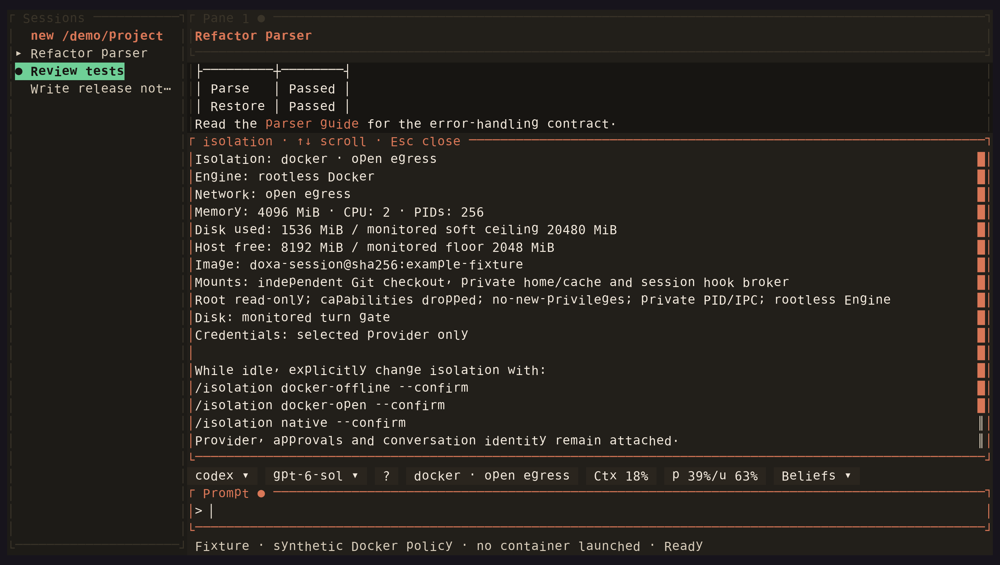
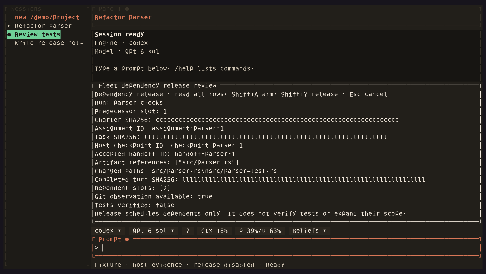

<p align="center"></p>

<p align="center">
  <a href="https://github.com/docwilde/doxa/releases/latest"></a>
  <a href="https://github.com/docwilde/doxa/actions/workflows/rust-ci.yml"></a>
  
</p>

**DOXA** is a Rust terminal workspace for coding agents. Run Claude, Codex, DeepSeek, or GLM in tabs and split panes, then close the terminal and reattach to running sessions later. Integrated [LORE](https://github.com/docwilde/LORE) shares reviewed memory across DOXA, Claude Code, and Codex.

> [!WARNING]
> Rust 2.0 is in beta. Agents can edit files and run commands with your privileges. Choose a [session isolation profile](docs/session-isolation.md) and review the [platform limits](#platform-and-scope) before using DOXA on important work.



[How the gallery was captured](docs/rust-gallery.md)

## Contents

- [Install and start](#install-and-start)
- [Workspace and sessions](#workspace-and-sessions)
- [Engines and review](#engines-and-review)
- [Remote access](#remote-access)
- [Gallery](#gallery)
- [Platform and scope](#platform-and-scope)
- [Documentation](#documentation)

## Install and start

Install the [latest Rust prerelease](https://github.com/docwilde/doxa/releases):

```sh
curl -fsSL https://raw.githubusercontent.com/docwilde/doxa/main/scripts/install.sh | sh
```

The installer builds the frontend, daemon, remote adapter, isolation and plugin workers, and native LORE carrier, then puts `doxa` in `~/.local/bin` by default. It adds a Linux application-menu entry or a macOS `~/Applications/DOXA.command` shortcut. Set `DOXA_NO_LAUNCHER=1` to skip the shortcut. Run `doxa update` to update; pass a tag after `sh -s --` to pin a version.

```sh
doxa doctor --engine codex
doxa new --engine codex
doxa list
```

Choose an installed engine in place of `codex`. Claude needs its CLI; protected Codex needs its private provider build on Linux. DeepSeek and GLM need API credentials through `/setup` or environment variables. `doxa help` lists CLI commands. From a checkout, use `./task build`, `./task run`, or `./task install`.

## Workspace and sessions

- **Work in parallel.** Open tabs with Ctrl+T, split with Alt+V or Alt+H, and keep a prompt in each pane. The project rail groups live and recoverable sessions. Saved layouts restore on launch.
- **Detach and return.** Ctrl+W closes a tab while its daemon runs; Ctrl+Q exits the window and leaves sessions detached. `/resume` finds saved sessions, including closed tabs. Ctrl+X stops the active daemon and retains its transcript.
- **Review the work.** Expand reasoning and tool calls, inspect diffs and worktrees, and use the action palette or slash commands. LORE facts, beliefs, and pending proposals have TUI review controls; verified pending proposals affect local rail urgency. Project headings can use a verified-root hue and an explicit `/collection project-label`; `/collection view panes` groups live tabs by pane and names a hidden tab needing attention. Local images and opt-in Mermaid previews appear in the transcript; Mermaid PNGs use a private session cache. `/codegraph` opens bounded Rust and Python syntax queries and reviewed LORE snapshots with reference freshness, without writing to LORE.
- **Choose isolation.** Start in `native`, `docker-open`, or `docker-offline`. Linux Docker profiles use a private rootless worker and checkout, with effective cgroup memory, CPU, PID, and swap limits checked before admission and CLI provider turns. The isolation chip shows the verified policy. Change an idle session with `/isolation PROFILE --confirm`. [Setup and limits](docs/session-isolation.md).

The [Rust guide](rust/README.md) covers keys, session recovery, worktrees, settings, and review behavior.

## Engines and review

| Engine | Connection | Setup |
| --- | --- | --- |
| Claude | Claude Code CLI | Sign in with the CLI. |
| Codex | Protected private app server | Linux build and Codex sign-in. |
| DeepSeek | Rust API client | Supply an API key. |
| GLM | Rust API client | Supply a z.ai API key. |

[Engine capability matrix](docs/engine-capabilities.md) lists model, permission, cost, compaction, and platform support. The picker distinguishes sourced model facts from unknown context or thinking support. Budget admission uses a conservative documented price bound and refuses an unknown priced bound. DOXA does not silently switch engines during a session.

Fleets can run an acting coordinator and workers under a reviewed charter, typed host gates, and spending limits. A separately selected alignment supervisor and fast LLM or Jev message judge can inspect work and messages. Dependent Docker-isolated workers wait for a host checkpoint, accepted handoff, and explicit human release. `/fleet dependency-review` shows the evidence in the TUI. An owner-run offline recipe can produce snapshot-bound test receipts on a capable rootless Docker host. A private scorer can evaluate consented, labeled real-message verdicts; no such corpus ships and evaluation does not change enforcement. [Fleet supervision](docs/fleet-supervision.md).

## Remote access

Remote control is opt in. `doxa remote serve` exposes a private Rust browser view through Tailscale Serve. A private `doxa-hub` lets another DOXA installation use browser, CLI, or native TUI control across machines. Native clients can encrypt transcript and control content end to end with a shared key; the hub still sees connection metadata. `doxa remote tui HUB_URL --save-layout` saves remote-only tabs; `/remote-control HUB_URL --save-layout` opts in to mixed local/remote pane restore after fresh roster checks. The [remote guide](rust/README.md#remote-access) covers setup and limits. The [Chrome extension](browser-extension/README.md) supports encrypted hub sessions. The [Android client](android-client/README.md) has local and opt-in FCM background alert paths. Its debug APK builds and opens in an [offline emulator screenshot](assets/shots/android-remote-beta17-offline.png); provisioned FCM, device and tailnet checks remain open.



## Gallery

These beta.22 frames render the production Ratatui app with deterministic example events. They show the interface without opening a provider, Docker container, or user store. The [capture record](docs/rust-gallery.md) includes more views and exact reproduction steps.

The gallery also shows the [read-only code graph modal](assets/shots/rust-2.0.0-beta.22-codegraph.png), [explicit project label](assets/shots/rust-2.0.0-beta.22-project-label.png), and [pane-row rail](assets/shots/rust-2.0.0-beta.22-pane-triage.png).

| Image preview | Isolation details | Fleet release review |
| --- | --- | --- |
|  |  |  |

## Platform and scope

Linux has bounded live checks for all four engines. macOS has build and transport CI, but authenticated provider sessions still need live verification; protected Codex is Linux only. Windows is unsupported. See [platform verification](docs/platform-verification.md). Python 1.x is archived at [v1.19.0](https://github.com/docwilde/doxa/tree/v1.19.0); its [manual](docs/manual.md) is historical.

DOXA loads selected provider plugins with scoped adoption rules. Remote access needs explicit private network setup. The [parity tracker](docs/rust-1.19-parity.md) and [latest provider verification](docs/live-provider-verification-2026-10-04.md) record detailed evidence and open checks.

## Documentation

- [Rust guide](rust/README.md) — install, sessions, review, fleets, and remote use.
- [Engine capabilities](docs/engine-capabilities.md) — what each provider supports.
- [Session isolation](docs/session-isolation.md) — Docker profiles and their limits.
- [Fleet supervision](docs/fleet-supervision.md) — independent review and message judging.
- [Code graph queries](docs/plans/code-graph.md) — bounded, read-only Rust and Python syntax with unverified call-site candidates.
- [Native plugins](docs/native-plugins.md) — owner-approved text commands, status files and WASM package preflight.
- [Plans and open work](docs/plans/README.md) — current implementation status.

DOXA is licensed under [AGPL-3.0-only](LICENSE), with a [commercial licence](LICENSE-COMMERCIAL.md) available. The name and mark follow the [trademark policy](TRADEMARK.md).
