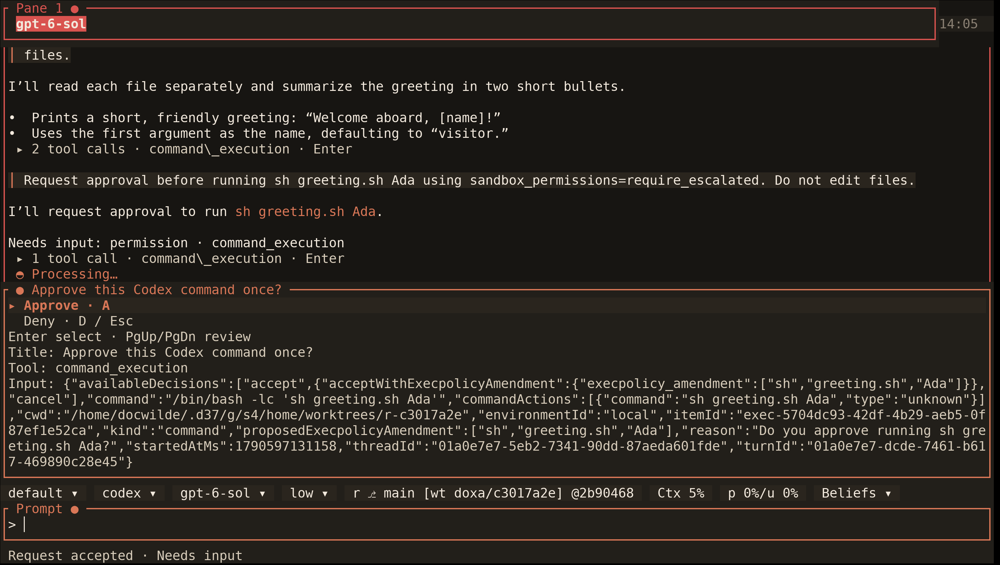

<p align="center"></p>

<p align="center">
  
  <a href="https://github.com/docwilde/doxa/releases/tag/v2.0.0-alpha.50"></a>
  <a href="https://github.com/docwilde/doxa/actions/workflows/rust-ci.yml"></a>
  
  
</p>

> [!WARNING]
> **Alpha.** Rust 2.0 is the main DOXA frontend. Config and on-disk formats
> can change between alpha releases. Agents
> can edit files and run commands with your privileges. Read
> [Non-goals](#non-goals) before using it on important work.

The official latest GitHub release is [v2.0.0-alpha.50](https://github.com/docwilde/doxa/releases/tag/v2.0.0-alpha.50).
Rust 2.0 leads development and remains an evolving alpha. See the
[parity tracker](docs/rust-1.19-parity.md) for supported provider contracts and
remaining release gates, and the [source audit](docs/source-audit-2026-09-27.md)
for engineering findings and their follow-up fixes. Alpha.48 adds session-scoped tool approvals,
clickable peer history, clearer memory browsing and a block Greek welcome banner.
Alpha.49 refreshes the docs and live terminal gallery.
Alpha.50 adds live captures of the curated memory and belief browsers.

**DOXA** is a terminal for coding agents. Development now leads with the
**Rust 2.0 alpha**, built with Ratatui and a native daemon. Run Claude, Codex,
DeepSeek, or GLM in separate sessions; close the terminal and reattach to their
daemons later. Claude runs through its CLI control protocol; Codex uses its app server.
DOXA and its integrated LORE runtime are Rust.
[LORE](https://github.com/docwilde/LORE)
shares user and repo memory across DOXA, Claude Code, and Codex, with
evidence-backed beliefs and an informational source-engine label. See the
[engine setup and capabilities](rust/README.md) guide.


*Captured from the running Rust app in a real VTE terminal, using an authenticated
Codex session and a small isolated example repository. The provider replies and tool
results are real. See the [capture method](docs/rust-gallery.md).*

## What you get

- **Four engines:** Run Claude, Codex, DeepSeek or GLM with supported model, reasoning effort and permission controls.
- **Flexible workspace:** Group tabs, split panes horizontally or vertically, and drag dividers; each pane has its own prompt.
- **Session recovery:** Restore tabs and layouts, safely resume recorded conversations, or reattach to running daemons. Unavailable sessions stay visible; unsent drafts belong to each pane while the app is open.
- **Clear conversations:** Follow live progress, expand reasoning or individual tool calls, and open links with Ctrl+click.
- **Shared memory:** Browse and filter LORE facts and beliefs, inspect full entries and evidence, and approve or reject fully reviewed changes.
- **Repo and worktree tools:** Browse folders, switch branches, inspect diffs and reject tracked hunks. Recover or clean up managed checkouts with ownership checks.
- **Fleets and peers:** Coordinate supervised agents and inspect clickable peers and recent messages in the TUI or browser mesh. Spend limits require complete reported accounting.
- **Usage at a glance:** Inspect reported context, plan, quota and API balance details; unavailable values stay unknown.
- **Keyboard and mouse:** Approve a request inline or approve the same tool for the rest of its session. Navigate with Tab, complete slash commands, and copy or paste where supported.
- **Setup and customization:** Manage provider login, masked API keys, plugins and settings. Run private local shell commands with `!`.

See the [Rust guide](rust/README.md) for engine capabilities, shortcuts and
[compaction boundaries](rust/doxa-engines/README.md#compaction-review).

## Gallery · alpha.49–50

### Welcome


*The block Greek ΔΟΞΑ banner appears when a new session is ready. This frame
uses a second isolated session in the same example repository.*

### Curated memory


*Browse individual LORE facts by scope. Arrow keys or mouse hover select a row;
the prompt becomes a filter, and the right scrollbar tracks longer lists.*

### Beliefs


*Review LORE claims with separate Accept and Reject actions. The table shows
confidence, evidence count and update time; the prompt filters beliefs.*

### Individual tool details


*Open a tool section, then expand each call independently with a click or Enter.
Here the README read is expanded while the greeting-script read remains collapsed.*

### Inline approval



*The real command request waits above the prompt. Select Approve or Deny with the mouse
or keyboard; Enter submits the selection, A approves, and D or Esc denies.
“Always approve this tool” applies to that tool in the current session only.
The pending indicator blinks while the request is unresolved.*

### Slash completion


*Type a slash command to filter local actions; Tab completes the selected entry.*

### Command help


*`/help` lists supported forms and their local or provider boundaries.*

### Session settings


*Settings identify configuration defaults and values inherited from the session.
The chips below show the active engine, model and verified low effort.*

All nine frames are unedited 3068 × 1734 captures of the running Rust app.
The first seven use alpha.49; the two LORE menus use alpha.50 with an isolated
store of example facts and beliefs.
[Capture provenance and reproduction](docs/rust-gallery.md).

## Install

### Rust 2.0 alpha

```sh
curl -fsSL https://raw.githubusercontent.com/docwilde/doxa/main/scripts/install.sh | sh
```

The installer builds the Rust frontend and daemon from `main` and installs the
Rust `doxa` command in `~/.local/bin` (or `DOXA_RUST_BIN_DIR`). Pass a tag such
as `v2.0.0-alpha.50` after `sh -s --` to pin a release. Git and Cargo build three
native binaries: the frontend, daemon and LORE carrier. Claude requires its CLI.
When Codex is installed, the installer also builds a private, protected Codex
app server and its required Code Mode host; the official CLI remains available
for login and ordinary commands.

The protected provider build needs Python 3.11+ as build tooling, a Linux x86_64
user systemd service, and a separately bootstrapped Rust 1.95 toolchain. Its first
build takes several minutes; later installs reuse verified artifacts in
`~/.cache/doxa/codex-protected` (override with `DOXA_CODEX_PROTECTED_CACHE`).
Runtime dispatch is native Rust. Other-engine installations can set
`DOXA_INSTALL_CODEX_PROTECTED=0`; Codex turns then require a separately installed
protected provider. From a checkout, run `./task codex-provider` to install it.
See the [Rust guide](rust/README.md) for provider setup and current limits.
On Linux, it also installs a per-user application menu entry and icons under
`$XDG_DATA_HOME` (default `~/.local/share`). The entry launches the installed
Rust `doxa` by absolute path. Set `DOXA_NO_LAUNCHER=1` to skip it.
If an older `uv tool` install owns `doxa`, run `uv tool uninstall doxa`
before installing Rust; the installer reports when another `doxa` on `PATH`
would shadow its launcher.

From a checkout, `cargo build --locked` builds the Rust frontend and daemon;
`./task build`, `./task run`, and `./task install` provide the matching local
launcher workflow. Install
builds committed `HEAD` with the same native binaries and launcher as the
release installer. If an existing local `main` predates the Rust files, run
`git pull --ff-only` after checking it out; `git checkout main` alone does not
fetch newer commits.
Use `doxa help` for commands and `doxa update` to rebuild an installed Rust
launcher from `main`.

## Quickstart

Check dependencies and start a session:

```sh
doxa doctor --engine codex
doxa new --engine codex
doxa list
```

Ctrl+Q detaches the frontend. Use an ID or unique prefix from `doxa list` to
reattach later:

```sh
doxa attach SESSION_ID
```

The [Rust guide](rust/README.md) is the primary user guide and covers Claude,
DeepSeek, and GLM setup.

## Status

Rust 2.0 alpha is the main line. The [Rust guide](rust/README.md) describes
current commands, setup and provider limits. Existing Python 1.x releases and
their [historical compatibility manual](docs/manual.md) remain reference material;
installation and normal operation use the Rust runtime.
Canonical **LORE 0.62.4** is integrated in Rust; memory, beliefs, context,
session indexing, detached review and standalone administration use the same store.
Caps, stage switches and sync settings use LORE’s shared settings resolver;
explicit environment overrides win, and custom stores stay isolated from saved
host credentials. The same effective store is passed to native review workers.
Signed sync replays portable project memory and file-map keys across machines,
preserves conflicts in their project scope, and sorts curated entries so the
same entry set converges to identical memory/file-map bytes. Capacity limits
still refuse or stage oversized writes; overflow does not guarantee the same entry set.

### Completed and checked

- **Rust workflows:** Sessions, split panes, inline approvals, expandable tools,
  memory actions, worktrees, fleets and setup are implemented. The
  [parity tracker](docs/rust-1.19-parity.md) records their supported boundaries.
- **Protected Codex:** Alpha.40–42 add reviewed compaction, the required native
  Code Mode host, verified installation and tool-process cleanup. See the
  [audit follow-ups](docs/source-audit-2026-09-27.md#completion-follow-up-in-alpha40).
- **Regression coverage:** Alpha.43's [main CI](https://github.com/docwilde/doxa/actions/runs/36476565103)
  passed **962 Rust tests**, with zero failures and four optional/harness tests
  ignored. CI also checks the installer and native launcher.
- **Claude quota handling:** Alpha.44 preserves nested and startup window reports,
  with seven focused quota regressions passing. A live candidate turn reported
  both five-hour and weekly percentages and resets; missing values stay unknown.
- **Latest verification:** The [2026-09-29 record](docs/live-provider-verification-2026-09-29.md)
  covers fixed Claude and vendor streaming, GLM effort controls, and the
  incomplete Codex default-window stress run. Earlier alpha.43 checks verified
  real LORE review, manual compaction and controlled automatic compaction.

### Remaining live checks

Codex default-window stress stopped at 241,119 context tokens, below the
approximately 244,800-token trigger; no automatic compaction or post-compaction
restart was verified. DeepSeek's earlier exact-nonce failure remains unresolved.
GLM numeric usage was omitted by the evidence collector. All paid tests are stopped.

LORE's persistent loopback hub transport works, but full historical replica
parity remains gated by an unsigned oversized operation, 154 unverified operations
and one deferred dependency. Linux is verified; the full protected DOXA runtime
is unsupported on macOS and Windows. See the
[tracker](docs/rust-1.19-parity.md#remaining-verification) and
[latest record](docs/live-provider-verification-2026-09-29.md) for scope and limits.
The [Rust UI benchmark](docs/rust-ui-benchmark-2026-09-30.md) covers rendering,
event-loop, scrolling and resize measurements; provider checks measure behavior.

## Non-goals

- **Automatic model routing:** you choose an engine per session; DOXA does
  not load-balance or fail over between providers.
- **Replacing LORE:** DOXA uses the same core as the Claude Code and Codex
  plugins.
- **Full Claude plugin compatibility:** adoption loads reviewed commands, skills
  and agents into a private CLI configuration. Foreign hooks and MCP servers
  are excluded; DOXA's [plugin API](docs/plans/plugin-api.md) remains a design.

## License

[AGPL-3.0-only](LICENSE) for everyone, including over a network; a
[commercial licence](LICENSE-COMMERCIAL.md) is available for uses AGPL's
terms don't suit. The DOXA name and mark are reserved — see
[TRADEMARK.md](TRADEMARK.md).
