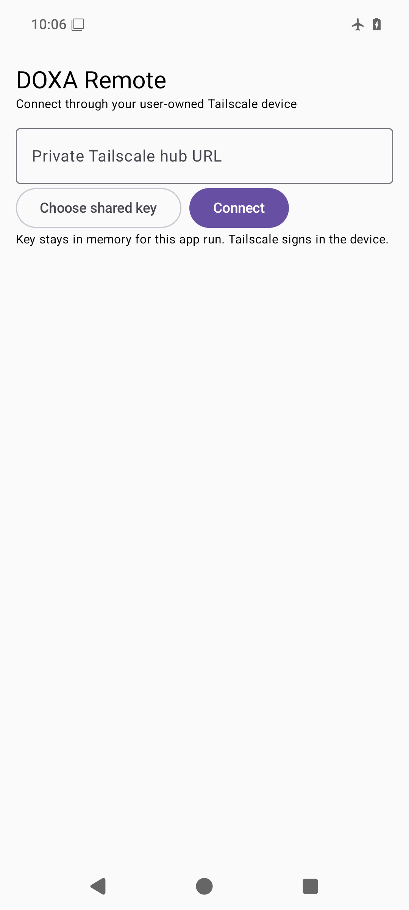
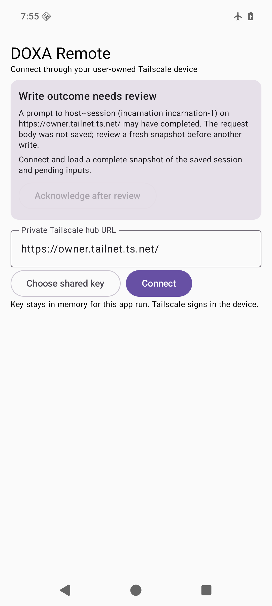

# DOXA Remote for Android

A small Kotlin/Compose client for the existing private DOXA hub. It lists the
owner's live sessions, loads bounded transcript pages, follows sequenced SSE
events, sends prompts, and answers pending approvals or questions. The hub URL
must be an `https://*.ts.net/` origin reachable from a user-owned Tailscale
device. The app supplies no Tailscale identity header: Serve authenticates the
device and forwards its attested login to the hub.



The normal connection screen above comes from a clean, unconfigured debug APK
on an offline Android 36 emulator. The hub URL is empty, and no Tailscale
account or shared key was entered. The [recovery-fence screen](../assets/shots/android-remote-beta28-recovery-fence-offline.png)
uses a synthetic `owner.tailnet.ts.net` URL and shows how an uncertain write
blocks acknowledgment until the app loads a fresh snapshot. A connected session
view requires a user-owned device and private hub.



To reproduce the home capture, install the Android 36 default x86_64 system
image, build the unconfigured APK, and start a fresh Pixel 6 emulator. The
capture script turns on airplane mode, disables Wi-Fi and mobile data, clears
app storage, verifies the empty URL field, and checks the PNG dimensions. It
refuses a physical device.

```bash
export TMPDIR="$HOME/t" ANDROID_HOME=/path/to/android-sdk
export ANDROID_AVD_HOME="$HOME/.cache/doxa-android-capture/avd"
mkdir -p "$TMPDIR" "$ANDROID_AVD_HOME"
./gradlew :app:assembleDebug
"$ANDROID_HOME/cmdline-tools/latest/bin/avdmanager" create avd \
  -n doxa-home-offline -k 'system-images;android-36;default;x86_64' \
  -p "$ANDROID_AVD_HOME/doxa-home-offline.avd" --device pixel_6 --force
"$ANDROID_HOME/emulator/emulator" -avd doxa-home-offline -port 5580 \
  -no-window -no-snapshot -no-audio -no-boot-anim -gpu swiftshader_indirect &
# Wait for emulator-5580 to report sys.boot_completed=1.
ANDROID_SERIAL=emulator-5580 ../scripts/capture_android_home.sh
```

## Build and connect

Open this directory in Android Studio with Android SDK 37.0 and JDK 21,
or run `./gradlew :app:assembleDebug` after setting `ANDROID_HOME`. The
wire contract tests also run without the Android SDK via `./gradlew :protocol:test`.
The project uses Gradle 9.3.1, Android Gradle Plugin 9.1.1,
Kotlin/Compose compiler 2.2.10, and the Compose 2026.09 BOM. Install the APK
on a device that is signed into the same private tailnet as the hub.

Enter the private hub origin and select **Choose shared key** if the session
host uses `DOXA_REMOTE_E2EE_KEY_FILE`. Transfer that file to the device through
a separate private channel; select it with Android's document picker. The key
is decoded for this app run and cleared on disconnect or process exit. An
encrypted session cannot be opened without it. Plaintext sessions can be
opened without a key. The app does not store a provider token or host lease.

The app stores the hub URL, selected session ID, last event cursor, one unsent
draft, and a versioned, size-bounded marker for an uncertain write in app-private
preferences. The marker holds only the hub origin, target and incarnation,
operation, request ID, and creation time. It is committed synchronously before
the POST; a failed commit prevents submission. It holds no prompt, approval
answer, shared key, encrypted envelope, or submitted request body. A process restart
reloads an authoritative snapshot before following events again.

## Write and reconnect behavior

Each prompt or answer has a random `request_id`. While the process is alive,
an uncertain retry sends the exact same JSON body, including the original
encrypted envelope. After the host's two-minute freshness window, **Retry same
request** first reloads the transcript. The user can review it before choosing
**Send new request** and confirming the new submission.

After process death, the body is gone and the app never replays the write. The
app first asks the hub to fence the saved request ID. Each Android write carries
a hub-boot-scoped ID and exact session incarnation, so a delayed POST cannot
arrive after a successful fence or cross a hub restart. A queued request is
cancelled; an already delivered request stays blocked until the host reports a
terminal result. Only then does the app load a fresh authoritative snapshot of
the saved hub and session incarnation, checks the host's transcript incarnation
receipt against inventory on both sides of the read, includes complete pending
inputs, and offers explicit acknowledgment. A safe fence for a retired boot in
the same hub process also permits review when the current inventory boot stays
stable across the read. New prompts and answers remain blocked across hub or
session changes. If that exact scope is unavailable, or the hub restarted before
it could fence the request, the readable marker stays blocked.
An unreadable marker stays blocked because its request ID and scope cannot be
fenced or verified. The app offers no in-app bypass; clearing app storage is a
last resort after independent outcome review and also removes local settings
and drafts. A terminal host response clears
the marker; a failed local clear keeps writes blocked for review. A corrupted
marker also fails closed. The app cannot establish from a lost response alone
whether the earlier write ran.
A new prompt may repeat an action that succeeded before the connection failed;
review the refreshed transcript before confirming. Pending inputs are
refreshed and compared immediately before sending an answer. The exact reviewed
pending input travels with the answer, and the host compares it to its current
pending input before acting. A fresh answer after an uncertain outcome repeats
that comparison against the original reviewed input.

The app reconnects SSE from the last processed sequence. A `replay_gap`
reloads the host transcript and pending inputs. Transcript and event text are
bounded in memory and rendered as plain text. The Android client never calls
the daemon or provider directly.

## Alerts and background push

Local alerts remain available while the app's SSE connection is alive. Background
alerts are a separate, explicit opt-in for the selected live session. A
configured build uses Firebase Cloud Messaging (FCM) data messages; the hub
uses its own service account to authenticate with FCM HTTP v1. The notification
contains only `needs_input` or `turn_done` and an opaque routing tag. It has no
session ID, transcript, tool content, or approval action. Opening the app
reloads the authoritative session inventory and transcript through Tailscale
Serve. The receiver checks the configured Firebase sender, opt-in, and current
tag before displaying anything. Changing sessions rotates the tag; disabling
clears it immediately and deletes the FCM token. Hub registration is bound to
the attested owner and exact live session incarnation.

Unconfigured builds need no Firebase account or key. To configure one, provide
these public app identifiers as Gradle properties, using a local untracked
`~/.gradle/gradle.properties` or `-P` arguments:

```text
doxaFirebaseAppId=1:...:android:...
doxaFirebaseApiKey=...
doxaFirebaseProjectId=...
doxaFirebaseSenderId=...
```

Keep the service account JSON **off the device**. On the private hub host, put
it at `$DOXA_HUB_RUNTIME_DIR/fcm-service-account.json`, owned by the hub UID,
mode `0600`, with one link and no symlink. The hub accepts a Google service
account whose `token_uri` is the standard OAuth endpoint; it obtains a
short-lived access token with the Firebase Messaging scope and sends only to
FCM HTTP v1. Enable the Firebase Cloud Messaging API and grant that service
account permission to send messages for the configured project. The Android
app project and service account must belong to the same Firebase project. The
hub starts with Android push disabled when the file is absent; no registration
can succeed until it is provisioned. Server registrations are volatile,
owner-scoped, capped, and expire after 24 hours. Reopening the app refreshes
the lease; token rotation also attempts registration. An offline disable still
stops local display immediately, while the server may retain the old token
until its lease expires.

The native endpoint is `POST` and `DELETE /api/push/android` with a private
Tailscale identity. POST includes `target`, `incarnation`, `token`, and a
32-character random `tag`; DELETE includes `token`. The browser Web Push
endpoint has a different protocol and cannot accept an FCM token.

## Scope and verification

There is no persistent shared key, file browser, or direct host command
endpoint in this client. Protocol and hub tests cover registration scope,
rotation, expiry, and generic payloads. An unconfigured debug APK was assembled
locally on 2026-10-09 with Temurin JDK 21.0.12.1, Android SDK 37.0, and Gradle
9.3.1; `:protocol:test` and `:app:lintDebug` passed in the same run. The
connection and recovery screens were captured and inspected in offline Android
36 emulators, including system-bar clearance. It has not been installed on a
Firebase-enabled device or exercised against a provisioned FCM project and
two-host tailnet. A separate offline Android 36 emulator smoke installed this
debug APK, injected a synthetic body-free marker, force-stopped and relaunched
the app, and confirmed the recovery warning and disabled acknowledgment before
a snapshot. Device QA must cover a real process-kill write and review flow,
token issuance and rotation,
background delivery after process
restart, opt-out while offline, Android notification permission, Tailscale
reconnect, encrypted/plaintext sessions, duplicate request, stale approval,
and host loss. No test sends a real notification.

The build versions follow the [Android Compose setup guide](https://developer.android.com/develop/ui/compose/setup-compose-dependencies-and-compiler),
[AGP 9.1 compatibility table](https://developer.android.com/build/releases/agp-9-1-0-release-notes),
and [Gradle wrapper guidance](https://docs.gradle.org/current/userguide/gradle_wrapper.html).
The push boundary follows [Firebase's Android registration guidance](https://firebase.google.com/docs/cloud-messaging/android/get-started)
and [FCM server authorization requirements](https://firebase.google.com/docs/cloud-messaging/send/v1-api).
