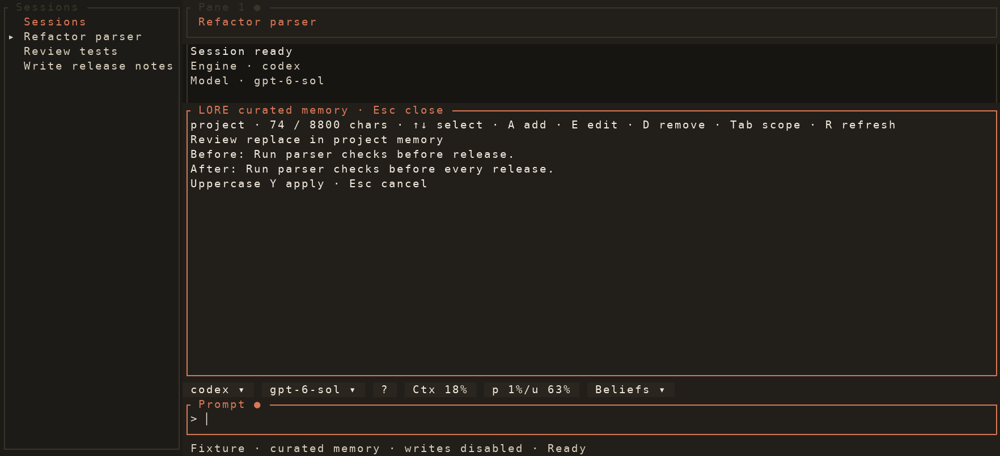
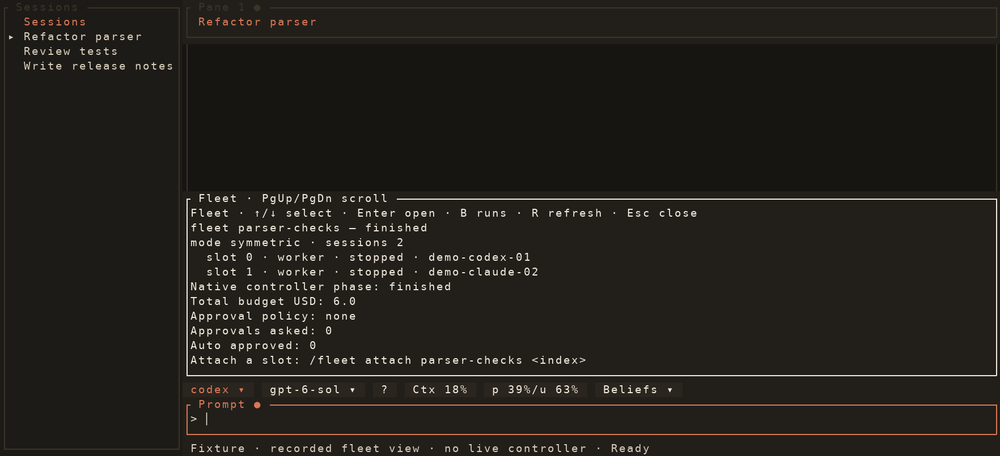

# Rust UI gallery

These images render the production Rust `App` through Ratatui's `TestBackend`.
The gallery supplies deterministic fixture sessions and frames, then rasterizes
actual styled terminal cells with Pillow. It does not record a live terminal or
contact providers, authenticate, mutate LORE memory, or launch fleet controllers.
Every scene uses one pane; nested pane behavior is covered by interaction tests.

Regenerate from the repository root with:

```sh
python3 scripts/rust_gallery.py
```

Pass scene names to update individual images. The script's `SCENES` list contains
the complete gallery. Version labels come from the compiled Rust package.
Use `--output-dir PATH` for review captures outside the checked-in gallery.
The `permission-request` and `tool-entries` scenes exercise pending inline
approval and independently expanded tool details through the production handlers.

## Prompt session search

The query is entered in the prompt. Matching saved sessions and their excerpts
appear in the menu directly above it.


## Curated memory

The management scene shows scoped entries, capacity, and available actions. The
change scene shows the complete before/after review through the production key
handler. Fixture writes are disabled even if the apply key is pressed.




## Native fleet review and view

The launch review uses the production plan renderer. It is scrolled to show the
budget, approval policy, task digest, and planned workers. The fixture controller
cannot launch. The recorded view illustrates the normal status overlay using
labelled fixture state; it does not create or persist real run identifiers.




## Belief decisions

`rust-beliefs.png` shows the production inline belief browser with per-entry
Accept and Reject buttons. The fixture disables sidecar reads and memory writes.
Accept records confirmation; Reject uses canonical retraction and retains history.


